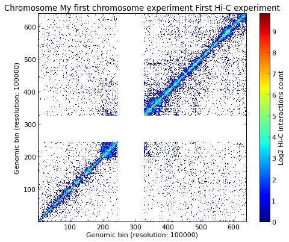
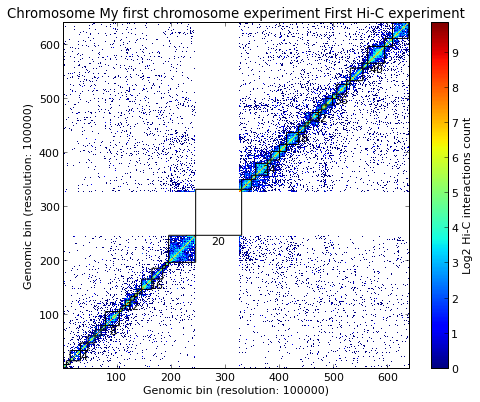

Getting started
===============

.. contents::
     :depth: 3

Hi-C data format
----------------

Hi-C data are usually represented as symmetric matrices in a tab separated file, as in the example below:
::

  chrT_001      chrT_002        chrT_003        chrT_004        chrT_005        chrT_006
  chrT_001      629     164     88      105     10      35
  chrT_002      86      612     175     110     40      29
  chrT_003      159     216     437     105     43      73
  chrT_004      100     111     146     278     70      42
  chrT_005      16      36      26      79      243     39
  chrT_006      19      50      53      42      37      224

TADBit allows to load most of this kind of matrices. A Hi-C matrix is loaded as this 
*(note: this example loads human chromosome 19 from* [Lieberman-Aiden2009]_ *results.)*:

In[5]:

.. code:: python

    from pytadbit import Chromosome
      
    # initiate a chromosome object that will store all Hi-C data and analysis
    my_chrom = Chromosome(name='My first chromosome')
    
    # load Hi-C data
    my_chrom.add_experiment('First Hi-C experiment', 
                            hic_data="../../scripts/sample_data/HIC_k562_chr19_chr19_100000_obs.txt", resolution=100000)

.. warning::
   TADBit assumes that Hi-C data matrices starts at chromosome position 1. If your matrix do not represents the full chromosome length, fill the missing columns and rows with zeros.

Unconventional data format
~~~~~~~~~~~~~~~~~~~~~~~~~~

If TADBit is unable to parse the input file, the user can create its own parser and pass it to the Chromosome instance. For example, one might be interested in using [Dixon2012]_ data that appear like this:

In[6]:

.. code:: python

    strange = '''
      chr21	0	20000	0	0	0	0	0	0	0	0
      chr21	20000	40000	0	0	0	0	0	0	0	0
      chr21	40000	60000	0	0	0	0	0	0	0	0
      chr21	60000	80000	0	0	0	0	0	0	0	0
      chr21	80000	100000	0	0	0	0	0	0	0	0
      chr21	100000	120000	0	0	0	0	0	0	0	0
      chr21	120000	140000	0	0	0	0	0	0	0	0
      chr21	140000	160000	0	0	0	0	0	0	0	0
    '''

In this case the user could implement a simple parser like this one:
In[7]:

.. code:: python

    def read_dixon_matrix(f_handle):
        """
        reads from file handler (already openned)
        """
        nums = []
        start = 3
        for line in f_handle:
            if not line:
                continue
            values = line.split()[start:]
            nums.append([int(v) for v in values])
            try:
                f_handle.close()
            except AttributeError:
                pass
        return tuple([nums[j][i] for i in xrange(len(nums)) for j in xrange(len(nums))]), len(nums)

And call it as follow:
In[8]:

.. code:: python

    other_chrom = Chromosome(name='An other chromosome')
    other_chrom.add_experiment('First Hi-C experiment', hic_data=strange,
                               parser=read_dixon_matrix, resolution=20000)

.. parsed-literal::

    /usr/local/lib/python2.7/dist-packages/TADBit-0.1-py2.7-linux-x86_64.egg/pytadbit/utils/hic_filtering.py:146: UserWarning: WARNING: Too few data to filter columns. SKIPPING...
      warn('WARNING: Too few data to filter columns. SKIPPING...')

Experiments, when loaded, are stored in a special kind of list attached to chromosome objects:
In[9]:

.. code:: python

    my_chrom.experiments

.. parsed-literal::

    [Experiment First Hi-C experiment (resolution: 100Kb, TADs: None, Hi-C rows: 639, normalized: None)]

A specific Experiment can be accessed either by its name or by its position in :class:`pytadbit.chromosome.ExperimentList` :
In[10]:

.. code:: python

    my_chrom.experiments[0] == my_chrom.experiments["First Hi-C experiment"]

.. parsed-literal::

    True

Each Experiment is an independent object with a list of associated functions 
(see :class:`pytadbit.experiment.Experiment`).
.. _run_tadbit:

Find Topologically Associating Domains
======================================

Once an experiment has been loaded, the location of Topologically Associating Domains (TADs) can be estimated as:
In[11]:

.. code:: python

    my_chrom.find_tad('First Hi-C experiment', n_cpus=8)

:func:`pytadbit.chromosome.Chromosome.find_tad` is called from our Chromosome object but is applied to a 
specific experiment. Therefore, TADs found by TADBbit will be associated to this specific experiment. 
They can be accessed as following:
In[12]:

.. code:: python

    exp = my_chrom.experiments["First Hi-C experiment"]
    exp.tads

.. parsed-literal::

    {1: {'brk': 5.0, 'end': 5.0, 'score': 2.0, 'start': 0.0},
     2: {'brk': 12.0, 'end': 12.0, 'score': 5.0, 'start': 6.0},
     3: {'brk': 31.0, 'end': 31.0, 'score': 6.0, 'start': 13.0},
     4: {'brk': 45.0, 'end': 45.0, 'score': 5.0, 'start': 32.0},
     5: {'brk': 58.0, 'end': 58.0, 'score': 3.0, 'start': 46.0},
     6: {'brk': 69.0, 'end': 69.0, 'score': 6.0, 'start': 59.0},
     7: {'brk': 77.0, 'end': 77.0, 'score': 2.0, 'start': 70.0},
     8: {'brk': 103.0, 'end': 103.0, 'score': 8.0, 'start': 78.0},
     9: {'brk': 108.0, 'end': 108.0, 'score': 4.0, 'start': 104.0},
     10: {'brk': 114.0, 'end': 114.0, 'score': 4.0, 'start': 109.0},
     11: {'brk': 124.0, 'end': 124.0, 'score': 2.0, 'start': 115.0},
     12: {'brk': 131.0, 'end': 131.0, 'score': 2.0, 'start': 125.0},
     13: {'brk': 136.0, 'end': 136.0, 'score': 3.0, 'start': 132.0},
     14: {'brk': 144.0, 'end': 144.0, 'score': 8.0, 'start': 137.0},
     15: {'brk': 163.0, 'end': 163.0, 'score': 6.0, 'start': 145.0},
     16: {'brk': 183.0, 'end': 183.0, 'score': 5.0, 'start': 164.0},
     17: {'brk': 188.0, 'end': 188.0, 'score': 1.0, 'start': 184.0},
     18: {'brk': 194.0, 'end': 194.0, 'score': 8.0, 'start': 189.0},
     19: {'brk': 244.0, 'end': 244.0, 'score': 4.0, 'start': 195.0},
     20: {'brk': 329.0, 'end': 329.0, 'score': 3.0, 'start': 245.0},
     21: {'brk': 347.0, 'end': 347.0, 'score': 4.0, 'start': 330.0},
     22: {'brk': 355.0, 'end': 355.0, 'score': 5.0, 'start': 348.0},
     23: {'brk': 377.0, 'end': 377.0, 'score': 6.0, 'start': 356.0},
     24: {'brk': 383.0, 'end': 383.0, 'score': 5.0, 'start': 378.0},
     25: {'brk': 399.0, 'end': 399.0, 'score': 4.0, 'start': 384.0},
     26: {'brk': 412.0, 'end': 412.0, 'score': 9.0, 'start': 400.0},
     27: {'brk': 434.0, 'end': 434.0, 'score': 4.0, 'start': 413.0},
     28: {'brk': 446.0, 'end': 446.0, 'score': 5.0, 'start': 435.0},
     29: {'brk': 452.0, 'end': 452.0, 'score': 4.0, 'start': 447.0},
     30: {'brk': 457.0, 'end': 457.0, 'score': 2.0, 'start': 453.0},
     31: {'brk': 471.0, 'end': 471.0, 'score': 4.0, 'start': 458.0},
     32: {'brk': 477.0, 'end': 477.0, 'score': 5.0, 'start': 472.0},
     33: {'brk': 485.0, 'end': 485.0, 'score': 8.0, 'start': 478.0},
     34: {'brk': 497.0, 'end': 497.0, 'score': 3.0, 'start': 486.0},
     35: {'brk': 505.0, 'end': 505.0, 'score': 5.0, 'start': 498.0},
     36: {'brk': 523.0, 'end': 523.0, 'score': 3.0, 'start': 506.0},
     37: {'brk': 530.0, 'end': 530.0, 'score': 8.0, 'start': 524.0},
     38: {'brk': 553.0, 'end': 553.0, 'score': 5.0, 'start': 531.0},
     39: {'brk': 562.0, 'end': 562.0, 'score': 5.0, 'start': 554.0},
     40: {'brk': 593.0, 'end': 593.0, 'score': 6.0, 'start': 563.0},
     41: {'brk': 608.0, 'end': 608.0, 'score': 7.0, 'start': 594.0},
     42: {'brk': 638.0, 'end': 638.0, 'score': 10.0, 'start': 609.0}}

The "tads" variable returned in this example is a dictionary of TADs, each of each is in turn a new dictionary containing information about the start and end positions of a TAD.

"start" and "end" values correspond respectively to the start and end positions of the given TAD in the chromosome (note that this numbers have to be multiplied by the resolution of the experiment, "exp.resolution"). The "brk" key corresponds to the value of "end", all "brk" together corresponds to all TAD's boundaries.

Forbidden regions and centromeres
---------------------------------

Once TADs are detected by the core :func:`pytadbit.tadbit.tadbit` function, TADBit checks that they are not 
larger than a given value (3 Mb by default). If a TAD is larger than this value, it will be marked with a 
**negative score**, and will be automatically excluded from the main TADBit functions.

Another inspection performed by TADBit is the presence of centromeric regions. TADBit assumes that the larger 
gap found in a Hi-C matrix corresponds to the centromere. This search is updated and refined each time a new 
experiment is linked to a given Chromosome. Typically, TADs calculated by the core 
:func:`pytadbit.tadbit.tadbit` function include centromeric regions; if a centromere is found, TADBit will 
split the TAD containing it into two TADs, one ending before the centromere and one starting after. As 
centromeric regions are not necessarily TAD boundaries, the TADs surrounding them are marked with a negative 
score (as for forbidden regions).

Data visualization
------------------

Once loaded, the Hi-C data can be visualized using the :func:`pytadbit.chromosome.Chromosome.visualize` 
function. The only parameter needed is which experiment to show. Therefore, the human chromosome 19 from [Lieberman-Aiden2009]_ can be visualized with:
In[13]:

.. code:: python

    my_chrom.visualize("First Hi-C experiment", show=True) 

.. parsed-literal::

    /usr/local/lib/python2.7/dist-packages/TADBit-0.1-py2.7-linux-x86_64.egg/pytadbit/chromosome.py:568: RuntimeWarning: divide by zero encountered in log2
      img = axe.imshow(fun(matrix), origin='lower', vmin=vmin, vmax=vmax,

.. parsed-literal::

    <matplotlib.image.AxesImage at 0x7375f50>

This plot shows the log2 interaction counts, resulting from the given Hi-C experiment.

If the steps in the previous section (:ref:`run_tadbit`) have been done and TADs habe been defined, they can 
be visualized in the same kind of plot:
In[14]:

.. code:: python

    my_chrom.visualize("First Hi-C experiment", paint_tads=True, show=True) 

*Note: the TAD number 19, corresponding to the centromere, and the TAD number 18, whose size is > 3 Mb, 
have been shaded*

Saving and restoring data
-------------------------

In order to avoid having to calculate TAD positions each time, TADBit allows to save and load Chromosome 
objects, with all the associated experiments. To save a Chromosome object:
In[15]:

.. code:: python

    my_chrom.save_chromosome("some_path.tdb")

And to load it:
In[16]:

.. code:: python

    from pytadbit import load_chromosome
    
    my_chrom = load_chromosome("some_path.tdb")

*Note: while information about TADs can be saved, in order to save disk space, raw Hi-C data are not stored in this way but can be loaded again for each experiment:*
In[19]:

.. code:: python

    expr = my_chrom.experiments["First Hi-C experiment"]
    
    expr.load_hic_data("../../scripts/sample_data/HIC_k562_chr19_chr19_100000_obs.txt")

