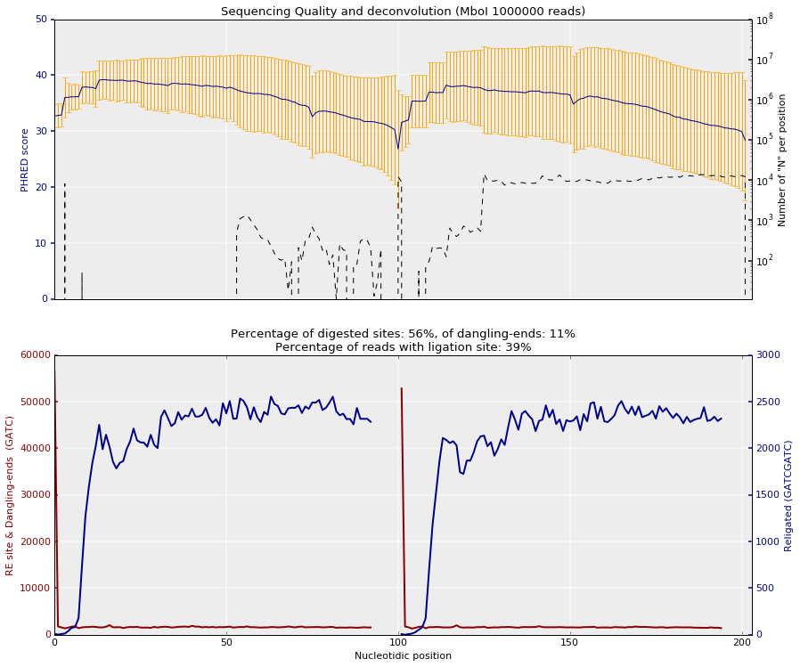
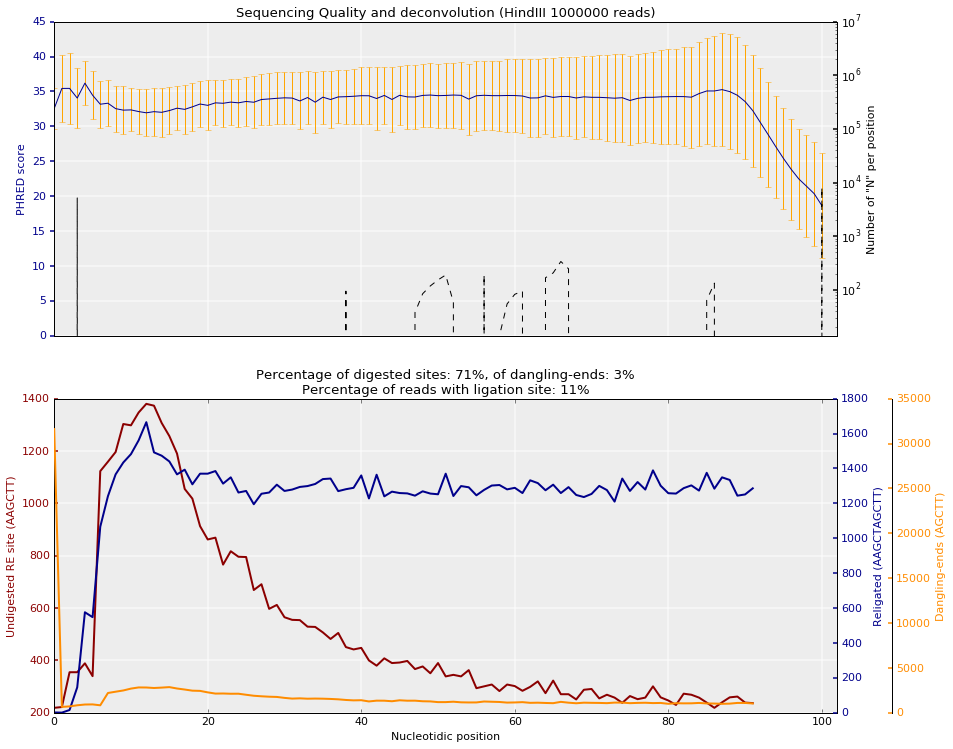
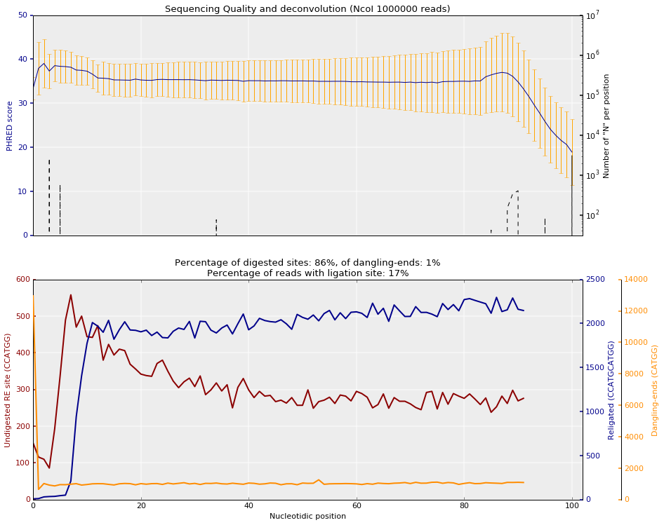
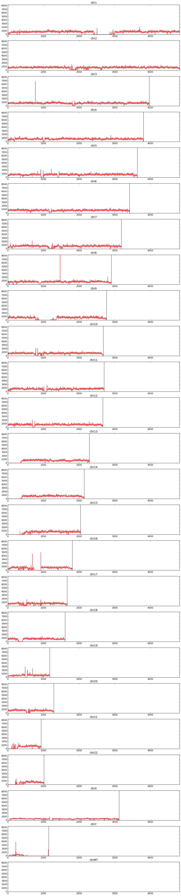
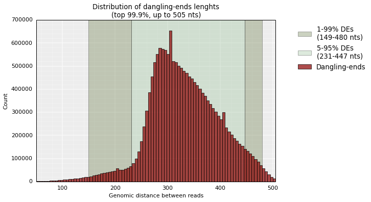
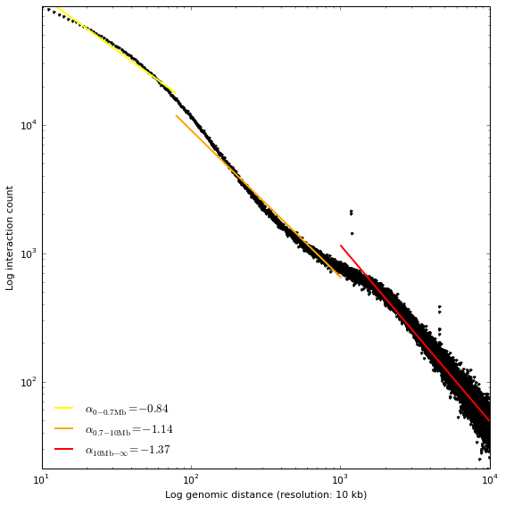
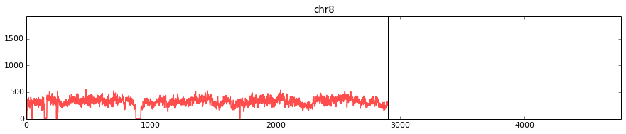
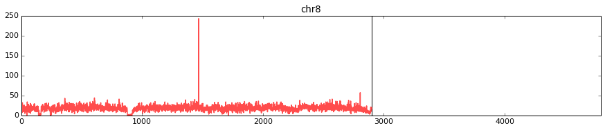

Mapping paired-end reads from NGS experiment (with GEM)
=======================================================

Download and index reference genome
-----------------------------------

Download last human reference genome from ucsc:
http://hgdownload.cse.ucsc.edu/goldenPath/hg38/bigZips/ It's better to
download the file that contains each chromosome separately (like this we
could only keep those which we are interested in): hg38.chromFa.tar.gz
Uncompress the genome

::

    tar -xzf hg38.chromFa.tar.gz

Check the header of the fasta files (it's important to know how
chromosomes are called in these files):

::

    head chr1.fa

Create a single file with all chromosomes together:

::

    cat chr1.fa chr2.fa chr3.fa chr4.fa chr5.fa chr6.fa chr7.fa chr8.fa chr9.fa chr10.fa chr11.fa chr12.fa chr13.fa chr14.fa  chr15.fa  chr16.fa  chr17.fa  chr18.fa  chr19.fa chr20.fa  chr21.fa  chr22.fa chrX.fa  chrY.fa chrM.fa > hg38.fa

Index reference genome:

::

    gemtools index -i hg38.fa -t 8

Creates a file hg38.gem that we will be used for the mapping.

Mapping
-------

Retrieving Hi-C experiment SRA format
~~~~~~~~~~~~~~~~~~~~~~~~~~~~~~~~~~~~~

Along this tutorial we are going to use the dataset from [Rao21014]\_
that can be downloaded at:
http://www.ncbi.nlm.nih.gov/geo/query/acc.cgi?acc=GSE63525

For this part of the tutorial we are going to work with the experiments
conducted in *Homo sapiens* GM12878 cell line with three diferent
restriction enzymes.

First we need to convert SRA files in FASTQ format, as TADbit does not
support reading directly from SRA. For this purpose we may want to use
the SRA-toolkit from the NCBI (https://github.com/ncbi/sratoolkit). We
finally shall endup with a single FASTQ file per experimental replica,
with commands like (can last for hours):

-  HindIII dilution Hi-C replica:

   ::

       fastq-dump -A SRR1658625 -DQ '+' --defline-seq '@$ac.$si' --split-files -X 50000000 -O HiC035

-  NcoI dilution Hi-C replica:

   ::

       fastq-dump -A SRR1658632 -DQ '+' --defline-seq '@$ac.$si' --split-files -X 50000000 -O HiC036

-  MboI *in situ* Hi-C replica:

   ::

       fastq-dump -A SRR1658572 -DQ '+' --defline-seq '@$ac.$si' -X 50000000 -O HiC003

.. note::

   the parameter used here for `fastq-dump` are for generating clean FASTQ files, `-DQ '+'` tells to put a single plus sign as header of the quality input, `--defline-seq '@$ac.$si'` reduces the information in the headers to the accession number and the read id, `--split-files` is to separate read1 and read2 in diferent files (note that it is only used in the two first examples in order to show different cases), finally `-X 50000000` is to download only 50 Milion reads.

.. note::

   FASTQ files can be used compressed in order to save space. TADbit recognize [DSRC](https://github.com/lrog/dsrc), gunzip, bunzip2 and zip compression formats

First quality check on the data
~~~~~~~~~~~~~~~~~~~~~~~~~~~~~~~

the compressed FASTQ files should be:

.. code:: python

    ! wc -l HiC036/SRR1658632_1.fastq

.. ansi-block::

    10354635 HiC036/SRR1658632_1.fastq

Usig these files directly we can infer the quality of the Hi-C
experiment with TADbit:

.. code:: python

    from pytadbit.utils.fastq_utils import quality_plot
    
    quality_plot('HiC003/SRR1658572.fastq', nreads=1000000, r_enz='MboI', paired=True)

.. ansi-block::

    (10.9159, 38.5393)

The plot on the top represents the typical per nucleotide quality
profile of NGS reads, with the addition of the proportion of "N" found
at each position. This plot is done over the first milion reads, as this
is usually enough to asses the general quality of the experiment.

The second plot, is specific to Hi-C experiments. Given a restriction
enzyme the function searches for the presence of ligation sites and of
undigested restriction enzyme sites. Depending on the enzyme used the
function can differentiate between dangling-ends and undigested sites.

From this proportion some qulaity statistic can be inferred before the
mapping: - The percentage of digested sites wich is the ratio of
digested over undigested sites found over the reads analyzed - The
percentage os dangling-ends which is the number of time a digested site
is found at the begining of a read - The percentage of ligation sites
which is the number of times a ligation site is found in the processed
reads. This number has to be transfrom to reflect the reality as it
corresponds only to the sequenced part of the DNA fragment. For example,
in this case, if the mean fragment size is 400 nucleotides and we found
that 11% of 1 million reads present 1 ligation site, we should expect a
proportional number of ligation sites in the insert (unsequenced space
between the ends of the reads). Thus, in this case we would have a final
number 22% of the reads with at least one ligation site.

For the other replicates used in this tutorial, the enzymes (DpnII and
HindIII) allow to differentiate between dangling-ends and undigested
sites, as their cut site is inside the recognition pattern (*note that
in the bellow plot we are now only seing one of the ends of the reads as
we used the ``--split-file`` we have the one end per file*):

.. code:: python

    quality_plot('HiC035/SRR1658625_1.fastq', nreads=1000000, r_enz='HindIII')

.. ansi-block::

    (3.1608, 11.3747)

.. code:: python

    quality_plot('HiC036/SRR1658632_1.fastq', nreads=1000000, r_enz='NcoI')

.. ansi-block::

    (1.2954, 17.1003)

.. note::

   the function returns two numbers that can be used to further analyze the quality of the reads, e.g. when, after mapping we can confirm the mean size of the insert. These numbers are the proportion of dangling-ends and the proportion of ligation sites.

Mapping
~~~~~~~

TADbit implements a flexible mapping that can be set to mimmic either
the **iterative mapping** as proposed by [Imakaev2012]\_ , or other
mapping strategies based on the restriction enzyme fragments we call
them **fragment-based mapping**.

.. code:: python

    import pytadbit

.. code:: python

    from pytadbit.mapping.mapper import full_mapping

Iterative mapping
^^^^^^^^^^^^^^^^^

The bellow example would be following the iterative mapping strategy,
defining the windows over which to do the iterations:

.. code:: python

    print 'Mapping the first end of the read\n'
    mapped_r1 = full_mapping('/scratch/db/Genomes/index_files/Homo_sapiens-79/Homo_sapiens.gem', 
                             '/scratch/test/rao2014/HiC003/SRR1658572.fastq',
                             '/scratch/test/rao2014/HiC003/01_mapped_read1', 
                             windows=((1,25), (1,50), (1,75),(1,100)),
                             frag_map=False, nthreads=8, clean=True, 
                             temp_dir='/scratch/test/rao2014/tmp_HiC003')

.. ansi-block::

    Mapping the first end of the read
    
    Preparing FASTQ file
      - conversion to MAP format
      - trimming reads 1-25
    Mapping reads in window 1-25...
    TO GEM /scratch/test/rao2014/tmp_HiC003/SRR1658572_NbfVlq
    /usr/local/bin/gem-mapper -I /scratch/db/Genomes/index_files/Homo_sapiens-79/Homo_sapiens.gem -q offset-33 -m 0.04 -s 0 --allow-incomplete-strata 0.00 --granularity 10000 --max-decoded-matches 1 --min-decoded-strata 0 --min-insert-size 0 --max-insert-size 0 --min-matched-bases 0.8 --gem-quality-threshold 26 --max-big-indel-length 15 --mismatch-alphabet ACGT -E 0.30 --max-extendable-matches 20 --max-extensions-per-match 1 -e 0.04 -T 8 -i /scratch/test/rao2014/tmp_HiC003/SRR1658572_NbfVlq -o /scratch/test/rao2014/tmp_HiC003/SRR1658572_NbfVlq_full_1-25
    Parsing result...
       x removing GEM input /scratch/test/rao2014/tmp_HiC003/SRR1658572_NbfVlq
       x removing map /scratch/test/rao2014/tmp_HiC003/SRR1658572_NbfVlq_full_1-25.map
    Preparing MAP file
      - trimming reads 1-50
       x removing original input /scratch/test/rao2014/tmp_HiC003/SRR1658572_NbfVlq_filt_1-25.map
    Mapping reads in window 1-50...
    TO GEM /scratch/test/rao2014/tmp_HiC003/SRR1658572_HxWwM8
    /usr/local/bin/gem-mapper -I /scratch/db/Genomes/index_files/Homo_sapiens-79/Homo_sapiens.gem -q offset-33 -m 0.04 -s 0 --allow-incomplete-strata 0.00 --granularity 10000 --max-decoded-matches 1 --min-decoded-strata 0 --min-insert-size 0 --max-insert-size 0 --min-matched-bases 0.8 --gem-quality-threshold 26 --max-big-indel-length 15 --mismatch-alphabet ACGT -E 0.30 --max-extendable-matches 20 --max-extensions-per-match 1 -e 0.04 -T 8 -i /scratch/test/rao2014/tmp_HiC003/SRR1658572_HxWwM8 -o /scratch/test/rao2014/tmp_HiC003/SRR1658572_HxWwM8_full_1-50
    Parsing result...
       x removing GEM input /scratch/test/rao2014/tmp_HiC003/SRR1658572_HxWwM8
       x removing map /scratch/test/rao2014/tmp_HiC003/SRR1658572_HxWwM8_full_1-50.map
    Preparing MAP file
      - trimming reads 1-75
       x removing original input /scratch/test/rao2014/tmp_HiC003/SRR1658572_HxWwM8_filt_1-50.map
    Mapping reads in window 1-75...
    TO GEM /scratch/test/rao2014/tmp_HiC003/SRR1658572_nUa3eh
    /usr/local/bin/gem-mapper -I /scratch/db/Genomes/index_files/Homo_sapiens-79/Homo_sapiens.gem -q offset-33 -m 0.04 -s 0 --allow-incomplete-strata 0.00 --granularity 10000 --max-decoded-matches 1 --min-decoded-strata 0 --min-insert-size 0 --max-insert-size 0 --min-matched-bases 0.8 --gem-quality-threshold 26 --max-big-indel-length 15 --mismatch-alphabet ACGT -E 0.30 --max-extendable-matches 20 --max-extensions-per-match 1 -e 0.04 -T 8 -i /scratch/test/rao2014/tmp_HiC003/SRR1658572_nUa3eh -o /scratch/test/rao2014/tmp_HiC003/SRR1658572_nUa3eh_full_1-75
    Parsing result...
       x removing GEM input /scratch/test/rao2014/tmp_HiC003/SRR1658572_nUa3eh
       x removing map /scratch/test/rao2014/tmp_HiC003/SRR1658572_nUa3eh_full_1-75.map
    Preparing MAP file
      - trimming reads 1-100
       x removing original input /scratch/test/rao2014/tmp_HiC003/SRR1658572_nUa3eh_filt_1-75.map
    Mapping reads in window 1-100...
    TO GEM /scratch/test/rao2014/tmp_HiC003/SRR1658572_IvYOT3
    /usr/local/bin/gem-mapper -I /scratch/db/Genomes/index_files/Homo_sapiens-79/Homo_sapiens.gem -q offset-33 -m 0.04 -s 0 --allow-incomplete-strata 0.00 --granularity 10000 --max-decoded-matches 1 --min-decoded-strata 0 --min-insert-size 0 --max-insert-size 0 --min-matched-bases 0.8 --gem-quality-threshold 26 --max-big-indel-length 15 --mismatch-alphabet ACGT -E 0.30 --max-extendable-matches 20 --max-extensions-per-match 1 -e 0.04 -T 8 -i /scratch/test/rao2014/tmp_HiC003/SRR1658572_IvYOT3 -o /scratch/test/rao2014/tmp_HiC003/SRR1658572_IvYOT3_full_1-100
    Parsing result...
       x removing GEM input /scratch/test/rao2014/tmp_HiC003/SRR1658572_IvYOT3
       x removing map /scratch/test/rao2014/tmp_HiC003/SRR1658572_IvYOT3_full_1-100.map

.. code:: python

    print 'Mapping the first end of the read\n'
    mapped_r2 = full_mapping('/scratch/db/Genomes/index_files/Homo_sapiens-79/Homo_sapiens.gem', 
                             '/scratch/test/rao2014/HiC003/SRR1658572.fastq',
                             '/scratch/test/rao2014/HiC003/01_mapped_read2',
                             windows=((101,125), (101,150), (101,175),(101,200)),
                             frag_map=False, nthreads=8, clean=True, 
                             temp_dir='/scratch/test/rao2014/tmp_HiC003')

.. ansi-block::

    Mapping the first end of the read
    
    Preparing FASTQ file
      - conversion to MAP format
      - trimming reads 101-125
    Mapping reads in window 101-125...

Fragment-based mapping
^^^^^^^^^^^^^^^^^^^^^^

And here bellow an alternative mapping, fragment-based, in this case the
restriction enzyme (RE) name is needed. And the windows parameter is
only used for defining which part of read should be used.

.. code:: python

    print 'Mapping the first end of the read\n'
    mapped_r1 = full_mapping('ref_genome/hg38.gem', 'HiC003/SRR1658572.fastq',
                             'mapped_read1', windows=(1,100),
                             r_enz='MboI', frag_map=True, nthreads=8, clean=True, temp_dir='tmp')

.. code:: python

    print '\n\nMapping the second end of the read\n'
    mapped_r2 = full_mapping('ref_genome/hg38.gem', 'HiC003/SRR1658572.fastq',
                             'mapped_read2', windows=(101,200),
                             r_enz='MboI', frag_map=True, nthreads=8, clean=True, temp_dir='tmp')

The Fragment based mapping works in 2 steps: - First read ends are
aligned entirely, assuming that no ligation occured in them. - Second,
for the read ends that were not mapped, the function searches for a
ligation site (in the case of MboI this would correspond to ``GATCGATC``
and in the case of HindIII to ``AAGCTAGCTT``). The read-end is splitted
accordingly replacing the ligation site by two RE sites:

::

    read-end-part-one---AAGCTAGCTT----read-end-part-two

will be splitted in:

::

    read-end-part-one---AAGCTT 

and

::

    AAGCTT----read-end-part-two

.. Note ::

  if no ligation site is found step two is repeated using digested RE site as split point (`AAGCT` in the case of HindIII). This in order to be protected against that sequencing errors. When this path is followed the digested RE site is removed, but not replaced.

.. Note::

   both mapping strategies can be mixed up, for example defining the windows as in the iterative mapping, and also gives a RE name and setting `frag_map=True`.

.. Warning::

   for the following part of the tutorial we are going to continue using the result of the fragment based mapping, as it contains the most complex results.

Map parsing
~~~~~~~~~~~

In case we lost the sams1/sams2 lists of paths we can "reload" them like
this:

.. code:: python

    import os
    
    mapped_r1 = []
    mapped_r2 = []
    
    r1_dir = '/scratch/test/rao2014/HiC003/01_mapped_read1'
    r2_dir = '/scratch/test/rao2014/HiC003/01_mapped_read2'
    
    for mapped in os.listdir(r1_dir):
        sams1.append('/scratch/mapped_reads/' + sam)
    
    print 'Output files of the maping of the first end of the reads:\n - ' + '\n - '.join(mapped_r1)
    print 'Output files of the maping of the second end of the reads:\n - ' + '\n - '.join(mapped_r2)

.. ansi-block::

    ['/scratch/mapped_reads/SRX116344_200_r1.sam.1.3:1-30', '/scratch/mapped_reads/SRX116344_200_r1.sam.1.6:1-45', '/scratch/mapped_reads/SRX116344_200_r1.sam.1.7:1-50', '/scratch/mapped_reads/SRX116344_200_r1.sam.2.8:1-55', '/scratch/mapped_reads/SRX116344_200_r1.sam.1.12:1-75', '/scratch/mapped_reads/SRX116344_200_r1.sam.2.12:1-75', '/scratch/mapped_reads/SRX116344_200_r1.sam.2.6:1-45', '/scratch/mapped_reads/SRX116344_200_r1.sam.1.1:1-20', '/scratch/mapped_reads/SRX116344_200_r1.sam.2.1:1-20', '/scratch/mapped_reads/SRX116344_200_r1.sam.1.9:1-60', '/scratch/mapped_reads/SRX116344_200_r1.sam.1.4:1-35', '/scratch/mapped_reads/SRX116344_200_r1.sam.1.10:1-65', '/scratch/mapped_reads/SRX116344_200_r1.sam.2.4:1-35', '/scratch/mapped_reads/SRX116344_200_r1.sam.2.9:1-60', '/scratch/mapped_reads/SRX116344_200_r1.sam.2.5:1-40', '/scratch/mapped_reads/SRX116344_200_r1.sam.2.2:1-25', '/scratch/mapped_reads/SRX116344_200_r1.sam.1.8:1-55', '/scratch/mapped_reads/SRX116344_200_r1.sam.2.7:1-50', '/scratch/mapped_reads/SRX116344_200_r1.sam.1.11:1-70', '/scratch/mapped_reads/SRX116344_200_r1.sam.1.2:1-25', '/scratch/mapped_reads/SRX116344_200_r1.sam.2.3:1-30', '/scratch/mapped_reads/SRX116344_200_r1.sam.1.5:1-40', '/scratch/mapped_reads/SRX116344_200_r1.sam.2.11:1-70', '/scratch/mapped_reads/SRX116344_200_r1.sam.2.10:1-65']
    ['/scratch/mapped_reads/SRX116344_200_r2.sam.1.11:102-171', '/scratch/mapped_reads/SRX116344_200_r2.sam.2.2:102-126', '/scratch/mapped_reads/SRX116344_200_r2.sam.2.9:102-161', '/scratch/mapped_reads/SRX116344_200_r2.sam.2.12:102-176', '/scratch/mapped_reads/SRX116344_200_r2.sam.2.5:102-141', '/scratch/mapped_reads/SRX116344_200_r2.sam.1.2:102-126', '/scratch/mapped_reads/SRX116344_200_r2.sam.1.8:102-156', '/scratch/mapped_reads/SRX116344_200_r2.sam.1.10:102-166', '/scratch/mapped_reads/SRX116344_200_r2.sam.1.5:102-141', '/scratch/mapped_reads/SRX116344_200_r2.sam.1.9:102-161', '/scratch/mapped_reads/SRX116344_200_r2.sam.1.7:102-151', '/scratch/mapped_reads/SRX116344_200_r2.sam.2.6:102-146', '/scratch/mapped_reads/SRX116344_200_r2.sam.1.4:102-136', '/scratch/mapped_reads/SRX116344_200_r2.sam.1.1:102-121', '/scratch/mapped_reads/SRX116344_200_r2.sam.2.11:102-171', '/scratch/mapped_reads/SRX116344_200_r2.sam.2.4:102-136', '/scratch/mapped_reads/SRX116344_200_r2.sam.2.7:102-151', '/scratch/mapped_reads/SRX116344_200_r2.sam.1.6:102-146', '/scratch/mapped_reads/SRX116344_200_r2.sam.1.3:102-131', '/scratch/mapped_reads/SRX116344_200_r2.sam.2.8:102-156', '/scratch/mapped_reads/SRX116344_200_r2.sam.2.10:102-166', '/scratch/mapped_reads/SRX116344_200_r2.sam.2.3:102-131', '/scratch/mapped_reads/SRX116344_200_r2.sam.2.1:102-121', '/scratch/mapped_reads/SRX116344_200_r2.sam.1.12:102-176']

Mapping analysis
^^^^^^^^^^^^^^^^

We collect mapped reads at all window sizes into a single file (a single
file for read1, and a single file for read2). These 2 files also contain
the placement of the restriction enzyme sites in the genome.

.. code:: python

    from pytadbit.parsers.map_parser    import parse_map
    from pytadbit.parsers.genome_parser import parse_fasta

.. code:: python

    # loads the genome
    genome_seq = parse_fasta('/scratch/db/index_files/Homo_sapiens-79/Homo_sapiens.fa', 
                             chr_names=['chr' + str(c) for c in range(1, 23) + ['X', 'Y', 'MT']])

.. ansi-block::

    Parsing 1 as chr1
    Parsing 2 as chr2
    Parsing 3 as chr3
    Parsing 4 as chr4
    Parsing 5 as chr5
    Parsing 6 as chr6
    Parsing 7 as chr7
    Parsing 8 as chr8
    Parsing 9 as chr9
    Parsing 10 as chr10
    Parsing 11 as chr11
    Parsing 12 as chr12
    Parsing 13 as chr13
    Parsing 14 as chr14
    Parsing 15 as chr15
    Parsing 16 as chr16
    Parsing 17 as chr17
    Parsing 18 as chr18
    Parsing 19 as chr19
    Parsing 20 as chr20
    Parsing 21 as chr21
    Parsing 22 as chr22
    Parsing X as chrX
    Parsing Y as chrY
    Parsing MT as chrMT

.. warning::

    - Make sure that your renaming corresponds to the chromosomes in the files (same order)
    - The chromosome names should be the same as the one used to generate the index file used by the mapper. Otherwise you will endup with no read mapped.

.. code:: python

    # new file with info of each "read1" and its placement with respect to RE sites
    reads1 = '/scratch/results/%s_r1_map.tsv' % name
    # new file with info of each "read2" and its placement with respect to RE sites
    reads2 = '/scratch/results/%s_r2_map.tsv' % name

.. code:: python

    print 'Parse MAP files...'
    parse_sam(sams1, sams2, reads1, reads2, genome_seq, 'HindIII', verbose=True, ncpus=8)

Plot iterative mapping
~~~~~~~~~~~~~~~~~~~~~~

.. code:: python

    from pytadbit.mapping.analyze import plot_iterative_mapping
    
    lengths = plot_iterative_mapping(reads1, reads2, total_reads=51493359)

Merging mapped "read1" and "read2"
~~~~~~~~~~~~~~~~~~~~~~~~~~~~~~~~~~

We create a new file that will contain only the reads mapped in both
ends ("read1" and "read2" uniquely mapped)

.. code:: python

    from pytadbit.mapping.mapper import get_intersection

.. code:: python

    reads  = '/scratch/results/%s_both_map.tsv' % name

.. code:: python

    get_intersection(reads1, reads2, reads, verbose=True)

.. ansi-block::

    Found 41123290 pair of reads mapping uniquely

Descriptive statistics
^^^^^^^^^^^^^^^^^^^^^^

In order to confirm the size of the inserts fed to the sequencer, we can
look at the distribution of genomic distances between the mapped read1
and read2 of dangling-ends. From this analysis we can extract the
maximum insert size, that is an important value to classify reads during
the filtering process.

.. code:: python

    from pytadbit.mapping.analyze import insert_sizes
    
    insert_sizes(reads)

.. image:: ../nbpictures//tutorial_0_mapping_53_0.png

Simple descriptive stats
~~~~~~~~~~~~~~~~~~~~~~~~

How the count in interaction falls as the genomic distance is larger
^^^^^^^^^^^^^^^^^^^^^^^^^^^^^^^^^^^^^^^^^^^^^^^^^^^^^^^^^^^^^^^^^^^^

Here we want to see how the interaction between to two genomic region
decays as the distance between these two loci is larger. Theexpectation
is that at distances between 700 kb and 10 Mb the decay in logarithm
scale is -1.

In the example below are represented the interactions in between genomic
regions that, each, spans over 10 kb (resolution parameter).

.. code:: python

    from pytadbit.mapping.analyze import plot_distance_vs_interactions
    
    plot_distance_vs_interactions(reads, max_diff=10000, resolution=10000)

Genomic coverage of our reads
^^^^^^^^^^^^^^^^^^^^^^^^^^^^^

In the plot above we want to see the distribution of the reads mapped in
the genome (regardless of their interactions). Here, te expecation is to
see a minimum number of reads mapping in all positions of the genome
with falls around centromeres and telomeres.

.. code:: python

    from pytadbit.mapping.analyze import plot_genomic_distribution

.. code:: python

    plot_genomic_distribution(reads, resolution=50000, first_read=True)

*The picks in the plot correspond to PCR artifact that we will remove in
the filtering step (see bellow)*

This plot can be zoomed in the y axis in order to avoid depending on
these artifacts. The plot can also be generated only for a given number
of chromosomes

.. code:: python

    plot_genomic_distribution(reads, resolution=50000, first_read=True, ylim=(1, 100), 
                              chr_names=['chr8'], nreads=1000000)

.. image:: ../nbpictures//tutorial_0_mapping_64_0.png

Interaction matrix
^^^^^^^^^^^^^^^^^^

The plot above is probablythe most informative, in order to infer the
qualtity of an Hi-C experiment. This plot represents the matrix of
interaction, the distribution of these interaction as an histogram or as
a function of genomic distance. Some statistics on the specificity of
these interaction, like the cis-to-trans ratio (expected to be between
40 and 60%), and the 3 first eigen vectors of the matrix highlighting
the principal structural features of the matrix (in non-normalized
matrices eigen-vectors are not very informative however).

.. code:: python

    from pytadbit.mapping.analyze import hic_map

.. code:: python

    hic_map(reads, resolution=1000000, show=True)

.. ansi-block::

    /usr/lib/python2.7/dist-packages/numpy/core/_methods.py:55: RuntimeWarning: Mean of empty slice.
      warnings.warn("Mean of empty slice.", RuntimeWarning)
    /usr/lib/python2.7/dist-packages/numpy/core/_methods.py:67: RuntimeWarning: invalid value encountered in double_scalars
      ret = ret.dtype.type(ret / rcount)

.. image:: ../nbpictures//tutorial_0_mapping_68_1.png

Filter reads
------------

In order to remove interactions between reads that are experimental
artifacts, or just uninoformative, a series of adjustable filters can be
applied:

1.  self-circle : reads are comming from a single RE fragment and point
    to the outside (—-<===—===>—)
2.  dangling-end : reads are comming from a single RE fragment and point
    to the inside (—-===>—<===—)
3.  error : reads are comming from a single RE fragment and point in the
    same direction
4.  extra dangling-end : reads are comming from different RE fragment
    but are close enough (< max\_molecule length) and point to the
    inside
5.  too close from RES : semi-dangling-end filter, start position of one
    of the read is too close (5 bp by default) from RE cutting site.
6.  too short : remove reads comming from small restriction less than
    100 bp (default) because they are comparable to the read length
7.  too large : remove reads comming from large restriction fragments
    (default: 100 Kb, P < 10-5 to occur in a randomized genome) as they
    likely represent poorly assembled or repeated regions
8.  over-represented : reads coming from the top 0.5% most frequently
    detected restriction fragments, they may be prone to PCR artifacts
    or represent fragile regions of the genome or genome assembly errors
9.  duplicated : the combination of the start positions of the reads is
    repeated -> PCR artifact (only keep one copy)
10. random breaks : start position of one of the read is too far (more
    than min\_dist\_to\_re) from RE cutting site. Non-canonical enzyme
    activity or random physical breakage of the chromatin.

The function ``filter_reads`` works in parallel (4 threads), and creates
one file per filter (10 files, which path are an extension of the input
file containing the reads).

.. code:: python

    from pytadbit.mapping.filter import filter_reads
    
    masked = filter_reads(reads, max_molecule_length=505, min_dist_to_re=760,
                          over_represented=0.005, max_frag_size=100000,
                          min_frag_size=100, re_proximity=5)

.. ansi-block::

    Filtered reads (and percentage of total):
    
         TOTAL mapped              :     41123290 (100.00%)
      -----------------------------------------------------
       1- self-circle               :       653029 (  1.59%)
       2- dangling-end              :     17054088 ( 41.47%)
       3- error                     :       250158 (  0.61%)
       4- extra dangling-end        :      4115590 ( 10.01%)
       5- too close from RES        :      5761851 ( 14.01%)
       6- too short                 :       307169 (  0.75%)
       7- too large                 :        63151 (  0.15%)
       8- over-represented          :      1334209 (  3.24%)
       9- duplicated                :      9132048 ( 22.21%)
      10- random breaks             :     18282481 ( 44.46%)

Previous function creates one file per filter. Each containing the list
of IDs of the reads falling into the corresponding filter. In order to
apply filter, the function ``apply_filter`` will create a new file
without the reads contained in the files. By default all filters are
applied.

.. code:: python

    from pytadbit.mapping.filter import apply_filter
    filt_reads  = '/scratch/results/%s_filtered_map.tsv' % name

.. code:: python

    apply_filter(reads, filt_reads, masked)

.. ansi-block::

       9403143 reads written to file

An example to apply only the 9 first filters:

.. code:: python

    apply_filter(reads, filt_reads, masked, filters=[1,2,3,4,5,6,7,8,9])

.. ansi-block::

       13666735 reads written to file

Filters can also be applied in a "reverse" way in order to select only
"bad" reads.

.. code:: python

    sc_de  = '/scratch/results/%s_self_circles_and_dangling-ends.tsv' % name
    
    apply_filter(reads, sc_de, masked, filters=[1,2], reverse=True)

.. ansi-block::

       17707117 reads written to file

This can be used for example to analyze the distribution of
dangling-ends and self-circle along the genome

.. code:: python

    plot_genomic_distribution(sc_de, resolution=50000, first_read=True, chr_names=['chr8'])

.. image:: ../nbpictures//tutorial_0_mapping_81_0.png

Once filtered the peaks previously seen should disapeear:

.. code:: python

    plot_genomic_distribution(reads, resolution=50000, first_read=True, chr_names=['chr8'],
                             nreads=1000000, ylim=(0,250))

.. image:: ../nbpictures//tutorial_0_mapping_83_0.png

.. code:: python

    plot_genomic_distribution(filt_reads, resolution=50000, first_read=True, chr_names=['chr8'],
                             nreads=1000000, ylim=(0,250))

.. image:: ../nbpictures//tutorial_0_mapping_84_0.png

.. code:: python

    hic_map(filt_reads, resolution=1000000, show=True)

.. image:: ../nbpictures//tutorial_0_mapping_85_0.png

These maps can be zoomed to a given region, like first chromosome:

.. code:: python

    hic_map(filt_reads, resolution=1000000, show=True, focus=(1, 250))

Same as above, calling the focus using directly chromosome name and
using a smaller resolution (100 kb):

.. code:: python

    hic_map(filt_reads, resolution=100000, show=True, focus='chr1')

Filtering and normalization
---------------------------

Removal of columns having to few data
~~~~~~~~~~~~~~~~~~~~~~~~~~~~~~~~~~~~~

Depending on the normalization method, the presence of columns with high
proportion of zeros can prevent to converge into a satisfactory result.

For this part of the processing of the data we will start to work on
full matrices. This step is critical in the sense that **we have to
decide at which resolution we are going to analyze the data**. For this
tutorial we will use a resolution of 1 Mb.

*Note* : as all previous steps ended in the generation of a single file,
we just need to load the name of the saved file with the filtered reads:

.. code:: python

    name = 'SRX116344_200'
    filt_reads  = '/scratch/results/%s_filtered_map.tsv' % name

.. code:: python

    from pytadbit import load_hic_data_from_reads
    
    hic_data = load_hic_data_from_reads(filt_reads, resolution=1000000)

We can visualize the matrix using the same function as before, with the
file of reads:

.. code:: python

    from pytadbit.mapping.analyze import hic_map
    
    hic_map(hic_data, show=True)

.. image:: ../nbpictures//tutorial_0_mapping_97_0.png

.. code:: python

    hic_data.filter_columns(draw_hist=True)

.. ansi-block::

    
    WARNING: removing columns having more than 2327 zeroes:
       123   124   125   126   127   128   129   130   131   132   133   134   135   136   137   138   139   140   141   142
       143   145   340   492   585   742   882   930   931   932   953  1124  1294  1295  1296  1440  1441  1541  1585  1586
      1587  1588  1589  1590  1591  1592  1593  1594  1595  1596  1597  1598  1599  1600  1601  1602  1603  1607  1680  1721
      1866  1867  1868  1950  1986  2085  2086  2087  2088  2089  2090  2091  2092  2093  2094  2095  2096  2097  2098  2099
      2100  2101  2102  2200  2201  2202  2203  2204  2205  2206  2207  2208  2209  2210  2211  2212  2213  2214  2215  2216
      2217  2218  2307  2308  2309  2310  2311  2312  2313  2314  2315  2316  2317  2318  2319  2320  2321  2322  2323  2324
      2325  2326  2327  2329  2446  2447  2448  2449  2450  2451  2452  2453  2454  2455  2500  2525  2601  2602  2603  2604
      2605  2691  2692  2752  2790  2791  2792  2793  2794  2795  2796  2797  2801  2802  2837  2838  2839  2840  2841  2842
      2843  2844  2845  2846  2847  2850  2851  2852  2888  2889  2890  2947  2948  2949  3044  3045  3046  3055  3067  3068
      3069  3070  3071  3072  3073  3074  3075  3076  3077  3078  3079  3080  3081  3082  3083  3084  3085  3086  3087  3088
      3089  3090  3091  3092  3093  3094  3095  3096  3097  3098  3099  3100  3101  3102  3103
    /usr/lib/python2.7/dist-packages/numpy/core/numeric.py:460: ComplexWarning: Casting complex values to real discards the imaginary part
      return array(a, dtype, copy=False, order=order)

.. image:: ../nbpictures//tutorial_0_mapping_98_1.png

.. ansi-block::

    /usr/local/lib/python2.7/dist-packages/pytadbit/utils/hic_filtering.py:145: ComplexWarning: Casting complex values to real discards the imaginary part
      round(root, 3), ' '.join(
    
    WARNING: removing columns having less than 1381.618 counts:
       123   124   125   126   127   128   129   130   131   132   133   134   135   136   137   138   139   140   141   142
       143   144   145   340   492   585   691   742   882   930   931   932   953  1124  1294  1295  1296  1440  1441  1541
      1585  1586  1587  1588  1589  1590  1591  1592  1593  1594  1595  1596  1597  1598  1599  1600  1601  1602  1603  1604
      1607  1609  1680  1721  1866  1867  1868  1950  1986  2085  2086  2087  2088  2089  2090  2091  2092  2093  2094  2095
      2096  2097  2098  2099  2100  2101  2102  2200  2201  2202  2203  2204  2205  2206  2207  2208  2209  2210  2211  2212
      2213  2214  2215  2216  2217  2218  2307  2308  2309  2310  2311  2312  2313  2314  2315  2316  2317  2318  2319  2320
      2321  2322  2323  2324  2325  2326  2327  2329  2446  2447  2448  2449  2450  2451  2452  2453  2454  2455  2500  2525
      2584  2601  2602  2603  2604  2605  2691  2692  2752  2790  2791  2792  2793  2794  2795  2796  2797  2801  2802  2837
      2838  2839  2840  2841  2842  2843  2844  2845  2846  2847  2850  2851  2852  2888  2889  2890  2947  2948  2949  3044
      3045  3046  3047  3055  3067  3068  3069  3070  3071  3072  3073  3074  3075  3076  3077  3078  3079  3080  3081  3082
      3083  3084  3085  3086  3087  3088  3089  3090  3091  3092  3093  3094  3095  3096  3097  3098  3099  3100  3101  3102
      3103

Filtered columns (to high count of zeroes, or to low mean value) will be
skipped in most of analysis available and are now shaded in the matrix
representation:

.. code:: python

    hic_map(hic_data, show=True)

.. ansi-block::

    /usr/lib/python2.7/dist-packages/numpy/core/_methods.py:55: RuntimeWarning: Mean of empty slice.
      warnings.warn("Mean of empty slice.", RuntimeWarning)
    /usr/lib/python2.7/dist-packages/numpy/core/_methods.py:67: RuntimeWarning: invalid value encountered in double_scalars
      ret = ret.dtype.type(ret / rcount)

.. image:: ../nbpictures//tutorial_0_mapping_100_1.png

Normalization
~~~~~~~~~~~~~

TADbit implements ICE normalization strategy [Imakaev2012]\_ which
basically consists constructing a new in dividing each cell

.. code:: python

    hic_data.normalize_hic(iterations=10, max_dev=0.1)

.. ansi-block::

    iterative correction
              1392.000        9454.176       13609.000    0   0.85276
              8583.102        9678.681       18479.813    1   0.90933
              7057.620        9725.242       10177.855    2   0.27430
              9531.512        9733.579       11274.686    3   0.15833
              9076.352        9735.375        9827.806    4   0.06769

.. code:: python

    hic_map(hic_data, show=True, normalized=True)

.. image:: ../nbpictures//tutorial_0_mapping_104_0.png

