Experimental data assessment and model parameters optimisation
==============================================================

Data preparation
~~~~~~~~~~~~~~~~

The first step to generate three-dimensional (3D) models of a specific
genomic regions is to filter columns with low counts and with no
diagonal count in order to remove outliers or problematic columns from
the interaction matrix. The particles associated with the filtered
columns will be modelled, but will have no experimental data applied.

Here we load the data previous data already normalised.

.. code:: ipython2

    from pytadbit import load_chromosome
    from pytadbit.parsers.hic_parser import load_hic_data_from_bam

.. code:: ipython2

    crm = load_chromosome('results/fragment/chr3.tdb')

.. code:: ipython2

    B, PSC = crm.experiments

.. code:: ipython2

    B, PSC

.. ansi-block::

    (Experiment mouse_B (resolution: 100 kb, TADs: 96, Hi-C rows: 1601, normalized: None),
     Experiment mouse_PSC (resolution: 100 kb, TADs: 118, Hi-C rows: 1601, normalized: None))

Load raw data matrices, and normalized matrices

.. code:: ipython2

    base_path = 'results/fragment/{0}_both/03_filtering/valid_reads12_{0}.bam'
    bias_path = 'results/fragment/{0}_both/04_normalizing/biases_{0}_both_{1}kb.biases'
    reso = 100000
    chrname = 'chr3'
    cel1 = 'mouse_B'
    cel2 = 'mouse_PSC'

.. code:: ipython2

    hic_data1 = load_hic_data_from_bam(base_path.format(cel1),
                                       resolution=reso,
                                       region='chr3',
                                       biases=bias_path.format(cel1, reso / 1000),
                                       ncpus=8)
    hic_data2 = load_hic_data_from_bam(base_path.format(cel2),
                                       resolution=reso,
                                       region='chr3',
                                       biases=bias_path.format(cel2, reso / 1000),
                                       ncpus=8)

.. ansi-block::

    
      (Matrix size 1601x1601)                                                      [2018-10-16 16:31:07]
    
      - Parsing BAM (101 chunks)                                                   [2018-10-16 16:31:07]
         .......... .......... .......... .......... ..........     50/101
         .......... .......... .......... .......... ..........    100/101
         .                                                         101/101
    
      - Getting matrices                                                           [2018-10-16 16:31:25]
         .......... .......... .......... .......... ..........     50/101
         .......... .......... .......... .......... ..........    100/101
         .                                                         101/101
    
    
      (Matrix size 1601x1601)                                                      [2018-10-16 16:31:38]
    
      - Parsing BAM (101 chunks)                                                   [2018-10-16 16:31:38]
         .......... .......... .......... .......... ..........     50/101
         .......... .......... .......... .......... ..........    100/101
         .                                                         101/101
    
      - Getting matrices                                                           [2018-10-16 16:31:56]
         .......... .......... .......... .......... ..........     50/101
         .......... .......... .......... .......... ..........    100/101
         .                                                         101/101
    

.. code:: ipython2

    B.load_hic_data([hic_data1.get_matrix(focus='chr3')])
    B.load_norm_data([hic_data1.get_matrix(focus='chr3', normalized=True)])
    
    PSC.load_hic_data([hic_data2.get_matrix(focus='chr3')])
    PSC.load_norm_data([hic_data2.get_matrix(focus='chr3', normalized=True)])

It is a good practice to check that the data is there:

.. code:: ipython2

    crm.visualize(['mouse_B', 'mouse_PSC'], normalized=True, paint_tads=True)

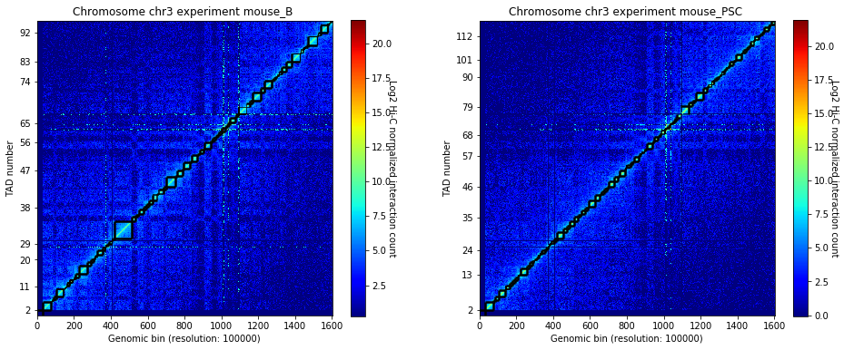

Focus on the genomic region to model.

.. code:: ipython2

    crm.visualize(['mouse_B', 'mouse_PSC'], normalized=True, paint_tads=True, focus=(300, 360))

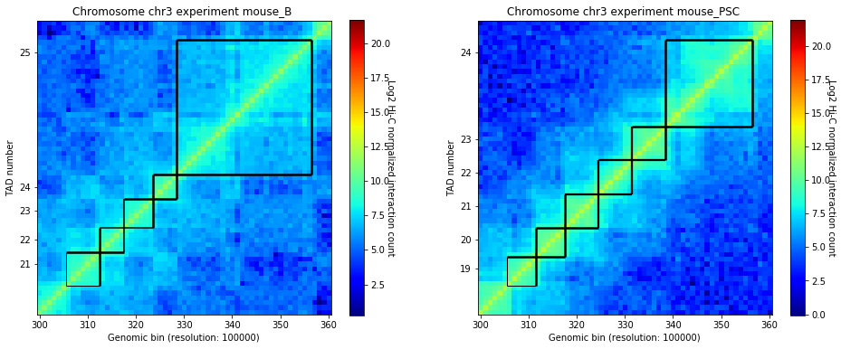

Data modellability assessment via MMP score
~~~~~~~~~~~~~~~~~~~~~~~~~~~~~~~~~~~~~~~~~~~

We can use the Matrix Modeling Potential (MMP) score (`Trussart M. et
al. Nature Communication,
2017 <https://www.ncbi.nlm.nih.gov/pmc/articles/PMC4402535/>`__) to
identify a priori whether the interaction matrices have the potential of
being use for modeling. The MMP score ranges from 0 to 1 and combines
three different measures: the contribution of the significant
eigenvectors, the skewness and the kurtosis of the distribution of
Z-scores.

.. code:: ipython2

    from pytadbit.utils.three_dim_stats import mmp_score

.. code:: ipython2

    mmp_score(hic_data1.get_matrix(focus='chr3:30000000-36000000'), savefig='../nbpictures/mmp_score.png')

.. ansi-block::

    (0.8049955427707568, 0.788681592624057, 0.6737285903820441, 0.9006937517389604)

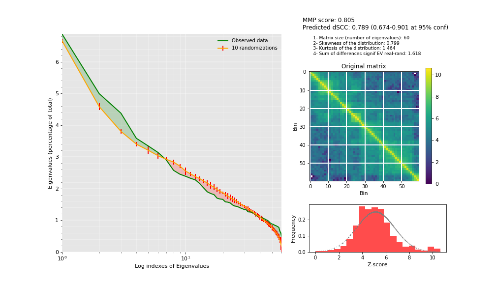

Data Transformation and scoring function
~~~~~~~~~~~~~~~~~~~~~~~~~~~~~~~~~~~~~~~~

This step is automatically done in TADbit. A a weight is generated for
each pair of interactions proportional to their interaction count as in
formula:

.. math:: weight(I, J) = \frac{\sum^N_{i=0}{\sum^N_{j=0}{(matrix(i, j))}}}{\sum^N_{i=0}{(matrix(i, J))} \times \sum^N_{j=0}{(matrix(I, j))}}

The raw data are then multiplied by this weight. In the case that
multiple experiments are used, the weighted interaction values are
normalised using a factor (default set as 1) in order to compare between
experiments. Then, a Z-score of the off-diagonal normalised/weighted
interaction is calculated as in formula:

.. math:: zscore(I, J) = \frac{log_{10}(weight(I, J) \times matrix(I, J)) - mean(log_{10}(weight \times matrix))}{stddev(log_{10}(weight \times matrix))}

The Z-scores are then transformed to distance restraints. To define the
type of restraints between each pair of particles. we need to identified
empirically three optimal parameters (i) a maximal distance between two
non-interacting particles (maxdist), (ii) a lower-bound cutoff to define
particles that do not interact frequently (lowfreq) and (iii) an
upper-bound cutoff to define particles that do interact frequently
(upfreq). In TADbit this is done via a grid search approach.

The following picture shows the different component of the scoring
funtion that is optimised during the Monte Carlo simulated annealing
sampling protocol. Two consecutive particles are spatially restrained by
a harmonic oscillator with an equilibrium distance that corresponds to
the sum of their radii. Non-consecutive particles with contact
frequencies above the upper-bound cutoff are restrained by a harmonic
oscillator at an equilibrium distance, while those below the lower-bound
cutoff are maintained further than an equilibrium distance by a lower
bound harmonic oscillator.

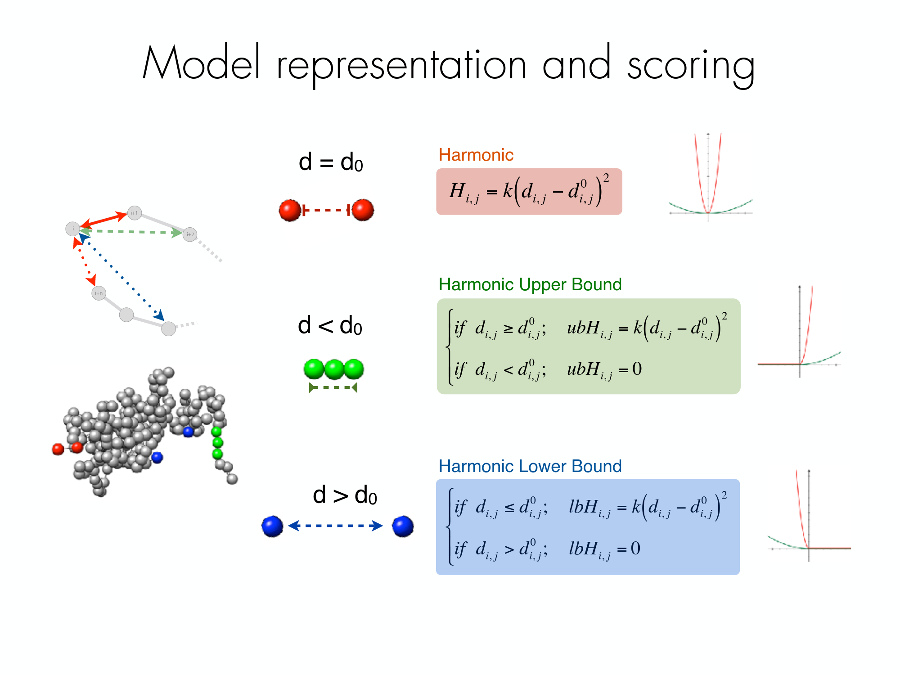

Optimization of parameters
--------------------------

We need to identified empirically (via a grid-search optimisation) the
optimal parameters for the mdoelling procedure:

-  maxdist: maximal distance assosiated two interacting particles.
-  upfreq: to define particles that do interact frequently (defines
   attraction)
-  lowfreq: to define particles that do not interact frequently (
   defines repulsion)
-  dcutoff: the definition of "contact" in units of bead diameter. Value
   of 2 means that a contact will occur when 2 beads are closer than 2
   times their diameter. This will be used to compare 3D models with
   Hi-C interaction maps.

Pairs of beads interacting less than lowfreq (left dashed line) are
penalized if they are closer than their assigned minimum distance
(Harmonic lower bound). Pairs of beads interacting more than ufreq
(right dashed line) are penalized if they are further apart than their
assigned maximum distance (Harmonic upper bound). Pairs of beads which
interaction fall in between lowfreq and upfreq are not penalized except
if they are neighbours (Harmonic)

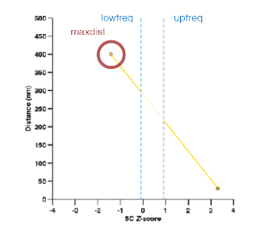

In the parameter optimization step we are going to give a set of ranges
for the different search parameters. For each possible combination
TADbit will produce a set of models.

In each individual model we consider that two beads are in contact if
their distance in 3D space is lower than the specified distance cutoff.
TADbit builds a cumulative contact map for each set of models as shown
in the schema below. The contact map is then compared with the Hi-C
interaction experiment by means of a Spearman correlation coefficient.
The sets having higher correlation coefficients are those that best
represents the original data.

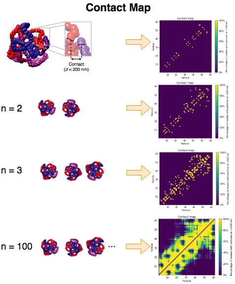

.. code:: ipython2

    opt_B = B.optimal_imp_parameters(start=300, end=360, n_models=40, n_keep=20, n_cpus=8, 
                                       upfreq_range=(0, 0.6, 0.3),
                                       lowfreq_range=(-0.9, 0, 0.3),
                                       maxdist_range=(1000, 2000, 500), 
                                       dcutoff_range=[2, 3, 4])

.. ansi-block::

    Optimizing 61 particles
      num scale	kbending	maxdist	lowfreq	upfreq	dcutoff	correlation

.. ansi-block::

      1   0.01 	0       	1000   	-0.9   	0     	4      0.1699
      1   0.01 	0       	1000   	-0.9   	0     	3      0.5399
      1   0.01 	0       	1000   	-0.9   	0     	2      0.8703
      2   0.01 	0       	1000   	-0.9   	0.3   	4      0.3357
      2   0.01 	0       	1000   	-0.9   	0.3   	3      0.6376
      2   0.01 	0       	1000   	-0.9   	0.3   	2      0.8724
      3   0.01 	0       	1000   	-0.9   	0.6   	4      0.5638
      3   0.01 	0       	1000   	-0.9   	0.6   	3      0.735
      3   0.01 	0       	1000   	-0.9   	0.6   	2      0.8341
      4   0.01 	0       	1000   	-0.6   	0     	4      0.1719
      4   0.01 	0       	1000   	-0.6   	0     	3      0.5417
      4   0.01 	0       	1000   	-0.6   	0     	2      0.87
      5   0.01 	0       	1000   	-0.6   	0.3   	4      0.3357
      5   0.01 	0       	1000   	-0.6   	0.3   	3      0.6375
      5   0.01 	0       	1000   	-0.6   	0.3   	2      0.8716
      6   0.01 	0       	1000   	-0.6   	0.6   	4      0.5647
      6   0.01 	0       	1000   	-0.6   	0.6   	3      0.7367
      6   0.01 	0       	1000   	-0.6   	0.6   	2      0.8347
      7   0.01 	0       	1000   	-0.3   	0     	4      0.1816
      7   0.01 	0       	1000   	-0.3   	0     	3      0.546
      7   0.01 	0       	1000   	-0.3   	0     	2      0.8663
      8   0.01 	0       	1000   	-0.3   	0.3   	4      0.3644
      8   0.01 	0       	1000   	-0.3   	0.3   	3      0.6365
      8   0.01 	0       	1000   	-0.3   	0.3   	2      0.8657
      9   0.01 	0       	1000   	-0.3   	0.6   	4      0.56
      9   0.01 	0       	1000   	-0.3   	0.6   	3      0.7333
      9   0.01 	0       	1000   	-0.3   	0.6   	2      0.8327
      10  0.01 	0       	1000   	0      	0     	4      0.1641
      10  0.01 	0       	1000   	0      	0     	3      0.538
      10  0.01 	0       	1000   	0      	0     	2      0.8642
      11  0.01 	0       	1000   	0      	0.3   	4      0.3614
      11  0.01 	0       	1000   	0      	0.3   	3      0.6382
      11  0.01 	0       	1000   	0      	0.3   	2      0.8704
      12  0.01 	0       	1000   	0      	0.6   	4      0.5564
      12  0.01 	0       	1000   	0      	0.6   	3      0.7318
      12  0.01 	0       	1000   	0      	0.6   	2      0.8283
      13  0.01 	0       	1500   	-0.9   	0     	4      0.2911
      13  0.01 	0       	1500   	-0.9   	0     	3      0.6079
      13  0.01 	0       	1500   	-0.9   	0     	2      0.8816
      14  0.01 	0       	1500   	-0.9   	0.3   	4      0.4308
      14  0.01 	0       	1500   	-0.9   	0.3   	3      0.6946
      14  0.01 	0       	1500   	-0.9   	0.3   	2      0.8797
      15  0.01 	0       	1500   	-0.9   	0.6   	4      0.6034
      15  0.01 	0       	1500   	-0.9   	0.6   	3      0.7661
      15  0.01 	0       	1500   	-0.9   	0.6   	2      0.8226
      16  0.01 	0       	1500   	-0.6   	0     	4      0.3003
      16  0.01 	0       	1500   	-0.6   	0     	3      0.6033
      16  0.01 	0       	1500   	-0.6   	0     	2      0.8842
      17  0.01 	0       	1500   	-0.6   	0.3   	4      0.4306
      17  0.01 	0       	1500   	-0.6   	0.3   	3      0.7004
      17  0.01 	0       	1500   	-0.6   	0.3   	2      0.8773
      18  0.01 	0       	1500   	-0.6   	0.6   	4      0.5964
      18  0.01 	0       	1500   	-0.6   	0.6   	3      0.7633
      18  0.01 	0       	1500   	-0.6   	0.6   	2      0.8305
      19  0.01 	0       	1500   	-0.3   	0     	4      0.3134
      19  0.01 	0       	1500   	-0.3   	0     	3      0.6251
      19  0.01 	0       	1500   	-0.3   	0     	2      0.8817
      20  0.01 	0       	1500   	-0.3   	0.3   	4      0.4292
      20  0.01 	0       	1500   	-0.3   	0.3   	3      0.6976
      20  0.01 	0       	1500   	-0.3   	0.3   	2      0.882
      21  0.01 	0       	1500   	-0.3   	0.6   	4      0.6027
      21  0.01 	0       	1500   	-0.3   	0.6   	3      0.7641
      21  0.01 	0       	1500   	-0.3   	0.6   	2      0.831
      22  0.01 	0       	1500   	0      	0     	4      0.3061
      22  0.01 	0       	1500   	0      	0     	3      0.6216
      22  0.01 	0       	1500   	0      	0     	2      0.886
      23  0.01 	0       	1500   	0      	0.3   	4      0.4257
      23  0.01 	0       	1500   	0      	0.3   	3      0.6979
      23  0.01 	0       	1500   	0      	0.3   	2      0.881
      24  0.01 	0       	1500   	0      	0.6   	4      0.6047
      24  0.01 	0       	1500   	0      	0.6   	3      0.7652
      24  0.01 	0       	1500   	0      	0.6   	2      0.826
      25  0.01 	0       	2000   	-0.9   	0     	4      0.4056
      25  0.01 	0       	2000   	-0.9   	0     	3      0.701
      25  0.01 	0       	2000   	-0.9   	0     	2      0.8931
      26  0.01 	0       	2000   	-0.9   	0.3   	4      0.5013
      26  0.01 	0       	2000   	-0.9   	0.3   	3      0.7637
      26  0.01 	0       	2000   	-0.9   	0.3   	2      0.8874
      27  0.01 	0       	2000   	-0.9   	0.6   	4      0.6337
      27  0.01 	0       	2000   	-0.9   	0.6   	3      0.7854
      27  0.01 	0       	2000   	-0.9   	0.6   	2      0.8334
      28  0.01 	0       	2000   	-0.6   	0     	4      0.4141
      28  0.01 	0       	2000   	-0.6   	0     	3      0.6998
      28  0.01 	0       	2000   	-0.6   	0     	2      0.8956
      29  0.01 	0       	2000   	-0.6   	0.3   	4      0.5109
      29  0.01 	0       	2000   	-0.6   	0.3   	3      0.7621
      29  0.01 	0       	2000   	-0.6   	0.3   	2      0.8843
      30  0.01 	0       	2000   	-0.6   	0.6   	4      0.6316
      30  0.01 	0       	2000   	-0.6   	0.6   	3      0.7835
      30  0.01 	0       	2000   	-0.6   	0.6   	2      0.8361
      31  0.01 	0       	2000   	-0.3   	0     	4      0.4018
      31  0.01 	0       	2000   	-0.3   	0     	3      0.6995
      31  0.01 	0       	2000   	-0.3   	0     	2      0.8917
      32  0.01 	0       	2000   	-0.3   	0.3   	4      0.5099
      32  0.01 	0       	2000   	-0.3   	0.3   	3      0.7648
      32  0.01 	0       	2000   	-0.3   	0.3   	2      0.8847
      33  0.01 	0       	2000   	-0.3   	0.6   	4      0.6404
      33  0.01 	0       	2000   	-0.3   	0.6   	3      0.7922
      33  0.01 	0       	2000   	-0.3   	0.6   	2      0.8407
      34  0.01 	0       	2000   	0      	0     	4      0.3912
      34  0.01 	0       	2000   	0      	0     	3      0.6963
      34  0.01 	0       	2000   	0      	0     	2      0.8929
      35  0.01 	0       	2000   	0      	0.3   	4      0.5051
      35  0.01 	0       	2000   	0      	0.3   	3      0.7564
      35  0.01 	0       	2000   	0      	0.3   	2      0.8858
      36  0.01 	0       	2000   	0      	0.6   	4      0.6377
      36  0.01 	0       	2000   	0      	0.6   	3      0.7839
      36  0.01 	0       	2000   	0      	0.6   	2      0.8392

.. code:: ipython2

    opt_B.plot_2d(show_best=10)

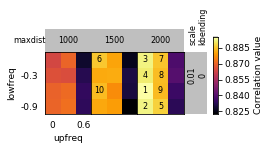

Refine optimization in a small region:

.. code:: ipython2

    opt_B.run_grid_search(upfreq_range=(0, 0.3, 0.3), lowfreq_range=(-0.9, -0.3, 0.3),
                           maxdist_range=[1750], 
                           dcutoff_range=[2, 3],
                           n_cpus=8)

.. ansi-block::

    Optimizing 61 particles
      num scale	kbending	maxdist	lowfreq	upfreq	dcutoff	correlation

.. ansi-block::

      1   0.01 	0       	1750   	-0.9   	0     	3      0.6576
      1   0.01 	0       	1750   	-0.9   	0     	2      0.8908
      2   0.01 	0       	1750   	-0.9   	0.3   	3      0.7223
      2   0.01 	0       	1750   	-0.9   	0.3   	2      0.8791
      3   0.01 	0       	1750   	-0.6   	0     	3      0.6603
      3   0.01 	0       	1750   	-0.6   	0     	2      0.889
      4   0.01 	0       	1750   	-0.6   	0.3   	3      0.7223
      4   0.01 	0       	1750   	-0.6   	0.3   	2      0.8827
      5   0.01 	0       	1750   	-0.3   	0     	3      0.6543
      5   0.01 	0       	1750   	-0.3   	0     	2      0.8909
      6   0.01 	0       	1750   	-0.3   	0.3   	3      0.731
      6   0.01 	0       	1750   	-0.3   	0.3   	2      0.8823

.. code:: ipython2

    opt_B.plot_2d(show_best=5)

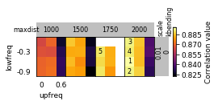

.. code:: ipython2

    opt_B.run_grid_search(upfreq_range=(0, 0.3, 0.3), lowfreq_range=(-0.3, 0, 0.1),
                           maxdist_range=[2000, 2250], 
                           dcutoff_range=[2],
                           n_cpus=8)

.. ansi-block::

      xx   	0.01 	0       	2000   	-0.3   	0     	4      	0.4018
      xx   	0.01 	0       	2000   	-0.3   	0.3   	2      	0.8847

.. ansi-block::

    Optimizing 61 particles
      num scale	kbending	maxdist	lowfreq	upfreq	dcutoff	correlation

.. ansi-block::

      1   0.01 	0       	2000   	-0.2   	0     	2      0.8933
      2   0.01 	0       	2000   	-0.2   	0.3   	2      0.8842
      3   0.01 	0       	2000   	-0.1   	0     	2      0.8945
      4   0.01 	0       	2000   	-0.1   	0.3   	2      0.8866
      xx   	0.01 	0       	2000   	0      	0     	4      	0.3912
      xx   	0.01 	0       	2000   	0      	0.3   	2      	0.8858
      5   0.01 	0       	2250   	-0.3   	0     	2      0.8944
      6   0.01 	0       	2250   	-0.3   	0.3   	2      0.886
      7   0.01 	0       	2250   	-0.2   	0     	2      0.8952
      8   0.01 	0       	2250   	-0.2   	0.3   	2      0.8876
      9   0.01 	0       	2250   	-0.1   	0     	2      0.8954
      10  0.01 	0       	2250   	-0.1   	0.3   	2      0.8881
      11  0.01 	0       	2250   	0      	0     	2      0.895
      12  0.01 	0       	2250   	0      	0.3   	2      0.8855

.. code:: ipython2

    opt_B.plot_2d(show_best=5)

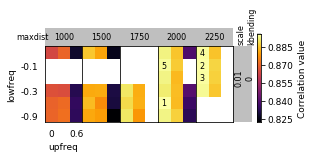

.. code:: ipython2

    opt_B.run_grid_search(upfreq_range=(0, 0.3, 0.1), lowfreq_range=(-0.3, 0, 0.1),
                           n_cpus=8,
                           maxdist_range=[2000, 2250], 
                           dcutoff_range=[2])

.. ansi-block::

      xx   	0.01 	0       	2000   	-0.3   	0     	4      	0.4018

.. ansi-block::

    Optimizing 61 particles
      num scale	kbending	maxdist	lowfreq	upfreq	dcutoff	correlation

.. ansi-block::

      1   0.01 	0       	2000   	-0.3   	0.1   	2      0.8905
      2   0.01 	0       	2000   	-0.3   	0.2   	2      0.8877
      xx   	0.01 	0       	2000   	-0.3   	0.3   	2      	0.8847
      xx   	0.01 	0       	2000   	-0.2   	0     	2      	0.8933
      3   0.01 	0       	2000   	-0.2   	0.1   	2      0.8857
      4   0.01 	0       	2000   	-0.2   	0.2   	2      0.8864
      xx   	0.01 	0       	2000   	-0.2   	0.3   	2      	0.8842
      xx   	0.01 	0       	2000   	-0.1   	0     	2      	0.8945
      5   0.01 	0       	2000   	-0.1   	0.1   	2      0.8892
      6   0.01 	0       	2000   	-0.1   	0.2   	2      0.8854
      xx   	0.01 	0       	2000   	-0.1   	0.3   	2      	0.8866
      xx   	0.01 	0       	2000   	0      	0     	4      	0.3912
      7   0.01 	0       	2000   	0      	0.1   	2      0.8895
      8   0.01 	0       	2000   	0      	0.2   	2      0.8846
      xx   	0.01 	0       	2000   	0      	0.3   	2      	0.8858
      xx   	0.01 	0       	2250   	-0.3   	0     	2      	0.8944
      9   0.01 	0       	2250   	-0.3   	0.1   	2      0.8941
      10  0.01 	0       	2250   	-0.3   	0.2   	2      0.8876
      xx   	0.01 	0       	2250   	-0.3   	0.3   	2      	0.886
      xx   	0.01 	0       	2250   	-0.2   	0     	2      	0.8952
      11  0.01 	0       	2250   	-0.2   	0.1   	2      0.8917
      12  0.01 	0       	2250   	-0.2   	0.2   	2      0.8893
      xx   	0.01 	0       	2250   	-0.2   	0.3   	2      	0.8876
      xx   	0.01 	0       	2250   	-0.1   	0     	2      	0.8954
      13  0.01 	0       	2250   	-0.1   	0.1   	2      0.8974
      14  0.01 	0       	2250   	-0.1   	0.2   	2      0.8855
      xx   	0.01 	0       	2250   	-0.1   	0.3   	2      	0.8881
      xx   	0.01 	0       	2250   	0      	0     	2      	0.895
      15  0.01 	0       	2250   	0      	0.1   	2      0.8948
      16  0.01 	0       	2250   	0      	0.2   	2      0.8876
      xx   	0.01 	0       	2250   	0      	0.3   	2      	0.8855

.. code:: ipython2

    opt_B.plot_2d(show_best=5)

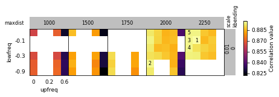

.. code:: ipython2

    opt_B.get_best_parameters_dict()

.. ansi-block::

    {'dcutoff': 2.0,
     'kbending': 0.0,
     'kforce': 5,
     'lowfreq': -0.1,
     'maxdist': 2250.0,
     'reference': '',
     'scale': 0.01,
     'upfreq': 0.1}

For the other replicate, we can reduce the space of search:

.. code:: ipython2

    opt_PSC = PSC.optimal_imp_parameters(start=300, end=360, n_models=40, n_keep=20, n_cpus=8, 
                                         upfreq_range=(0, 0.3, 0.1),
                                         lowfreq_range=(-0.3, -0.1, 0.1),
                                         maxdist_range=(2000, 2250, 250), 
                                         dcutoff_range=[2])

.. ansi-block::

    Optimizing 61 particles
      num scale	kbending	maxdist	lowfreq	upfreq	dcutoff	correlation

.. ansi-block::

      1   0.01 	0       	2000   	-0.3   	0     	2      0.925
      2   0.01 	0       	2000   	-0.3   	0.1   	2      0.9242
      3   0.01 	0       	2000   	-0.3   	0.2   	2      0.9199
      4   0.01 	0       	2000   	-0.3   	0.3   	2      0.9119
      5   0.01 	0       	2000   	-0.2   	0     	2      0.9243
      6   0.01 	0       	2000   	-0.2   	0.1   	2      0.924
      7   0.01 	0       	2000   	-0.2   	0.2   	2      0.9191
      8   0.01 	0       	2000   	-0.2   	0.3   	2      0.9122
      9   0.01 	0       	2000   	-0.1   	0     	2      0.9255
      10  0.01 	0       	2000   	-0.1   	0.1   	2      0.9231
      11  0.01 	0       	2000   	-0.1   	0.2   	2      0.9194
      12  0.01 	0       	2000   	-0.1   	0.3   	2      0.911
      13  0.01 	0       	2250   	-0.3   	0     	2      0.9274
      14  0.01 	0       	2250   	-0.3   	0.1   	2      0.9239
      15  0.01 	0       	2250   	-0.3   	0.2   	2      0.918
      16  0.01 	0       	2250   	-0.3   	0.3   	2      0.9126
      17  0.01 	0       	2250   	-0.2   	0     	2      0.9262
      18  0.01 	0       	2250   	-0.2   	0.1   	2      0.9239
      19  0.01 	0       	2250   	-0.2   	0.2   	2      0.9172
      20  0.01 	0       	2250   	-0.2   	0.3   	2      0.9122
      21  0.01 	0       	2250   	-0.1   	0     	2      0.9287
      22  0.01 	0       	2250   	-0.1   	0.1   	2      0.9243
      23  0.01 	0       	2250   	-0.1   	0.2   	2      0.9172
      24  0.01 	0       	2250   	-0.1   	0.3   	2      0.9144

.. code:: ipython2

    opt_PSC.plot_2d(show_best=5)

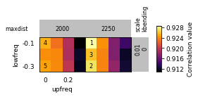

.. code:: ipython2

    opt_PSC.get_best_parameters_dict()

.. ansi-block::

    {'dcutoff': 2.0,
     'kbending': 0.0,
     'kforce': 5,
     'lowfreq': -0.1,
     'maxdist': 2250.0,
     'reference': '',
     'scale': 0.01,
     'upfreq': 0.0}

