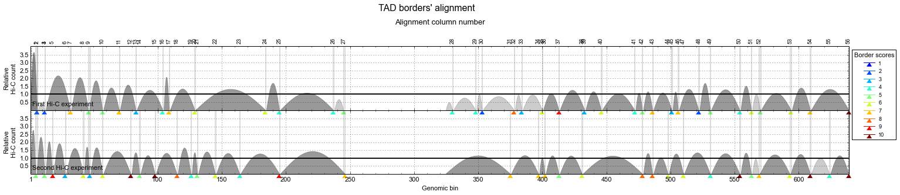
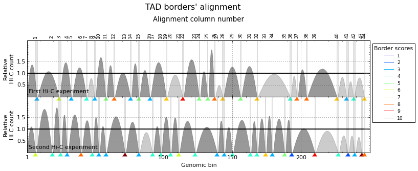
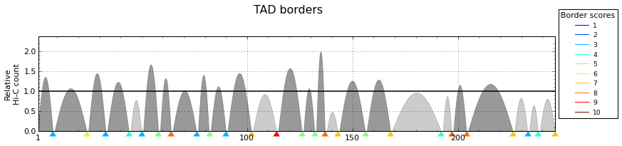

Alignment of TAD boundaries
===========================

.. contents::
   :depth: 3

TADbit allows to use the information from different Hi-C experiments and to put it together in order to 
decide whether some TAD boundaries are conserved or not.

Following with the example in the previous section (:ref:`getting_start`), we will load one extra experiment 
(from the same works of [Lieberman-Aiden2009]_):

.. code:: python

    from pytadbit import Chromosome
    
    # initiate a chromosome object that will store all Hi-C data and analysis
    my_chrom = Chromosome(name='My fisrt chromosome', centromere_search=True)
    
    # load Hi-C data
    my_chrom.add_experiment('First Hi-C experiment', hic_data="../../scripts/sample_data/HIC_k562_chr19_chr19_100000_obs.txt", resolution=100000)
    my_chrom.add_experiment('Second Hi-C experiment', hic_data="../../scripts/sample_data/HIC_gm06690_chr19_chr19_100000_obs.txt", resolution=100000)
    
    # Filter and normalize Hi-C matrices
    my_chrom.experiments['First Hi-C experiment'].filter_columns()
    my_chrom.experiments['Second Hi-C experiment'].filter_columns()
    my_chrom.experiments['First Hi-C experiment'].normalize_hic(iterations=30, max_dev=0.1)
    my_chrom.experiments['Second Hi-C experiment'].normalize_hic(iterations=30, max_dev=0.1)
    
    # run core tadbit function to find TADs, on each experiment
    my_chrom.find_tad('First Hi-C experiment', ncpus=4)
    my_chrom.find_tad('Second Hi-C experiment', ncpus=4)
       
    print my_chrom.experiments

.. ansi-block::

    /usr/local/lib/python2.7/dist-packages/pytadbit/parsers/hic_parser.py:98: UserWarning: WARNING: non integer values
      warn('WARNING: non integer values')
    /usr/local/lib/python2.7/dist-packages/pytadbit/utils/hic_filtering.py:148: ComplexWarning: Casting complex values to real discards the imaginary part
      round(root, 3), ' '.join(
    
    WARNING: removing columns having less than 46.314 counts:
       245   246   247   248   249   250   251   252   253   254   255   256   257   258   259   260   261   262   263   264
       265   266   267   268   269   270   271   272   273   274   275   276   277   278   279   280   281   282   283   284
       285   286   287   288   289   290   291   292   293   294   295   296   297   298   299   300   301   302   303   304
       305   306   307   308   309   310   311   312   313   314   315   316   317   318   319   320   321   322   323   324
       639
    
    WARNING: removing columns having less than 76.97 counts:
       246   247   248   249   250   251   252   253   254   255   256   257   258   259   260   261   262   263   264   265
       266   267   268   269   270   271   272   273   274   275   276   277   278   279   280   281   282   283   284   285
       286   287   288   289   290   291   292   293   294   295   296   297   298   299   300   301   302   303   304   305
       306   307   308   309   310   311   312   313   314   315   316   317   318   319   320   321   322   323   324   639
    

.. ansi-block::

    iterative correction
                49.000         341.532        1342.000    0   2.92935
               139.270         402.232        1851.850    1   3.60393
               106.547         446.349         823.188    2   0.84427
               291.427         478.358        1558.017    3   2.25701
               170.153         505.116         692.435    4   0.66314
               388.071         526.012        1311.444    5   1.49318
               235.726         543.686         688.292    6   0.56643
               442.199         557.807        1137.874    7   1.03991
               295.885         569.706         689.294    8   0.48064
               480.023         579.308        1020.535    9   0.76165
               350.139         587.353         687.806   10   0.40387
               508.486         593.878         930.721   11   0.56719
               398.234         599.321         684.504   12   0.33552
               531.296         603.750         862.416   13   0.42843
               439.558         607.430         678.216   14   0.27637
               549.819         610.433         810.355   15   0.32751
               474.266         612.921         671.209   16   0.22622
               564.630         614.955         770.461   17   0.25287
               502.952         616.638         664.452   18   0.18437
               576.402         618.015         739.694   19   0.19689
               526.394         619.153         658.326   20   0.14982
               585.751         620.086         715.815   21   0.15438
               545.408         620.855         652.947   22   0.12152
               593.187         621.487         697.170   23   0.12178
               560.754         622.007         648.310   24   0.09848
    iterative correction
               145.000         980.181        2207.000    0   1.25163
               608.654        1002.177        2710.006    1   1.70412
               498.304        1010.461        1323.625    2   0.50685
               865.363        1013.794        1629.838    3   0.60766
               729.059        1015.556        1108.639    4   0.28211
               966.332        1016.460        1272.554    5   0.25195
               870.542        1016.979        1047.025    6   0.14399
               994.846        1017.278        1131.194    7   0.11198
               945.435        1017.459        1034.748    8   0.07079
    [3.0, 6.0, 3.0, 4.0, 3.0, 5.0, 8.0, 3.0, 5.0, 3.0, 7.0, 9.0, 5.0, 5.0, 8.0, 7.0, 5.0, 7.0, 4.0, 8.0, 8.0, 7.0, 3.0, 4.0, 7.0, 8.0, 5.0, 4.0, 8.0, 7.0, 6.0, 4.0, 5.0, 7.0, 2.0, 2.0, 3.0, 3.0, 8.0, 3.0, 6.0, 6.0, 2.0, 9.0, 4.0, 3.0, 6.0, 4.0, 6.0, 4.0, 5.0, 3.0, 5.0, 7.0, 7.0, 4.0, 3.0, 4.0, 5.0, 5.0, 3.0]
    [6.0, 4.0, 4.0, 3.0, 8.0, 4.0, 3.0, 3.0, 10.0, 3.0, 4.0, 4.0, 4.0, 6.0, 4.0, 3.0, 3.0, 4.0, 4.0, 4.0, 7.0, 3.0, 5.0, 2.0, 9.0, 4.0, 2.0, 3.0, 10.0, 8.0, 6.0, 6.0, 5.0, 2.0, 2.0, 2.0, 8.0, 5.0, 4.0, 5.0, 5.0, 5.0, 3.0, 2.0, 5.0, 2.0, 10.0, 7.0, 5.0, 3.0, 4.0, 5.0, 8.0, 1.0, 7.0, 3.0]
    [Experiment First Hi-C experiment (resolution: 100Kb, TADs: 63, Hi-C rows: 639, normalized: visibility_factor:1), Experiment Second Hi-C experiment (resolution: 100Kb, TADs: 58, Hi-C rows: 639, normalized: visibility_factor:1)]

We now have loaded two Hi-C experiments, both at 100 Kb resolution, and have predicted the location of TADs in each of them (42 TADs detected in the first experiment and 31 in the second).

Aligning boundaries
-------------------

To align TAD boundaries several algorithms have been implemented 
(see :func:`pytadbit.chromosome.Chromosome.align_experiments`); our recommendation, however, is to use 
the default "reciprocal" method (:func:`pytadbit.boundary_aligner.reciprocally.reciprocal`). 

*Note: If the align_experiments function is run with no argument, by default all the loaded experiments will be aligned.*

Continuing with the example, the two loaded experiments are aligned as follow:

.. code:: python

    my_chrom.align_experiments(names=["First Hi-C experiment", "Second Hi-C experiment"])
    
    print my_chrom.alignment

.. ansi-block::

    {('First Hi-C experiment', 'Second Hi-C experiment'): Alignment of boundaries (length: 95, number of experiments: 2)}

All the alignments done between the experiments belonging to the same chromosome are stored under the 
alignment dictionary attached to the Chromosome object. Each alignment is an object itself 
(see :class:`pytadbit.alignment.Alignment`)

Check alignment consistency through randomization
~~~~~~~~~~~~~~~~~~~~~~~~~~~~~~~~~~~~~~~~~~~~~~~~~

In order to check that the alignment makes sense and that it does not correspond to a random association of boundaries, the “randomize” parameter can be set to True when aligning:

.. code:: python

    score, pval = my_chrom.align_experiments(randomize=True, rnd_method="interpolate",
                                             rnd_num=100)
    
    print 'score:', score
    print 'p-value:', pval

.. ansi-block::

    score: 0.2
    p-value: 0.0

Alignment objects
-----------------

Visualization
~~~~~~~~~~~~~

The first function to call to check the quality of the generated alignments is the 
:func:`pytadbit.alignment.Alignment.write_alignment`:

.. code:: python

    ali = my_chrom.alignment[('First Hi-C experiment', 'Second Hi-C experiment')]
    
    print ali

.. ansi-block::

    Alignment shown in 100 Kb (2 experiments) (scores: 0 1 2 3 4 5 6 7 8 9 10)
     First Hi-C experiment:|     8| ---- |    24| ---- |    33| ---- |    44| ---- |    50| ---- |    58|    64| ---- |    76|    82|    90| ---- | ---- |   102| ---- | ---- |   114| ---- |   126|   132|   137| ---- |   143| ---- |   156| ---- |   168| ---- | ---- | ---- |   192|   197|   204| ---- |   226|   233|   238| ---- |   246|   325|   330|   349|   356|   364|   378| ---- |   383|   388|   403|   409| ---- |   418| ---- |   427| ---- |   437| ---- |   444|   454| ---- |   459|   465|   471|   477|   487| ---- | ---- |   500|   505| ---- |   511|   516|   525| ---- |   530|   538|   548|   556|   562| ---- |   576|   587|   592|   600|   606| ---- |   622| ---- |   633|   639
    Second Hi-C experiment:|     7|    19|    25|    30| ---- |    40| ---- |    48| ---- |    53|    58| ---- |    72| ---- |    82| ---- |    92|    98| ---- |   105|   111| ---- |   123| ---- | ---- | ---- |   139|   144|   150| ---- |   163|   168|   174|   179|   188|   193| ---- | ---- |   210|   227|   234|   239|   244|   246| ---- | ---- | ---- | ---- | ---- | ---- |   380| ---- | ---- |   404|   410|   415| ---- |   420|   426|   431| ---- |   440| ---- | ---- |   456| ---- |   465|   471|   477|   486|   493|   498| ---- | ---- |   509| ---- | ---- | ---- |   528| ---- |   537| ---- |   556| ---- |   568|   576|   588|   593|   600| ---- |   615| ---- |   624|   633|   639
    

The different colors, corresponding to the TADbit confidence in detecting the boundaries, show how conserved the boundaries are between (in this case) cell types.

Alignment can also be viewed using matplotlib (already mention in :ref:`density_plot`):

.. code:: python

    ali.draw()

*Note that this function can also be zoomed in.*

.. code:: python

    ali.draw(focus=(1, 250))

.. code:: python

    xpr = my_chrom.experiments[0]
    my_chrom.tad_density_plot(0, focus=(1, 300))

The get\_column function
~~~~~~~~~~~~~~~~~~~~~~~~

The :func:`pytadbit.alignment.Alignment.get_column` function allows to select specific columns of an alignment. 

To select, for example, the third column of an alignment:

.. code:: python

    ali.get_column(3)

.. ansi-block::

    [(2, [>2300<, >2400<])]

The first element of the tuple is the column index, while the two values of the second element of the tuple 
are the TADs associated to the aligned boundaries in that column. Note that TAD objects are represented 
between the '>' and '<' symbols (see: :class:`pytadbit.alignment.TAD`).

The :func:`pytadbit.alignment.Alignment.get_column` function can also take as an argument a function, in 
order to select a column (or several) depending on a specific condition. For example, to select all the 
boundaries with a score higher than 7:

.. code:: python

    cond1 = lambda x: x['score'] > 7

and to the get the selected columns:

.. code:: python

    ali.get_column(cond1=cond1)

.. ansi-block::

    [(94, [>63800<, >63800<])]

resulting, in the selection of these 3 columns.

To add a second condition, e.g. to select only the columns after the 50th column of the alignment:

.. code:: python

    cond2 = lambda x: x['pos'] > 50
    ali.get_column(cond1=cond1, cond2=cond2)

.. ansi-block::

    [(94, [>63800<, >63800<])]

Finally, to be more flexible, this conditions can be applied to only a given number of experiments (in this example of a pairwise alignment, it does not make a lot of sense):

.. code:: python

    ali.get_column(cond1=cond1, cond2=cond2, min_num=1)

.. ansi-block::

    [(61, [>-<, >43900<]),
     (63, [>45300<, >-<]),
     (69, [>48600<, >48500<]),
     (80, [>53700<, >53600<]),
     (88, [>59900<, >59900<]),
     (94, [>63800<, >63800<])]

