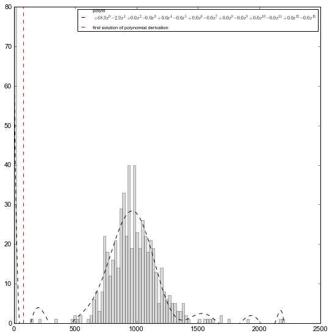

Hi-C data processing
====================

Data filtering
--------------

Remove outliers
~~~~~~~~~~~~~~~

To model chromatin structure, we need to ensure that our data is clean
enough. The first step is thus to draw the distribution of the sum of
interactions per raw/columns in the Hi-C matrix. According to this
distribution, we may remove some columns if they present a suspiciously
low count of interaction.

Here an example, where "exp" is an preloaded Experiment corresponding to
human's 19th chromosome:

.. code:: python

    from pytadbit import Chromosome
    
    my_chrom = Chromosome('19')
    my_chrom.add_experiment('gm', resolution=10000, 
                            hic_data='../../scripts/sample_data/HIC_gm06690_chr19_chr19_100000_obs.txt')
    
    exp = my_chrom.experiments[0]
    
    zeroes = exp.filter_columns(draw_hist=True)
    

.. ansi-block::

    /usr/local/lib/python2.7/dist-packages/pytadbit/parsers/hic_parser.py:93: UserWarning: WARNING: non integer values
      warn('WARNING: non integer values')
    /usr/lib/python2.7/dist-packages/numpy/core/numeric.py:460: ComplexWarning: Casting complex values to real discards the imaginary part
      return array(a, dtype, copy=False, order=order)

.. ansi-block::

    /usr/local/lib/python2.7/dist-packages/pytadbit/utils/hic_filtering.py:132: ComplexWarning: Casting complex values to real discards the imaginary part
      round(root, 3), ' '.join(
    
    WARNING: removing columns having less than 67.485 counts:
       246   247   248   249   250   251   252   253   254   255   256   257   258   259   260   261   262   263   264   265
       266   267   268   269   270   271   272   273   274   275   276   277   278   279   280   281   282   283   284   285
       286   287   288   289   290   291   292   293   294   295   296   297   298   299   300   301   302   303   304   305
       306   307   308   309   310   311   312   313   314   315   316   317   318   319   320   321   322   323   324   639
    

*Note that the columns cited in the warning correspond to the columns on
the left of the dot vertical red line*

Than, according to the fit represented above, we would discard all
columns in the Hi-C raw data having cumulative count of interaction
below the dashed red line in the graph above (~67). This columns will be
removed from the modeling, and their associated particles will have no
experimental data.

*This step is done automatically within tadbit each time an experiment
is loaded. In order to ensure that we do remove outlier columns, tadbit
checks if this root corresponds to a* **concave down** *region and if it
stands* **between zero and the median** \*of the overall distribution.
The result of these "bad" columns is stored in the variable
Experiment.\_zeros, that represents the columns to be skipped in the
consecutive steps.\*

\*Also it is not recommended to do it, the column filtering can be
skipped, using the ``filter_columns=False`` parameter when loading or
creating a :class:``pytadbit.experiment.Experiment``

Remove row/columns where diagonal is null
~~~~~~~~~~~~~~~~~~~~~~~~~~~~~~~~~~~~~~~~~

In case TADbit find a null value right in the diagonal of the Hi-C data
matrix (where highest values are expected), TADbit assumes that this
observation is artefactual and removes the whole row and column passing
through this bin.

Dealing with NaNs
~~~~~~~~~~~~~~~~~

Any row or column that contains a *NaN* value will be removed from
further steps.

Data normalization
------------------

Hi-C data stored in :class:`pytadbit.experiment.Experiment` might be normalized in order to be used by IMP.
This normalization is achieve in two steps, first we generate weight for each pair of interactions, depending on the interaction count in the corresponding row/column, second we calculate the `z-score <http://en.wikipedia.org/wiki/Standard_score#Calculation_from_raw_score>`_ of each of these interaction pairs.

Calculation of weights
~~~~~~~~~~~~~~~~~~~~~~

Weights are calculated according to this formula (see :func:`pytadbit.experiment.Experiment.normalize_hic`):

.. math::

  weight(I, J) = \frac{\sum^N_{i=0}{\sum^N_{j=0}{(matrix(i, j))}}}{\sum^N_{i=0}{(matrix(i, J))} \times \sum^N_{j=0}{(matrix(I, j))}}

"matrix", being our row data (count of interactions), N the number of rows/columns.

The result is stored in a new matrix, called weight. The values that will be used in the next step are the multiplication of this weights per the raw data.

There is one extra step of the normalization that consists in making the normalized values comparable between experiments. This step is control by the parameter `factor` and consists in asking to the function to normalize in order that the overall mean value of a cell would be equal to the value of `factor`. By default factor is set to 1, thus the mean value of a cell in a normalized matrix would be 1, and the summ of the normalized Hi-C count of a matrix of 100x100 would be equal to 10000. When 2 experiments are summed the resulting experiment would have a factor equal to the sum of the factors of the summed experiments, and in the same way, when changes in the resoltuion of an experiment (through :func:`pytadbit.experiment.Experiment.set_resolution`) will also change the factor according to the change of the resolution.

.. note::

  Filtered rows/columns are not taken into account for normalization

.. note::

  When modelling a portion of a chromosome values used are taken from the normalization of the whole chromosome, **no local normalization is done**.

Calculation of the z-score
~~~~~~~~~~~~~~~~~~~~~~~~~~

Z-scores are computed according to classical formula (:math:`\frac{x-\mu}{\sigma}`), over the decimal logarithm values of the normalized data (see above). Ending in this formula:

.. math::

  zscore(I, J) = \frac{log_{10}(weight(I, J) \times matrix(I, J)) - mean(log_{10}(weight \times matrix))}{stddev(log_{10}(weight \times matrix))}

**Important: values on the diagonal are not taken into account for this calculus.**

Dealing with zeros
^^^^^^^^^^^^^^^^^^

A zero in an Hi-C interaction matrix, means that the given two fragments of DNA were never found close enough to be crosslinked together. However such values are also highly suspicious to be artifacts. 

Right now we assume that :math:`log_{10}(0) = 0`, in the calculation of the mean and stddev, and equal to -1 in the calculation of the z-score itself.
