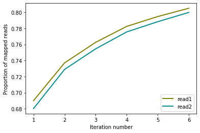
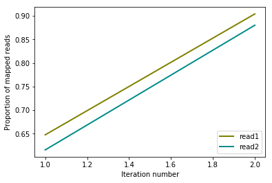
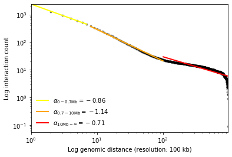
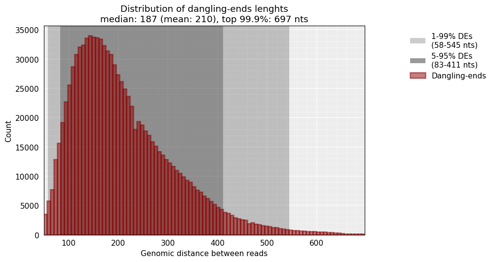
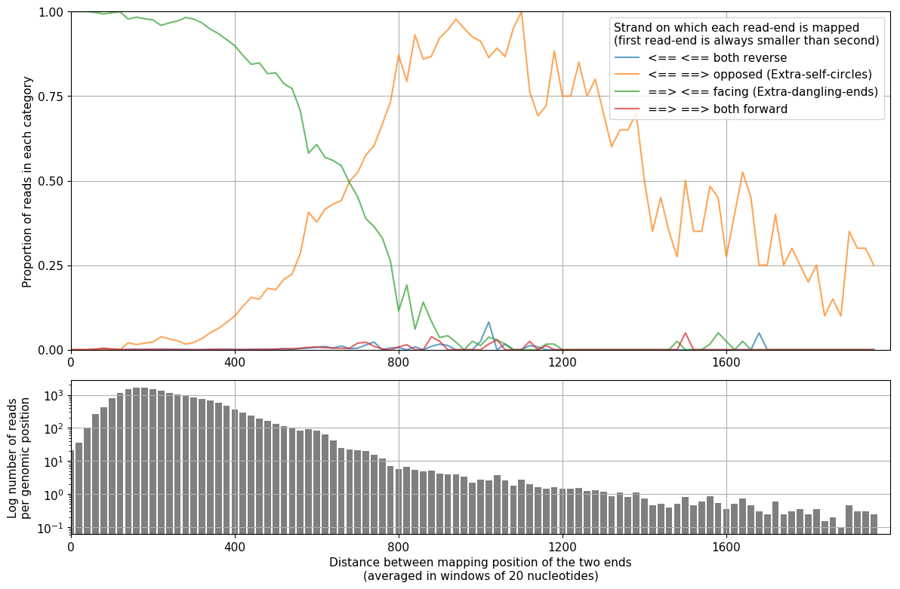
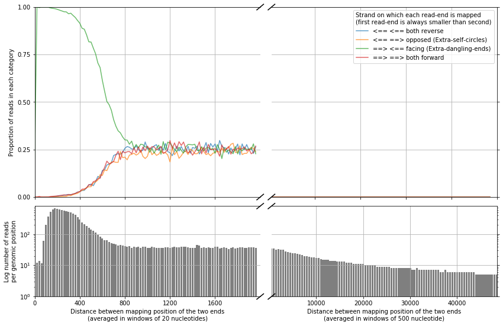

Load mapped read-ends and generate a matrix
===========================================

We read now each mapped read-ends in the map files and extact the ones
that are uniquely mapped. For each of these uniquely mapped read-ends,
we store: - The strand - The genomic location (most upstream position is
reported for both sequences mapped in forward and reverse strand) - The
chromosome - The sequence itself - The **restriction enzyme fragment**
on which it is located

This information will be used to filter the reads and, finally, to
construct the interaction matrix. Above we show the same analysis done
for the fragment-based and iterative mapping strategies.

Extract uniquely mapped reads
~~~~~~~~~~~~~~~~~~~~~~~~~~~~~

.. code:: ipython3

    # replicate and enzyme used
    cell = 'mouse_B'  # or mouse_PSC
    rep = 'rep1'  # or rep2

*Note: the execution of this notebook should be repeated for each of the
4 replicates*

Load genomic sequence to map restriction sites
^^^^^^^^^^^^^^^^^^^^^^^^^^^^^^^^^^^^^^^^^^^^^^

.. code:: ipython3

    from pytadbit.parsers.genome_parser import parse_fasta

.. code:: ipython3

    genome_seq = parse_fasta('genome/Mus_musculus-GRCm38.p6/Mus_musculus-GRCm38.p6.fa')

.. ansi-block::

    Loading cached genome

.. code:: ipython3

    from pytadbit.parsers.map_parser import parse_map

Iterative mapping results
~~~~~~~~~~~~~~~~~~~~~~~~~

In case we haven’t stored the location of each of the reads we could
load them as follow:

.. code:: ipython3

    maps1 = [('results/iterativ/{0}_{1}/01_mapping/mapped_{0}_{1}_r1/'
              '{0}_{1}_1.fastq_full_1-{2}.map').format(cell, rep, i) 
             for i in range(25, 80, 10)]
    
    maps2 = [('results/iterativ/{0}_{1}/01_mapping/mapped_{0}_{1}_r2/'
              '{0}_{1}_2.fastq_full_1-{2}.map').format(cell, rep, i) 
             for i in range(25, 80, 10)]

Load all reads, and check if they are uniquely mapped. The Result is
stored in two separate tab-separated-values (tsv) files that will
contain the essential information of each read-end

.. code:: ipython3

    ! mkdir -p results/iterativ/$cell\_$rep/02_parsing

.. code:: ipython3

    parse_map(maps1, maps2,
              'results/iterativ/{0}_{1}/02_parsing/reads1_{0}_{1}.tsv'.format(cell, rep),
              'results/iterativ/{0}_{1}/02_parsing/reads2_{0}_{1}.tsv'.format(cell, rep),
              genome_seq=genome_seq, re_name='MboI', verbose=True)

.. ansi-block::

    Searching and mapping RE sites to the reference genome
    Found 6669655 RE sites
    Loading read1
    loading file: results/iterativ/mouse_B_rep1/01_mapping/mapped_mouse_B_rep1_r1/mouse_B_rep1_1.fastq_full_1-25.map
    loading file: results/iterativ/mouse_B_rep1/01_mapping/mapped_mouse_B_rep1_r1/mouse_B_rep1_1.fastq_full_1-35.map
    loading file: results/iterativ/mouse_B_rep1/01_mapping/mapped_mouse_B_rep1_r1/mouse_B_rep1_1.fastq_full_1-45.map
    loading file: results/iterativ/mouse_B_rep1/01_mapping/mapped_mouse_B_rep1_r1/mouse_B_rep1_1.fastq_full_1-55.map
    loading file: results/iterativ/mouse_B_rep1/01_mapping/mapped_mouse_B_rep1_r1/mouse_B_rep1_1.fastq_full_1-65.map
    loading file: results/iterativ/mouse_B_rep1/01_mapping/mapped_mouse_B_rep1_r1/mouse_B_rep1_1.fastq_full_1-75.map
    Merge sort....................................................................................
    Getting Multiple contacts
    Loading read2
    loading file: results/iterativ/mouse_B_rep1/01_mapping/mapped_mouse_B_rep1_r2/mouse_B_rep1_2.fastq_full_1-25.map
    loading file: results/iterativ/mouse_B_rep1/01_mapping/mapped_mouse_B_rep1_r2/mouse_B_rep1_2.fastq_full_1-35.map
    loading file: results/iterativ/mouse_B_rep1/01_mapping/mapped_mouse_B_rep1_r2/mouse_B_rep1_2.fastq_full_1-45.map
    loading file: results/iterativ/mouse_B_rep1/01_mapping/mapped_mouse_B_rep1_r2/mouse_B_rep1_2.fastq_full_1-55.map
    loading file: results/iterativ/mouse_B_rep1/01_mapping/mapped_mouse_B_rep1_r2/mouse_B_rep1_2.fastq_full_1-65.map
    loading file: results/iterativ/mouse_B_rep1/01_mapping/mapped_mouse_B_rep1_r2/mouse_B_rep1_2.fastq_full_1-75.map
    Merge sort...................................................................................
    Getting Multiple contacts

.. ansi-block::

    ({0: {1: 69012817, 2: 4693142, 3: 2552881, 4: 1982032, 5: 1225598, 6: 1031718},
      1: {1: 68026433,
       2: 4866307,
       3: 2558036,
       4: 2103111,
       5: 1271540,
       6: 1153164}},
     {0: {0: 80498187}, 1: {0: 79978590}})

.. code:: ipython3

    from pytadbit.mapping.analyze import plot_iterative_mapping
    
    total_reads = 100000000
    
    lengths = plot_iterative_mapping(
        'results/iterativ/{0}_{1}/02_parsing/reads1_{0}_{1}.tsv'.format(cell, rep), 
        'results/iterativ/{0}_{1}/02_parsing/reads2_{0}_{1}.tsv'.format(cell, rep), 
        total_reads)

Fragment-based mapping results
~~~~~~~~~~~~~~~~~~~~~~~~~~~~~~

.. code:: ipython3

    ! mkdir -p results/fragment/$cell\_$rep/02_parsing

.. code:: ipython3

    maps1 = [('results/fragment/{0}_{1}/01_mapping/mapped_{0}_{1}_r1/'
              '{0}_{1}_1.fastq_full_1-end.map').format(cell, rep),
             ('results/fragment/{0}_{1}/01_mapping/mapped_{0}_{1}_r1/'
              '{0}_{1}_1.fastq_frag_1-end.map').format(cell, rep)]
    
    maps2 = [('results/fragment/{0}_{1}/01_mapping/mapped_{0}_{1}_r2/'
              '{0}_{1}_2.fastq_full_1-end.map').format(cell, rep),
             ('results/fragment/{0}_{1}/01_mapping/mapped_{0}_{1}_r2/'
              '{0}_{1}_2.fastq_frag_1-end.map').format(cell, rep)]

.. code:: ipython3

    parse_map(maps1, maps2,
              'results/fragment/{0}_{1}/02_parsing/reads1_{0}_{1}.tsv'.format(cell, rep), 
              'results/fragment/{0}_{1}/02_parsing/reads2_{0}_{1}.tsv'.format(cell, rep), 
              genome_seq=genome_seq, re_name='MboI', verbose=True)

.. ansi-block::

    Searching and mapping RE sites to the reference genome
    Found 6669655 RE sites
    Loading read1
    loading file: results/fragment/mouse_B_rep1/01_mapping/mapped_mouse_B_rep1_r1/mouse_B_rep1_1.fastq_full_1-end.map
    loading file: results/fragment/mouse_B_rep1/01_mapping/mapped_mouse_B_rep1_r1/mouse_B_rep1_1.fastq_frag_1-end.map
    Merge sort...........................................................................................
    Getting Multiple contacts
    Loading read2
    loading file: results/fragment/mouse_B_rep1/01_mapping/mapped_mouse_B_rep1_r2/mouse_B_rep1_2.fastq_full_1-end.map
    loading file: results/fragment/mouse_B_rep1/01_mapping/mapped_mouse_B_rep1_r2/mouse_B_rep1_2.fastq_frag_1-end.map
    Merge sort........................................................................................
    Getting Multiple contacts

.. ansi-block::

    ({0: {1: 64750569, 2: 25664719}, 1: {1: 61548041, 2: 26467447}},
     {0: {1: 8157782, 0: 74098430, 2: 431}, 1: {0: 71100363, 1: 8456843, 2: 479}})

.. code:: ipython3

    reads1 = 'results/fragment/{0}_{1}/02_parsing/reads1_{0}_{1}.tsv'.format(cell, rep)
    reads2 = 'results/fragment/{0}_{1}/02_parsing/reads2_{0}_{1}.tsv'.format(cell, rep)

.. code:: ipython3

    from pytadbit.mapping.analyze import plot_iterative_mapping
    
    total_reads = 100000000
    
    lengths = plot_iterative_mapping(reads1, reads2, total_reads)

*Note: From now on we are going to focus only on the results of
the*\ **fragment based mapping**\ *.*

Keep only uniquely mapped reads pairs
~~~~~~~~~~~~~~~~~~~~~~~~~~~~~~~~~~~~~

.. code:: ipython3

    from pytadbit.mapping import get_intersection

.. code:: ipython3

    ! mkdir -p results/fragment/$cell\_$rep/03_filtering

.. code:: ipython3

    reads = 'results/fragment/{0}_{1}/03_filtering/reads12_{0}_{1}.tsv'.format(cell, rep)

.. code:: ipython3

    get_intersection(reads1, reads2, reads, verbose=True)

.. ansi-block::

    Getting intersection of reads 1 and reads 2:
     
      .......... .......... .......... .......... ..........     50 milion reads
      .......... .......... .......... .......... ...
    Found 68707083 pair of reads mapping uniquely
    Sorting each temporary file by genomic coordinate
        1025/1025 sorted files
    Removing temporary files...

.. ansi-block::

    (68707083, {2: 9191166, 3: 154507, 4: 17})

Quality check of the Hi-C experiment
====================================

Interaction count vs. genomic separation!
-----------------------------------------

.. code:: ipython3

    from pytadbit.mapping.analyze import plot_distance_vs_interactions
    
    plot_distance_vs_interactions(reads, resolution=100000, max_diff=1000, show=True)

.. ansi-block::

    ((-0.8597345093043444, 7.77896435141178, -0.9993659328855855),
     (-1.1357021175965485, 8.287957073239085, -0.9982246432365471),
     (-0.7085449034953684, 6.662855682899386, -0.8479147001712137))

According to the fractal globule model \ `(Mirny,
2011) <#cite-Mirny2011>`__ the slope between 700 kb and 10 Mb should be
around -1 in log scale

Note: decay by chromosome
~~~~~~~~~~~~~~~~~~~~~~~~~

With a bit of coding we can also extract the decay by chromosome.

Although the level of interaction changes depending on the chromosome
(and the number of chromosomes, cf: chrX), the slope is relatively
constant, and in very few occasions we may observe line crossings.

Differences in the slopes observed between chromosomes or conditions
relates to gains or losses of close or long range interactions \ `(Kojic
et al. 2018) <#cite-Kojic2018>`__.

.. code:: ipython3

    from pytadbit import load_hic_data_from_reads
    from matplotlib import pyplot as plt
    import numpy as np

.. code:: ipython3

    hic_data = load_hic_data_from_reads(reads, resolution=100000)

.. code:: ipython3

    min_diff  = 1
    max_diff  = 200

.. code:: ipython3

    plt.figure(figsize=(12, 12))
    for cnum, c in enumerate(hic_data.chromosomes):
        if c in ['chrY','chrMT']:
            continue
        dist_intr = []
        for diff in range(min_diff, min((max_diff, 1 + hic_data.chromosomes[c]))):
            beg, end = hic_data.section_pos[c]
            dist_intr.append([])
            for i in range(beg, end - diff):
                dist_intr[-1].append(hic_data[i, i + diff])
        mean_intrp = []
        for d in dist_intr:
            if len(d):
                mean_intrp.append(float(np.nansum(d)) / len(d))
            else:
                mean_intrp.append(0.0)
        xp, yp = range(min_diff, max_diff), mean_intrp
        x = []
        y = []
        for k in range(len(xp)):
            if yp[k]:
                x.append(xp[k])
                y.append(yp[k])
        l = plt.plot(x, y, '-', label=c, alpha=0.8)
        plt.hlines(mean_intrp[2], 3, 5.25 + np.exp(cnum / 4.3), color=l[0].get_color(), 
                   linestyle='--', alpha=0.5)
        plt.text(5.25 + np.exp(cnum / 4.3), mean_intrp[2], c, color=l[0].get_color())
        plt.plot(3, mean_intrp[2], '+', color=l[0].get_color())
    plt.xscale('log')
    plt.yscale('log')
    plt.ylabel('number of interactions')
    plt.xlabel('Distance between bins (in 100 kb bins)')
    plt.grid()
    plt.ylim(2, 250)
    _ = plt.xlim(1, 110)

.. image:: ../nbpictures//tutorial_5-Parsing_mapped_reads_37_0.png

*Note: these*\ **decay are computed on the raw data**\ *, and although
the slopes may not change dramatically, it is a*\ **good practice to
repeate this analysis and interpret the results also once the data are
normalized**\ *.*

Coverage per bin
----------------

In an ideal situation, the number of reads per bin along the genome is
expected to be homogeneous across the genome. However, PCR artifacts
(see for example the middle of the chromosome 3 below) or variations in
the distributions of GC content, mappability or the number of RE
cut-sites along the genome can cause heterogeneity. In the following
sections, we will discuss how to correct for these sources of
heterogeneity.

.. code:: ipython3

    from pytadbit.mapping.analyze import plot_genomic_distribution

.. code:: ipython3

    plot_genomic_distribution(reads, resolution=500000, ylim=(0, 100000), show=True)
    plt.tight_layout()

.. image:: ../nbpictures//tutorial_5-Parsing_mapped_reads_42_0.png

.. ansi-block::

    <Figure size 432x288 with 0 Axes>

First Hi-C map
--------------

The plot bellow is probably the most informative, in order to infer the
quality of an Hi-C experiment. This plot shows on the left part: - The
histogram of the interaction counts. - The interaction count as a
function of the genomic distance between the interacting sequences. -
Some statistics on the specificity of the interaction: (i) the total
number of interactions; (ii) the cis-to-trans ratio (expected to be at
least between 50 or 60% in mammals), (iii and iv) the minimum and the
maximum values of the ineraction matrix.

and on the right part:

-  The interaction matrix.
-  The first 3 eigenvectors of the interaction matrix are shown on top
   of the matrix itself.

**Note**\ *: The first 3 eigenvectors of the interaction matrix
highlight the principal structural features of the matrix. In the raw
matrix shown here, we can see, for instance, that here the maxima of the
first eigenvector seem to be correlated with the presence of
low-coverage bins.*

.. code:: ipython3

    from pytadbit.mapping.analyze import hic_map

.. code:: ipython3

    hic_map(reads, resolution=1000000, show=True, cmap='viridis')

.. image:: ../nbpictures//tutorial_5-Parsing_mapped_reads_46_0.png

Insert size
-----------

From the reads that are mapped in a single RE fragment we can infer the
average insert size:

.. code:: ipython3

    from pytadbit.mapping.analyze import insert_sizes

.. code:: ipython3

    insert_sizes(reads, show=True, nreads=1000000)

.. ansi-block::

    [187.0, 697.0]

The median size of the sequenced DNA fragments is thus 187 nt.

**Note**\ *: This distribution is usually peaked at smaller values than
the one measured experimentally (with a Bioanalyzer for example). This
difference is due in part to the fact that, here, we are only measuring
dangling-ends that may be, on average, shorter than other reads.*

Distance between mapped read-ends classified by their orientation
-----------------------------------------------------------------

The following function in TADbit allows to measure the size of the
sequenced fragment. If we set the parameter ``valid-pairs`` to
``False``, we will look only at the interactions captured within RE
fragments (similarly to the ``insert_sizes`` function above):

.. code:: ipython3

    from pytadbit.mapping.analyze import  plot_strand_bias_by_distance

.. code:: ipython3

    plot_strand_bias_by_distance(reads, valid_pairs=False, full_step=None, nreads=20000000)

This function separates each read-end pair into 4 categories depending
of the orientation of the strand in which each maps.

Having a look at the minimum distance from which the orientation of the
mapped read-ends is even, is also useful for the interpretation of the
results and for the definition of filters.

.. code:: ipython3

    plot_strand_bias_by_distance(reads, nreads=20000000)

.. ansi-block::

    /home/dcastillo/miniconda2/envs/py3_tadbit/lib/python3.7/site-packages/pytadbit/mapping/analyze.py:1638: UserWarning: Attempted to set non-positive bottom ylim on a log-scaled axis.
    Invalid limit will be ignored.
      axRb.set_ylim(0, max(sum_dirs) * 1.1)

We can see that when the distance between the mapped read-ends is larger
than ~1 kb, the orientation is even (25% each category). Meaning that
bellow this size interactions are very likely to be extra-dangling-ends
or re-ligated fragments, with no useful structural information.

.. raw:: html

   <!--bibtex
   @article{Mirny2011,
   abstract = {The fractal globule is a compact polymer state that emerges during polymer condensation as a result of topological constraints which prevent one region of the chain from passing across another one. This long-lived intermediate state was introduced in 1988 (Grosberg et al. 1988) and has not been observed in experiments or simulations until recently (Lieberman-Aiden et al. 2009). Recent characterization of human chromatin using a novel chromosome conformational capture technique brought the fractal globule into the spotlight as a structural model of human chromosome on the scale of up to 10 Mb (Lieberman-Aiden et al. 2009). Here, we present the concept of the fractal globule, comparing it to other states of a polymer and focusing on its properties relevant for the biophysics of chromatin. We then discuss properties of the fractal globule that make it an attractive model for chromatin organization inside a cell. Next, we connect the fractal globule to recent studies that emphasize topological constraints as a primary factor driving formation of chromosomal territories. We discuss how theoretical predictions, made on the basis of the fractal globule model, can be tested experimentally. Finally, we discuss whether fractal globule architecture can be relevant for chromatin packing in other organisms such as yeast and bacteria.},
   author = {Mirny, Leonid a},
   doi = {10.1007/s10577-010-9177-0},
   file = {:home/fransua/.local/share/data/Mendeley Ltd./Mendeley Desktop/Downloaded/Mirny - 2011 - The fractal globule as a model of chromatin architecture in the cell.pdf:pdf},
   issn = {1573-6849},
   journal = {Chromosome research : an international journal on the molecular, supramolecular and evolutionary aspects of chromosome biology},
   keywords = {Biophysics,Chromatin,Chromatin: ultrastructure,Chromosomes, Human,Fractals,Humans,Models, Molecular,Protein Conformation,Protein Folding},
   mendeley-groups = {Research articles,projects/FEBS{\_}review/modeling{\_}perspectives},
   month = {jan},
   number = {1},
   pages = {37--51},
   pmid = {21274616},
   title = {{The fractal globule as a model of chromatin architecture in the cell.}},
   url = {http://www.pubmedcentral.nih.gov/articlerender.fcgi?artid=3040307{\&}tool=pmcentrez{\&}rendertype=abstract},
   volume = {19},
   year = {2011}
   }
   -->

References
~~~~~~~~~~

[^](#ref-1) Mirny, Leonid a. 2011. *The fractal globule as a model of
chromatin architecture in the cell.*.
`URL <http://www.pubmedcentral.nih.gov/articlerender.fcgi?artid=3040307%7B&%7Dtool=pmcentrez%7B&%7Drendertype=abstract>`__

[^](#ref-2) Aleksandar Kojic, Ana Cuadrado, Magali De Koninck, Daniel
Giménez-Llorente, Miriam Rodríguez-Corsino, Gonzalo Gómez-López,
François Le Dily, Marc A. Marti-Renom & Ana Losada. *Distinct roles of
cohesin-SA1 and cohesin-SA2 in 3D chromosome organization.* Nature
Structural & Molecular Biologyvolume 25, pages496–504 (2018)
`URL <https://www.nature.com/articles/s41594-018-0070-4>`__

