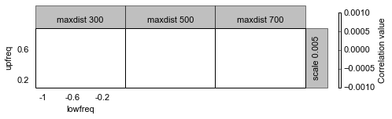

Parameter optimization for IMP.
===============================

*Recover data from previous section by loading the previously saved chromosome and its Hi-C data.*

Import the necessary libraries.

.. code:: python

    # Libraries
    from pytadbit import load_chromosome # to load chromosomes
    from pytadbit.imp.impoptimizer import IMPoptimizer

First, load the chromosome from previous tutorial (:ref:`run_tadbit`).

.. code:: python

    # Load the chromosome
    my_chrom = load_chromosome('some_path.tdb')

Next, load Hi-C data for each experiment (Hi-C data is not saved inside chromosome objects because of their size):

.. code:: python

    # Loop over experiments in chromosome and load Hi-C data.
    res = 100000
    
    for exp in my_chrom.experiments:
        try:
            exp.load_hic_data('../../scripts/sample_data/HIC_{0}_{1}_{1}_{2}_obs.txt'.format(
                              exp.name, my_chrom.name, res))
        except IOError:
            print 'file not found for experiment: ' + exp.name
            continue
        print exp

.. ansi-block::

    /usr/local/lib/python2.7/dist-packages/pytadbit/parsers/hic_parser.py:89: UserWarning: WARNING: non integer values
      warn('WARNING: non integer values')
    
    WARNING: removing columns having less than 24.165 counts: (detected threshold)
        8    9   10   12  245  246  247  248  249  250  251  252  253  254  255
      256  257  258  259  260  261  262  263  264  265  266  267  268  269  270
      271  272  273  274  275  276  277  278  279  280  281  282  283  284  285
      286  287  288  289  290  291  292  293  294  295  296  297  298  299  300
      301  302  303  304  305  306  307  308  309  310  311  312  313  314  315
      316  317  318  319  320  321  322  323  324  639

.. ansi-block::

    Experiment k562:
       resolution        : 100Kb
       TADs              : 37
       Hi-C rows         : 639
       normalized        : None
       identifier        : k562
       cell type         : wild type
       restriction enzyme: UNKNOWN
       project           : TADbit tutorial
    
    Experiment gm06690:
       resolution        : 100Kb
       TADs              : 34
       Hi-C rows         : 639
       normalized        : None
       identifier        : gm06690
       cell type         : cancer
       restriction enzyme: UNKNOWN
       project           : TADbit tutorial
    
    file not found for experiment: k562+gm06690
    file not found for experiment: batch_gm06690_k562

.. ansi-block::

    /usr/local/lib/python2.7/dist-packages/pytadbit/utils/hic_filtering.py:209: ComplexWarning: Casting complex values to real discards the imaginary part
      round(root, 3), ' '.join(
    
    WARNING: removing columns having less than 67.485 counts: (detected threshold)
      246  247  248  249  250  251  252  253  254  255  256  257  258  259  260
      261  262  263  264  265  266  267  268  269  270  271  272  273  274  275
      276  277  278  279  280  281  282  283  284  285  286  287  288  289  290
      291  292  293  294  295  296  297  298  299  300  301  302  303  304  305
      306  307  308  309  310  311  312  313  314  315  316  317  318  319  320
      321  322  323  324  639

The log indicates that experiment "k562+gm06690" had no file. Such experiment was built ad-hoc in our previous tutorial and needs to be created again by summing the Hi-C matrices from the individual experiments.

.. code:: python

    # Load Hi-C of the individual experiments and put it into the sum experiment BR+TR1+TR2
    my_chrom.experiments['k562+gm06690'].load_hic_data(
                  (my_chrom.experiments['k562'] + my_chrom.experiments['gm06690']).hic_data, 
                  'k562+gm06690')
    exp = my_chrom.experiments['gm06690']
    
    print my_chrom.experiments

.. ansi-block::

    
    WARNING: removing columns having less than 73.545 counts: (detected threshold)
      246  247  248  249  250  251  252  253  254  255  256  257  258  259  260
      261  262  263  264  265  266  267  268  269  270  271  272  273  274  275
      276  277  278  279  280  281  282  283  284  285  286  287  288  289  290
      291  292  293  294  295  296  297  298  299  300  301  302  303  304  305
      306  307  308  309  310  311  312  313  314  315  316  317  318  319  320
      321  322  323  324  639
    /usr/local/lib/python2.7/dist-packages/pytadbit/experiment.py:176: UserWarning: WARNING: experiments should be normalized before being summed
    
      'summed\n')
    
    WARNING: removing columns having less than 73.545 counts: (detected threshold)
      246  247  248  249  250  251  252  253  254  255  256  257  258  259  260
      261  262  263  264  265  266  267  268  269  270  271  272  273  274  275
      276  277  278  279  280  281  282  283  284  285  286  287  288  289  290
      291  292  293  294  295  296  297  298  299  300  301  302  303  304  305
      306  307  308  309  310  311  312  313  314  315  316  317  318  319  320
      321  322  323  324  639

.. ansi-block::

    [Experiment k562 (resolution: 100Kb, TADs: 37, Hi-C rows: 639, normalized: None), Experiment gm06690 (resolution: 100Kb, TADs: 34, Hi-C rows: 639, normalized: None), Experiment k562+gm06690 (resolution: 100Kb, TADs: None, Hi-C rows: 639, normalized: None), Experiment batch_gm06690_k562 (resolution: 100Kb, TADs: 35, Hi-C rows: 639, normalized: None)]

Optimization of IMP 3D modeling parameters
------------------------------------------

In the previous tutorial we found a specific TAD (region 406 to 448) that seemed quite conserved accross different cell types.

Next, we will optimize the three IMP parameters for this TAD. The IMP parameters to optimize are maximal distance between two non-interacting particles (maxdist), Upper-bound Z-score (upfreq) and Lower-bound Z-score (lowfreq). For details see Bau & Marti-Renom. METHODS [Baù2012]_.

.. code:: python

    optimizer = IMPoptimizer(exp, 100, 200, n_models=50, n_keep=25, cutoff=2000)

.. ansi-block::

    /usr/local/lib/python2.7/dist-packages/pytadbit/experiment.py:630: UserWarning: WARNING: normalizing according to visibility method
      warn('WARNING: normalizing according to visibility method')

``cutoff`` value corresponds to the distance limit, in nanometers, to consider if two particles of a model are interacting or not. A wise choice corresponds to two time the resolution times the scale factor (0.01), which in this case is :math:`cutoff = 100Kb \times 2 \times scale = 100000 \times 2 \times 0.01 = 2000`

*Note: Usually the number of models to generate and to keep, should be respectively 500 and 100.*

.. code:: python

    # Optimize parameters. Be aware that this step is CPU intensive. If you want to se the progress, set verbose=True.
    optimizer.run_grid_search(n_cpus=8, lowfreq_range=(-1, 0, 0.2), upfreq_range=(0.2, 0.8, 0.2), 
                              maxdist_range=(2000, 4000, 500), verbose=True)

.. ansi-block::

        1  0.2 -1 500 0.005 nan

.. ansi-block::

    /usr/lib/python2.7/dist-packages/numpy/lib/function_base.py:1824: RuntimeWarning: invalid value encountered in true_divide
      return c/sqrt(multiply.outer(d, d))
    /usr/local/lib/python2.7/dist-packages/scipy-0.11.0-py2.7-linux-x86_64.egg/scipy/stats/distributions.py:1457: RuntimeWarning: invalid value encountered in greater
      cond1 = (scale > 0) & (x > self.a) & (x < self.b)
    /usr/local/lib/python2.7/dist-packages/scipy-0.11.0-py2.7-linux-x86_64.egg/scipy/stats/distributions.py:1457: RuntimeWarning: invalid value encountered in less
      cond1 = (scale > 0) & (x > self.a) & (x < self.b)
    /usr/local/lib/python2.7/dist-packages/scipy-0.11.0-py2.7-linux-x86_64.egg/scipy/stats/distributions.py:1458: RuntimeWarning: invalid value encountered in less_equal
      cond2 = cond0 & (x <= self.a)

.. note::
   The above warning is given when a small matrix is loaded. TADbit has a filtering function that is applied to all Hi-C matrices with the aim of removing entire rows with very low counts. Those rows/colums are treated then for modeling as "missing-data" points. This flitering function can only be applied for relatively large matrices.

.. note::
   By default TADbit does not store the models generated during the optimization, however, in case they are needed, the option savedata may allow to store them.

Optimizing from Experiment
~~~~~~~~~~~~~~~~~~~~~~~~~~

The exact same as above can be done from Experiment objects directly:

.. code:: python

    optimizer = exp.optimal_imp_parameters(100, 200, n_cpus=8, n_models=50, n_keep=25, cutoff=1000,
                                           lowfreq_range=(-1, 0, 0.2), upfreq_range=(0.2, 0.8, 0.2), 
                                           scale_range=[0.005], maxdist_range=(500, 900, 200), verbose=False)

::

    ---------------------------------------------------------------------------
    Exception                                 Traceback (most recent call last)

    <ipython-input-7-531db7bca5d2> in <module>()
          1 optimizer = exp.optimal_imp_parameters(100, 200, n_cpus=8, n_models=50, n_keep=25, cutoff=1000,
          2                                        lowfreq_range=(-1, 0, 0.2), upfreq_range=(0.2, 0.8, 0.2),
    ----> 3                                        scale_range=[0.005], maxdist_range=(300, 700, 200), verbose=False)
    

    /usr/local/lib/python2.7/dist-packages/pytadbit/experiment.pyc in optimal_imp_parameters(self, start, end, n_models, n_keep, n_cpus, upfreq_range, close_bins, lowfreq_range, scale_range, maxdist_range, cutoff, outfile, verbose, corr, off_diag, savedata)
        608                                   scale_range=scale_range, corr=corr,
        609                                   n_cpus=n_cpus, verbose=verbose,
    --> 610                                   off_diag=off_diag, savedata=savedata)
        611 
        612         if outfile:

    /usr/local/lib/python2.7/dist-packages/pytadbit/imp/impoptimizer.pyc in run_grid_search(self, upfreq_range, lowfreq_range, maxdist_range, scale_range, corr, off_diag, savedata, n_cpus, verbose)
        169                                                  n_cpus=n_cpus,
        170                                                  values=self.values,
    --> 171                                                  close_bins=self.close_bins)
        172                         count += 1
        173                         if verbose:

    /usr/local/lib/python2.7/dist-packages/pytadbit/imp/imp_modelling.pyc in generate_3d_models(zscores, resolution, nloci, start, n_models, n_keep, close_bins, n_cpus, keep_all, verbose, outfile, config, values, experiment, coords)
        127                             CONFIG['lowrdist']) +
        128                         '   -> resolution times scale -- %s*%s)' % (
    --> 129                             resolution, CONFIG['scale']))
        130 
        131     # get SLOPE and regression for all particles of the z-score data

    Exception: ERROR: we must prevent you from doing this for the safe of our universe...
    In this case, maxdist must be higher than 500.0
       -> resolution times scale -- 100000*0.005)

Visualize the results
---------------------

.. code:: python

    optimizer.write_result('results.log')
.. code:: python

    # Visualize the results of the optimization.
    optimizer.plot_2d()

::

    ---------------------------------------------------------------------------
    IndexError                                Traceback (most recent call last)

    <ipython-input-9-13a57a482708> in <module>()
          1 # Visualize the results of the optimization.
    ----> 2 optimizer.plot_2d()
    

    /usr/local/lib/python2.7/dist-packages/pytadbit/imp/impoptimizer.pyc in plot_2d(self, axes, show_best, skip, savefig)
        306                                       [float(i) for i in self.lowfreq_range]),
        307                                      results), axes=axes, show_best=show_best,
    --> 308                                     skip=skip, savefig=savefig)
        309 
        310 

    /usr/local/lib/python2.7/dist-packages/pytadbit/utils/extraviews.pyc in plot_2d_optimization_result(result, axes, show_best, skip, savefig)
        673     tit += 'Best: %s=%%s, %s=%%s, %s=%%s, %s=%%s' % (axes[0], axes[1],
        674                                                      axes[3], axes[2])
    --> 675     fig.suptitle(tit % tuple([0my_round(i, 3) for i in sort_result[0][1:]]),
        676                  size='large')
        677     if savefig:

    IndexError: list index out of range

.. ansi-block::

    /usr/lib/python2.7/dist-packages/numpy/ma/core.py:3847: UserWarning: Warning: converting a masked element to nan.
      warnings.warn("Warning: converting a masked element to nan.")
    /usr/lib/pymodules/python2.7/matplotlib/colors.py:576: RuntimeWarning: invalid value encountered in less
      cbook._putmask(xa, xa < 0.0, -1)

.. image:: ../nbpictures/tutorial_5_parameter_optimization_21_2.png

We can also ask to mark on the plot the best N combination of parameters with the "show_best" parameter.

.. code:: python

    # Visualize the results of the optimization and mark the best 10 parameter sets
    optimizer.plot_2d(show_best=20)

.. code:: python

    axes_range = [[float(i) for i in optimizer.scale_range],
                        [float(i) for i in optimizer.maxdist_range],
                        [float(i) for i in optimizer.upfreq_range],
                        [float(i) for i in optimizer.lowfreq_range]]
    
    print axes_range
    [round(i, 3) for i in axes_range[3]]
    result = optimizer._result_to_array()
    wax = [round(i, 3) for i in axes_range[0]]
    zax = [round(i, 3) for i in axes_range[1]]
    xax = [round(i, 3) for i in axes_range[3]]
    yax = [round(i, 3) for i in axes_range[2]]
    sort_result = sorted([(result[i, j, k, l], wax[i], zax[j], xax[l], yax[k])
                                  for i in range(len(wax))
                                  for j in range(len(zax))
                                  for k in range(len(yax))
                                  for l in range(len(xax))
                                  if not np.isnan(result[i, j, k, l])
                                  ], key=lambda x: x[0],
                                 reverse=True)[0]
    print sort_result
One can also visualize the parameter optimization according to ne of the three optimization parameters.

.. code:: python

    # Visualize the results of the optimization based on the lowfreq parameter.
    optimizer.plot_2d(axes=('upfreq', 'lowfreq', 'maxdist', 'scale'),show_best=10)

.. code:: python

    optimizer.plot_2d(skip={"scale":0.005}, show_best=10)

TADbit also provides the possibility to view it all together in a 3D plot (note that, while here its a static image, inside matplotlib GUI you would be able to turn around and zoom):

.. code:: python

    # Visualize the results of the optimization using a 3D representation with the three optimization parameters in the axis.
    optimizer.plot_3d(axes=('scale', 'maxdist', 'upfreq', 'lowfreq'))

.. code:: python

    optimizer.run_grid_search(n_cpus=8, lowfreq_range=(-1., -0.0, 0.1), upfreq_range=(0.3, 0.6, 0.05), 
                              scale_range=[0.005], maxdist_range=[200,250,300,350], verbose=False)

.. code:: python

    optimizer.scale_range
    optimizer.maxdist_range

.. code:: python

    optimizer.plot_2d(show_best=100)

::

    ---------------------------------------------------------------------------
    IndexError                                Traceback (most recent call last)

    <ipython-input-15-9667fef4f0da> in <module>()
    ----> 1 optimizer.plot_2d(show_best=100)
    

    /usr/local/lib/python2.7/dist-packages/pytadbit/imp/impoptimizer.pyc in plot_2d(self, axes, show_best, skip, savefig)
        306                                       [float(i) for i in self.lowfreq_range]),
        307                                      results), axes=axes, show_best=show_best,
    --> 308                                     skip=skip, savefig=savefig)
        309 
        310 

    /usr/local/lib/python2.7/dist-packages/pytadbit/utils/extraviews.pyc in plot_2d_optimization_result(result, axes, show_best, skip, savefig)
        673     tit += 'Best: %s=%%s, %s=%%s, %s=%%s, %s=%%s' % (axes[0], axes[1],
        674                                                      axes[3], axes[2])
    --> 675     fig.suptitle(tit % tuple([0my_round(i, 3) for i in sort_result[0][1:]]),
        676                  size='large')
        677     if savefig:

    IndexError: list index out of range

.. code:: python

    optimizer.write_result('results.log')
.. code:: python

    optimizer2 = IMPoptimizer(exp, 100, 200, n_models=50, n_keep=25, cutoff=1000)
.. code:: python

    optimizer2.load_from_file('results.log')
.. code:: python

    optimizer2.results.keys()[105]

::

    ---------------------------------------------------------------------------
    IndexError                                Traceback (most recent call last)

    <ipython-input-13-fd8fa669d7d1> in <module>()
    ----> 1 optimizer2.results.keys()[105]
    

    IndexError: list index out of range

.. code:: python

    optimizer2.plot_2d(show_best=20)
Retrieve best parameters
------------------------

Once done, best results can be returned as a dictionary to be used for modeling (see next section of the tutorial)

.. code:: python

    config = optimizer.get_best_parameters_dict(reference='gm cell from Job Dekker 2009')
    
    print config

.. ansi-block::

    None

.. ansi-block::

    /usr/local/lib/python2.7/dist-packages/pytadbit/imp/impoptimizer.py:263: UserWarning: WARNING: no optimization done yet
      warn('WARNING: no optimization done yet')

.. code:: python

    