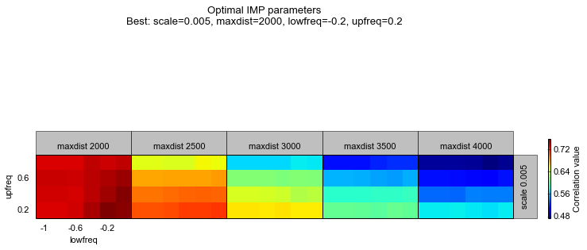

Parameter optimization for IMP.
===============================

*Recover data from previous section by loading the previously saved chromosome and its Hi-C data.*

Import the necessary libraries.

.. code:: python

    # Libraries
    from pytadbit import load_chromosome # to load chromosomes
    from pytadbit.imp.impoptimizer import IMPoptimizer

First, load the chromosome from previous tutorial (:ref:`run_tadbit`).

.. code:: python

    # Load the chromosome
    my_chrom = load_chromosome('some_path.tdb')

Next, load Hi-C data for each experiment (Hi-C data is not saved inside chromosome objects because of their size):

.. code:: python

    # Loop over experiments in chromosome and load Hi-C data.
    res = 100000
    
    for exp in my_chrom.experiments:
        try:
            exp.load_hic_data('../../scripts/sample_data/HIC_{0}_{1}_{1}_{2}_obs.txt'.format(
                              exp.name, my_chrom.name, res))
        except IOError:
            print 'file not found for experiment: ' + exp.name
            continue
        print exp

.. ansi-block::

    /usr/local/lib/python2.7/dist-packages/pytadbit/parsers/hic_parser.py:89: UserWarning: WARNING: non integer values
      warn('WARNING: non integer values')
    
    WARNING: removing columns having less than 24.165 counts: (detected threshold)
        8    9   10   12  245  246  247  248  249  250  251  252  253  254  255
      256  257  258  259  260  261  262  263  264  265  266  267  268  269  270
      271  272  273  274  275  276  277  278  279  280  281  282  283  284  285
      286  287  288  289  290  291  292  293  294  295  296  297  298  299  300
      301  302  303  304  305  306  307  308  309  310  311  312  313  314  315
      316  317  318  319  320  321  322  323  324  639

.. ansi-block::

    Experiment k562:
       resolution        : 100Kb
       TADs              : 37
       Hi-C rows         : 639
       normalized        : None
       identifier        : k562
       cell type         : wild type
       restriction enzyme: UNKNOWN
       project           : TADbit tutorial
    
    Experiment gm06690:
       resolution        : 100Kb
       TADs              : 34
       Hi-C rows         : 639
       normalized        : None
       identifier        : gm06690
       cell type         : cancer
       restriction enzyme: UNKNOWN
       project           : TADbit tutorial
    
    file not found for experiment: k562+gm06690
    file not found for experiment: batch_gm06690_k562

.. ansi-block::

    /usr/local/lib/python2.7/dist-packages/pytadbit/utils/hic_filtering.py:209: ComplexWarning: Casting complex values to real discards the imaginary part
      round(root, 3), ' '.join(
    
    WARNING: removing columns having less than 67.485 counts: (detected threshold)
      246  247  248  249  250  251  252  253  254  255  256  257  258  259  260
      261  262  263  264  265  266  267  268  269  270  271  272  273  274  275
      276  277  278  279  280  281  282  283  284  285  286  287  288  289  290
      291  292  293  294  295  296  297  298  299  300  301  302  303  304  305
      306  307  308  309  310  311  312  313  314  315  316  317  318  319  320
      321  322  323  324  639

The log indicates that experiment "k562+gm06690" had no file. Such experiment was built ad-hoc in our previous tutorial and needs to be created again by summing the Hi-C matrices from the individual experiments.

.. code:: python

    # Load Hi-C of the individual experiments and put it into the sum experiment BR+TR1+TR2
    my_chrom.experiments['k562+gm06690'].load_hic_data(
                  (my_chrom.experiments['k562'] + my_chrom.experiments['gm06690']).hic_data, 
                  'k562+gm06690')
    exp = my_chrom.experiments['gm06690']
    
    print my_chrom.experiments

.. ansi-block::

    
    WARNING: removing columns having less than 73.545 counts: (detected threshold)
      246  247  248  249  250  251  252  253  254  255  256  257  258  259  260
      261  262  263  264  265  266  267  268  269  270  271  272  273  274  275
      276  277  278  279  280  281  282  283  284  285  286  287  288  289  290
      291  292  293  294  295  296  297  298  299  300  301  302  303  304  305
      306  307  308  309  310  311  312  313  314  315  316  317  318  319  320
      321  322  323  324  639
    /usr/local/lib/python2.7/dist-packages/pytadbit/experiment.py:196: UserWarning: WARNING: experiments should be normalized before being summed
    
      'summed\n')
    
    WARNING: removing columns having less than 73.545 counts: (detected threshold)
      246  247  248  249  250  251  252  253  254  255  256  257  258  259  260
      261  262  263  264  265  266  267  268  269  270  271  272  273  274  275
      276  277  278  279  280  281  282  283  284  285  286  287  288  289  290
      291  292  293  294  295  296  297  298  299  300  301  302  303  304  305
      306  307  308  309  310  311  312  313  314  315  316  317  318  319  320
      321  322  323  324  639

.. ansi-block::

    [Experiment k562 (resolution: 100Kb, TADs: 37, Hi-C rows: 639, normalized: None), Experiment gm06690 (resolution: 100Kb, TADs: 34, Hi-C rows: 639, normalized: None), Experiment k562+gm06690 (resolution: 100Kb, TADs: None, Hi-C rows: 639, normalized: None), Experiment batch_gm06690_k562 (resolution: 100Kb, TADs: 35, Hi-C rows: 639, normalized: None)]

Optimization of IMP 3D modeling parameters
------------------------------------------

In the previous tutorial we found a specific TAD (region 406 to 448) that seemed quite conserved accross different cell types.

Next, we will optimize the three IMP parameters for this TAD. The IMP parameters to optimize are maximal distance between two non-interacting particles (maxdist), Upper-bound Z-score (upfreq) and Lower-bound Z-score (lowfreq). For details see Bau & Marti-Renom. METHODS [Baù2012]_.

.. code:: python

    optimizer = IMPoptimizer(exp, 100, 200, n_models=50, n_keep=25, cutoff=2000)

.. ansi-block::

    /usr/local/lib/python2.7/dist-packages/pytadbit/experiment.py:648: UserWarning: WARNING: normalizing according to visibility method
      warn('WARNING: normalizing according to visibility method')

``cutoff`` value corresponds to the distance limit, in nanometers, to consider if two particles of a model are interacting or not. A wise choice corresponds to two time the resolution times the scale factor (0.01), which in this case is :math:`cutoff = 100Kb \times 2 \times scale = 100000 \times 2 \times 0.01 = 2000`

*Note: Usually the number of models to generate and to keep, should be respectively 500 and 100.*

.. code:: python

    # Optimize parameters. Be aware that this step is CPU intensive. If you want to se the progress, set verbose=True.
    optimizer.run_grid_search(n_cpus=8, lowfreq_range=(-1, 0, 0.2), upfreq_range=(0.2, 0.8, 0.2), 
                              maxdist_range=(2000, 4000, 500), verbose=True)

.. ansi-block::

        1  0.2 -1 2000 0.01 0.7685079084
        2  0.2 -0.8 2000 0.01 0.7685079084
        3  0.2 -0.6 2000 0.01 0.769312534002
        4  0.2 -0.4 2000 0.01 0.774552988272
        5  0.2 -0.2 2000 0.01 0.774799693632
        6  0.2 0 2000 0.01 0.779079372102
        7  0.4 -1 2000 0.01 0.77968485295
        8  0.4 -0.8 2000 0.01 0.77968485295
        9  0.4 -0.6 2000 0.01 0.777330669016
       10  0.4 -0.4 2000 0.01 0.781161643149
       11  0.4 -0.2 2000 0.01 0.784325067495
       12  0.4 0 2000 0.01 0.786674923707
       13  0.6 -1 2000 0.01 0.784429455755
       14  0.6 -0.8 2000 0.01 0.784429455755
       15  0.6 -0.6 2000 0.01 0.785634447252
       16  0.6 -0.4 2000 0.01 0.786321444973
       17  0.6 -0.2 2000 0.01 0.786910943468
       18  0.6 0 2000 0.01 0.786984401856
       19  0.8 -1 2000 0.01 0.790513719434
       20  0.8 -0.8 2000 0.01 0.790513719434
       21  0.8 -0.6 2000 0.01 0.790296856543
       22  0.8 -0.4 2000 0.01 0.793885340581
       23  0.8 -0.2 2000 0.01 0.789759250026
       24  0.8 0 2000 0.01 0.789797737342
       25  0.2 -1 2500 0.01 0.750962048643
       26  0.2 -0.8 2500 0.01 0.750962048643
       27  0.2 -0.6 2500 0.01 0.757205157705
       28  0.2 -0.4 2500 0.01 0.761306112068
       29  0.2 -0.2 2500 0.01 0.774749585795
       30  0.2 0 2500 0.01 0.77526716922
       31  0.4 -1 2500 0.01 0.768413156879
       32  0.4 -0.8 2500 0.01 0.768413156879
       33  0.4 -0.6 2500 0.01 0.769621944212
       34  0.4 -0.4 2500 0.01 0.774313586043
       35  0.4 -0.2 2500 0.01 0.784154703349
       36  0.4 0 2500 0.01 0.780215999106
       37  0.6 -1 2500 0.01 0.7769226588
       38  0.6 -0.8 2500 0.01 0.7769226588
       39  0.6 -0.6 2500 0.01 0.7771795099
       40  0.6 -0.4 2500 0.01 0.781692802602
       41  0.6 -0.2 2500 0.01 0.791132811629
       42  0.6 0 2500 0.01 0.791622500864
       43  0.8 -1 2500 0.01 0.794414661228
       44  0.8 -0.8 2500 0.01 0.794414661228
       45  0.8 -0.6 2500 0.01 0.791675414244
       46  0.8 -0.4 2500 0.01 0.797601045479
       47  0.8 -0.2 2500 0.01 0.797521713992
       48  0.8 0 2500 0.01 0.797093368434
       49  0.2 -1 3000 0.01 0.747088558176
       50  0.2 -0.8 3000 0.01 0.747088558176
       51  0.2 -0.6 3000 0.01 0.745301762181
       52  0.2 -0.4 3000 0.01 0.75657287698
       53  0.2 -0.2 3000 0.01 0.768255433103
       54  0.2 0 3000 0.01 0.771134956344
       55  0.4 -1 3000 0.01 0.760224850725
       56  0.4 -0.8 3000 0.01 0.760224850725
       57  0.4 -0.6 3000 0.01 0.758212146329
       58  0.4 -0.4 3000 0.01 0.76576862456
       59  0.4 -0.2 3000 0.01 0.778685124478
       60  0.4 0 3000 0.01 0.779102317515
       61  0.6 -1 3000 0.01 0.77089869622
       62  0.6 -0.8 3000 0.01 0.77089869622
       63  0.6 -0.6 3000 0.01 0.771149348295
       64  0.6 -0.4 3000 0.01 0.778054314513
       65  0.6 -0.2 3000 0.01 0.788888301661
       66  0.6 0 3000 0.01 0.792927420622
       67  0.8 -1 3000 0.01 0.787058090092
       68  0.8 -0.8 3000 0.01 0.787058090092
       69  0.8 -0.6 3000 0.01 0.787064682158
       70  0.8 -0.4 3000 0.01 0.789444985636
       71  0.8 -0.2 3000 0.01 0.795363982681
       72  0.8 0 3000 0.01 0.798344059632
       73  0.2 -1 3500 0.01 0.742503135603
       74  0.2 -0.8 3500 0.01 0.742503135603
       75  0.2 -0.6 3500 0.01 0.745313876975
       76  0.2 -0.4 3500 0.01 0.757818572633
       77  0.2 -0.2 3500 0.01 0.768088409932
       78  0.2 0 3500 0.01 0.772953014174
       79  0.4 -1 3500 0.01 0.758090294693
       80  0.4 -0.8 3500 0.01 0.758090294693
       81  0.4 -0.6 3500 0.01 0.756077064231
       82  0.4 -0.4 3500 0.01 0.760791799894
       83  0.4 -0.2 3500 0.01 0.770118662441
       84  0.4 0 3500 0.01 0.771190886989
       85  0.6 -1 3500 0.01 0.755069982191
       86  0.6 -0.8 3500 0.01 0.755069982191
       87  0.6 -0.6 3500 0.01 0.753952944201
       88  0.6 -0.4 3500 0.01 0.760897343161
       89  0.6 -0.2 3500 0.01 0.771145005701
       90  0.6 0 3500 0.01 0.773442327166
       91  0.8 -1 3500 0.01 0.772281982099
       92  0.8 -0.8 3500 0.01 0.772281982099
       93  0.8 -0.6 3500 0.01 0.774513250696
       94  0.8 -0.4 3500 0.01 0.776897099364
       95  0.8 -0.2 3500 0.01 0.780965488029
       96  0.8 0 3500 0.01 0.778109941084
       97  0.2 -1 4000 0.01 0.74469288042
       98  0.2 -0.8 4000 0.01 0.74469288042
       99  0.2 -0.6 4000 0.01 0.744839537795
      100  0.2 -0.4 4000 0.01 0.749552494453
      101  0.2 -0.2 4000 0.01 0.756184508999
      102  0.2 0 4000 0.01 0.759171645369
      103  0.4 -1 4000 0.01 0.737113094756
      104  0.4 -0.8 4000 0.01 0.737113094756
      105  0.4 -0.6 4000 0.01 0.737373689722
      106  0.4 -0.4 4000 0.01 0.739865712079
      107  0.4 -0.2 4000 0.01 0.74968044876
      108  0.4 0 4000 0.01 0.753525984586
      109  0.6 -1 4000 0.01 0.740316370858
      110  0.6 -0.8 4000 0.01 0.740316370858
      111  0.6 -0.6 4000 0.01 0.739165113831
      112  0.6 -0.4 4000 0.01 0.743513322704
      113  0.6 -0.2 4000 0.01 0.7493620759
      114  0.6 0 4000 0.01 0.751928906505
      115  0.8 -1 4000 0.01 0.745707450814
      116  0.8 -0.8 4000 0.01 0.745707450814
      117  0.8 -0.6 4000 0.01 0.743929246866
      118  0.8 -0.4 4000 0.01 0.746609953329
      119  0.8 -0.2 4000 0.01 0.748258868417
      120  0.8 0 4000 0.01 0.745006154143

.. note::
   The above warning is given when a small matrix is loaded. TADbit has a filtering function that is applied to all Hi-C matrices with the aim of removing entire rows with very low counts. Those rows/colums are treated then for modeling as "missing-data" points. This flitering function can only be applied for relatively large matrices.

.. note::
   By default TADbit does not store the models generated during the optimization, however, in case they are needed, the option savedata may allow to store them.

Optimizing from Experiment
~~~~~~~~~~~~~~~~~~~~~~~~~~

The exact same as above can be done from Experiment objects directly:

.. code:: python

    optimizer = exp.optimal_imp_parameters(100, 200, n_cpus=8, n_models=50, n_keep=25, cutoff=1000,
                                           lowfreq_range=(-1, 0, 0.2), upfreq_range=(0.2, 0.8, 0.2), 
                                           scale_range=[0.005], maxdist_range=(2000, 4000, 500), 
                                           verbose=False)

Visualize the results
---------------------

.. code:: python

    optimizer.write_result('results.log')
.. code:: python

    # Visualize the results of the optimization.
    optimizer.plot_2d()

We can also ask to mark on the plot the best N combination of parameters with the "show_best" parameter.

.. code:: python

    # Visualize the results of the optimization and mark the best 10 parameter sets
    optimizer.plot_2d(show_best=20)

.. code:: python

    axes_range = [[float(i) for i in optimizer.scale_range],
                        [float(i) for i in optimizer.maxdist_range],
                        [float(i) for i in optimizer.upfreq_range],
                        [float(i) for i in optimizer.lowfreq_range]]
    
    print axes_range
    [round(i, 3) for i in axes_range[3]]
    result = optimizer._result_to_array()
    wax = [round(i, 3) for i in axes_range[0]]
    zax = [round(i, 3) for i in axes_range[1]]
    xax = [round(i, 3) for i in axes_range[3]]
    yax = [round(i, 3) for i in axes_range[2]]
    sort_result = sorted([(result[i, j, k, l], wax[i], zax[j], xax[l], yax[k])
                                  for i in range(len(wax))
                                  for j in range(len(zax))
                                  for k in range(len(yax))
                                  for l in range(len(xax))
                                  if not np.isnan(result[i, j, k, l])
                                  ], key=lambda x: x[0],
                                 reverse=True)[0]
    print sort_result

.. ansi-block::

    [[0.005], [2000.0, 2500.0, 3000.0, 3500.0, 4000.0], [0.2, 0.4, 0.6, 0.8], [-1.0, -0.8, -0.6, -0.4, -0.2, 0.0]]
    (0.75936709524864121, 0.005, 2000.0, -0.2, 0.2)

One can also visualize the parameter optimization according to ne of the three optimization parameters.

.. code:: python

    # Visualize the results of the optimization based on the lowfreq parameter.
    optimizer.plot_2d(axes=('upfreq', 'lowfreq', 'maxdist', 'scale'),show_best=10)

.. image:: ../nbpictures/tutorial_5_parameter_optimization_26_0.png

.. code:: python

    optimizer.plot_2d(skip={"scale":0.01}, show_best=10)

::

    ---------------------------------------------------------------------------
    ValueError                                Traceback (most recent call last)

    <ipython-input-13-4c8c4f4e635a> in <module>()
    ----> 1 optimizer.plot_2d(skip={"scale":0.01}, show_best=10)
    

    /usr/local/lib/python2.7/dist-packages/pytadbit/imp/impoptimizer.pyc in plot_2d(self, axes, show_best, skip, savefig)
        308                                       [float(i) for i in self.lowfreq_range]),
        309                                      results), axes=axes, show_best=show_best,
    --> 310                                     skip=skip, savefig=savefig)
        311 
        312 

    /usr/local/lib/python2.7/dist-packages/pytadbit/utils/extraviews.pyc in plot_2d_optimization_result(result, axes, show_best, skip, savefig)
        602             continue
        603         if i == 0:
    --> 604             wax_range = [wax.index(skip[k])]
        605         elif i==1:
        606             zax_range = [zax.index(skip[k])]

    ValueError: 0.01 is not in list

TADbit also provides the possibility to view it all together in a 3D plot (note that, while here its a static image, inside matplotlib GUI you would be able to turn around and zoom):

.. code:: python

    # Visualize the results of the optimization using a 3D representation with the three optimization parameters in the axis.
    optimizer.plot_3d(axes=('scale', 'maxdist', 'upfreq', 'lowfreq'))

.. code:: python

    optimizer.run_grid_search(n_cpus=8, lowfreq_range=(-1., -0.0, 0.1), upfreq_range=(0.3, 0.6, 0.05), 
                              scale_range=[0.01], maxdist_range=[2250,2500,2750,3000], verbose=False)

.. code:: python

    optimizer.plot_2d()
.. code:: python

    optimizer.plot_2d(show_best=100)
.. code:: python

    optimizer.write_result('results.log')
.. code:: python

    optimizer2 = IMPoptimizer(exp, 100, 200, n_models=50, n_keep=25, cutoff=1000)
.. code:: python

    optimizer2.load_from_file('results.log')
.. code:: python

    optimizer2.results.keys()[105]
.. code:: python

    optimizer2.plot_2d(show_best=20)
Retrieve best parameters
------------------------

Once done, best results can be returned as a dictionary to be used for modeling (see next section of the tutorial)

.. code:: python

    config = optimizer.get_best_parameters_dict(reference='gm cell from Job Dekker 2009')
    
    print config

.. code:: python

    