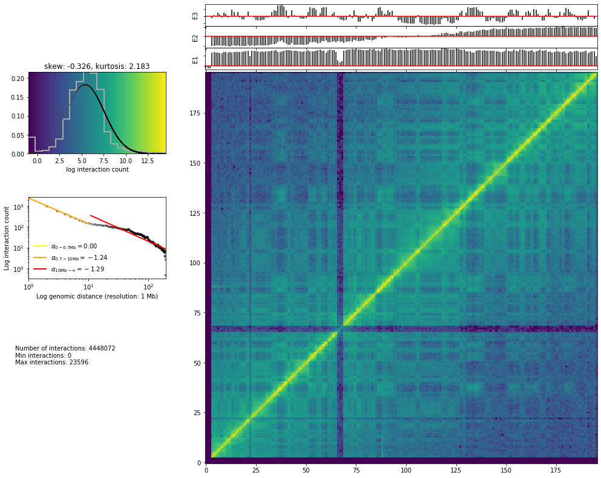

Filtering
=========

   Filters

Pairs of mapped read-ends are filtered in order to keep only valid
pairs. The filters available in TADbit are these one: 1.
**Self-circle**: both read-ends are mapped to the same RE fragment in
*opposed* orientation. 2. **Dangling-end**: both read-ends are mapped to
the same RE fragment in *facing* orientation. 3. **Error**: both
read-ends are mapped to the same RE fragment in the same orientation. 4.
**Extra dangling-end**: the read-ends are mapped to different RE
fragments in *facing* orientation, but are close enough (<
*max_molecule_length* bp) from the RE cut-site to be considered part of
adjacent RE fragments that were not separated by digestion. The
*max_molecule_length* parameter can be inferred from the *fragment_size*
function previously detailed. 5. **Too close from RE sites (or
semi-dangling-end)**: the start position of one of the read-end is too
close (5 bp by default) from the RE cutting site. 6. **Too short**: one
of the read-ends is mapped to RE fragments of less than 75bp. These are
removed since there is ambiguity on where the read-end is mapped as it
could also belong to any of the two neighboring RE fragments. 7. **Too
large**: the read-ends are mapped to long RE fragments (default: 100 kb,
P < 10-5 to occur in a randomized genome) and they likely represent
poorly assembled or repetitive regions. 8. **Over-represented**: the
read-ends coming from the top 0.5% most frequently detected RE
fragments, they may represent PCR artefacts, random breaks, or genome
assembly errors. 9. **PCR artefacts or duplicated**: the combination of
the start positions, mapped length, and strands of both read-ends are
identical. In this case, only one copy is kept. 10. **Random breaks**:
the start position of one read-end is too far (>
*minimum_distance_to_RE*) from the RE cut-site. These are produced most
probably by non-canonical enzyme activity or by random physical breakage
of the chromatin. Note, that to filter all these types of fragments the
minimum_distance_to_RE parameter should be larger than the
*maximum_fragment_length*.

.. code:: ipython3

    cell = 'mouse_B'  # or mouse_PSC
    rep = 'rep1'  # or rep2

Filter out dangling ends and self-circles
~~~~~~~~~~~~~~~~~~~~~~~~~~~~~~~~~~~~~~~~~

.. code:: ipython3

    from pytadbit.mapping.filter import filter_reads

The ``max_molecule_length`` parameter used to filter-out
pseudo-dangling-ends can be extracted from the ``insert_size`` function
in previous section.

The ``min_distance_to_re``, that affects the detection of random breaks,
should be large enough in order to contain almost all the fragments.

.. code:: ipython3

    # this will last ~10 minutes
    masked = filter_reads(
        'results/fragment/{0}_{1}/03_filtering/reads12_{0}_{1}.tsv'.format(cell, rep), 
        max_molecule_length=750, over_represented=0.005, max_frag_size=100000, 
        min_frag_size=50, re_proximity=5, min_dist_to_re=1000)

.. ansi-block::

    Filtered reads (and percentage of total):
    
                       Mapped both  :   87,862,102 (100.00%)
      -----------------------------------------------------
       1-               self-circle :       87,761 (  0.10%)
       2-              dangling-end :    4,813,620 (  5.48%)
       3-                     error :       18,165 (  0.02%)
       4-        extra dangling-end :   12,933,038 ( 14.72%)
       5-        too close from RES :   21,372,275 ( 24.32%)
       6-                 too short :    3,628,579 (  4.13%)
       7-                 too large :        1,256 (  0.00%)
       8-          over-represented :    2,693,107 (  3.07%)
       9-                duplicated :    1,605,185 (  1.83%)
      10-             random breaks :      308,512 (  0.35%)

This generates a dictionary with the different filters and the reads
affected by each.

Apply filters on the data
~~~~~~~~~~~~~~~~~~~~~~~~~

.. code:: ipython3

    from pytadbit.mapping.filter import apply_filter
    
    apply_filter('results/fragment/{0}_{1}/03_filtering/reads12_{0}_{1}.tsv'.format(cell, rep), 
                 'results/fragment/{0}_{1}/03_filtering/valid_reads12_{0}_{1}.tsv'.format(cell, rep), masked, 
                 filters=[1, 2, 3, 4, 6, 7, 9, 10])

.. ansi-block::

        saving to file 66,612,427 reads without.

.. ansi-block::

    66612427

Evaluate changes
^^^^^^^^^^^^^^^^

.. code:: ipython3

    from pytadbit.mapping.analyze import hic_map
    
    hic_map('results/fragment/{0}_{1}/03_filtering/valid_reads12_{0}_{1}.tsv'.format(cell, rep), 
            resolution=1000000, show=True, cmap='viridis')

Zoom to a single chromosome or a region:

.. code:: ipython3

    hic_map('results/fragment/{0}_{1}/03_filtering/valid_reads12_{0}_{1}.tsv'.format(cell, rep), 
            resolution=1000000, show=True, focus='chr1', cmap='viridis')

.. code:: ipython3

    hic_map('results/fragment/{0}_{1}/03_filtering/valid_reads12_{0}_{1}.tsv'.format(cell, rep), 
            resolution=1000000, show=True, focus=(500, 1000), cmap='viridis')

Save to BAM
-----------

Working with TSV (tab-separated-value file format) files is very slow.
For the next part of the tutorial we will be using BAM
(binary-alignment-map) files, which are compressed and indexed.

**Note**: The fields we use in TADbit to generate a BAM file are not the
conventional ones, we modify them as follows to store only the necessary
information for the remaining part of the analysis: - Read ID (same as
in the original FASTQ file) - Flag (binary mask for the application of
the 10 filters previously described): 1. self-circle 2. dangling-end 3.
error 4. extra dangling-end 5. too close from RES 6. too short 7. too
large 8. over-represented 9. duplicated 10. random breaks 11.
inter-chromosomal

For example if we want to keep only pairs of read-ends that are
excelusively inter-fragment contacts and that are not duplicated, we
would apply filters 1, 2, 3 (self-circle, dangling-ends, errors) and 9
(duplicated) resulting in a binary number like this: 00100000111 which
translates in decimal: 263. We could thus obtain these read-pairs with
``samtools view -F 263``. - Chromosome ID of the first read-end -
Genomic position of the first read-end - MAPQ set to 0 - Pseudo CIGAR
replaced by the mapped length of the first read-end, and information
about current copy (each pair is present twice in the BAM, P: first
copy, S: second copy) - Chromosome ID of the second read-end - Genomic
position of the second read-end - Mapped length of the second pair-end -
Nothing (*) (the field is usually reserved to sequence) - Nothing (*)
(the field is usually reserved to quality) - TC tag indicating single
(1) or multi contact (3 6 … number being the number of times a given
sequenced fragment is involved in a pairwise contact) - S1 and S2 tags
are the strand orientation of the left and right read-end

.. code:: ipython3

    from pytadbit.parsers.hic_bam_parser import bed2D_to_BAMhic

.. code:: ipython3

    bed2D_to_BAMhic('results/fragment/{0}_{1}/03_filtering/valid_reads12_{0}_{1}.tsv'.format(cell, rep), 
                    valid=True, ncpus=8, 
                    outbam='results/fragment/{0}_{1}/03_filtering/valid_reads12_{0}_{1}'.format(cell, rep), 
                    frmt='mid', masked=None)

