Three-dimensional modeling of chromatine structure
==================================================

Recover data from previous tutorial by loading the previously saved chromosome.

.. code:: python

    # Libraries
    from pytadbit import load_chromosome # load chromosome
    from pytadbit.imp.CONFIG import CONFIG # Pre-defined parameters for modeling
    from pytadbit.imp.structuralmodels import load_structuralmodels # library for modeling.
    
    # Load the chromosome
    my_chrom = load_chromosome('some_path.tdb')

Next, load Hi-C data for each experiment (Hi-C data is not saved inside chromosome objects because of their size):

.. code:: python

    # Loop over experiments in chromosome and load Hi-C data.
    res = 100000
    
    for exp in my_chrom.experiments:
        try:
            exp.load_hic_data('../../scripts/sample_data/HIC_{0}_{1}_{1}_{2}_obs.txt'.format(
                              exp.name, my_chrom.name, res))
        except AttributeError:
            print 'file not found for experiment: ' + exp.name
            continue
    
    # Load Hi-C of the individual experiments and put it into the sum experiment BR+TR1+TR2
    my_chrom.experiments['k562+gm06690'].load_hic_data(
                  (my_chrom.experiments['k562'] + my_chrom.experiments['gm06690']).hic_data, 
                  'k562+gm06690')
    exp = my_chrom.experiments['k562+gm06690']
    
    print my_chrom.experiments

.. parsed-literal::

    file not found for experiment: k562+gm06690
    file not found for experiment: batch_gm06690_k562
    [Experiment k562 (resolution: 100Kb, TADs: 43, Hi-C rows: 639, normalized: None), Experiment gm06690 (resolution: 100Kb, TADs: 31, Hi-C rows: 639, normalized: None), Experiment k562+gm06690 (resolution: 100Kb, TADs: None, Hi-C rows: 639, normalized: None), Experiment batch_gm06690_k562 (resolution: 100Kb, TADs: 37, Hi-C rows: 639, normalized: None)]

Model the 3D structure of a selected TAD
----------------------------------------

TADBit uses the Integrative Modeling Platform (IMP, http://www.integrativemodeling.org) for modeling the 3D structure of genomes and genomic domains. Here we aim at modeling the 3D structure of the selected TAD in the first tutorial (#1. Detection of TADs) using the optimal parameters from the second tutorial (#2 Parameter optimization.

All models are based on specific sets of experimental data for which TADBit modeling parameters need to be optimized (see tutorial #2). Optimizing the parameters takes significant CPU time and thus have created a python dictionary with sets of pre-optimized parameters for relaeased datasets. The specific parameters are stored in a python dictionary called CONFIG.

.. code:: python

    # See pre-defined sets of parameters
    CONFIG

.. parsed-literal::

    {'dmel_01': {'kforce': 5,
      'lowfreq': -0.7,
      'maxdist': 600,
      'reference': 'victor corces dataset 2013',
      'scale': 0.005,
      'upfreq': 0.3}}

.. note::
   Overtime, we will populate the CONFIG dictionary with more optimal sets of parameters for released Hi-C matrices.

To set the values for the parameters, one can create an array and use it for moodeling (see config parameter for model_region function)

.. code:: python

    # Set of optimal parameters from pervious tutorial #2
    optpar = {'kforce': 5,
              'lowfreq': -0.6,
              'lowrdist': 100,
              'upfreq': 0,
              'maxdist': 450,
              'scale': 0.005,
              'reference': 'Dekker dataset optimzed for TAD24'}
    
    # Build 3D models based on the HiC data. This is done by IMP.
    models = exp.model_region(1, 200, n_models=500, n_keep=100, n_cpus=8, keep_all=True, config=optpar)
    print models

.. parsed-literal::

    /usr/local/lib/python2.7/dist-packages/TADBit-0.1-py2.7-linux-x86_64.egg/pytadbit/experiment.py:428: UserWarning: WARNING: normalizing according to visibility method
      warn('WARNING: normalizing according to visibility method')

Once finished, the IMP generated models are stored in a dictionary which keys are numbered from smaller to larger based on the IMP Objective Function (that is, how well the model satifies the input restraints). One can select parts of the models or single models to get some information.

.. code:: python

    # Select top 10 models
    models.define_best_models(10)
    print "Lowest 10 IMP OF models:" 
    print models
    
    # Select top 100 models
    models.define_best_models(10)
    print "Lowest 100 IMP OF models:" 
    print models
    
    # Get the data for the lowest IMP OF model (number 0) in the set of models
    model = models[0]
    print model

.. parsed-literal::

    Lowest 10 IMP OF models:
    StructuralModels with 10 models (objective function range: 1243287276 - 1247672118)
       (corresponding to the best models out of 50 models).
      IMP modeling used this parameters:
       - maxdist     : 450
       - upfreq      : 0
       - reference   : Dekker dataset optimzed for TAD24
       - kforce      : 5
       - lowfreq     : -0.6
       - scale       : 0.005
       - lowrdist    : 1000.0
      Models where clustered into 0 clusters
    Lowest 100 IMP OF models:
    StructuralModels with 10 models (objective function range: 1243287276 - 1247672118)
       (corresponding to the best models out of 50 models).
      IMP modeling used this parameters:
       - maxdist     : 450
       - upfreq      : 0
       - reference   : Dekker dataset optimzed for TAD24
       - kforce      : 5
       - lowfreq     : -0.6
       - scale       : 0.005
       - lowrdist    : 1000.0
      Models where clustered into 0 clusters
    IMP model of 200 particles with: 
     - Final objective function value: 1243287276.69
     - random initial value: 44
     - first coordinates:
            X      Y      Z
         6162  -3172   2971
         5438  -3231   2996
         6338  -3226   3283
    

One measure to check whether the IMP optimization has reached equilibrium is to plot the value of the IMP Objective Function as a function of the iteration during optimization. If the plot has a plateau, this means that the modeling exercise run properly.

.. code:: python

    # Get the IMP OF of the stored model in "model"
    model.objective_function(log=True, smooth=True)

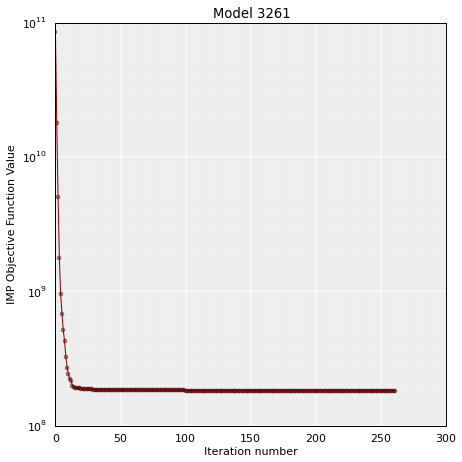

One important aspect is to identfy whether the set of models has a good correlation with the input HiC data. This can be done with a single function that affects the models.

.. code:: python

    # Re-select again the top 1000 models
    models.define_best_models(10)
    # Calculate the correlation coefficient between a set of kept models and the original HiC matrix
    models.correlate_with_real_data(plot=True, cutoff=1000)

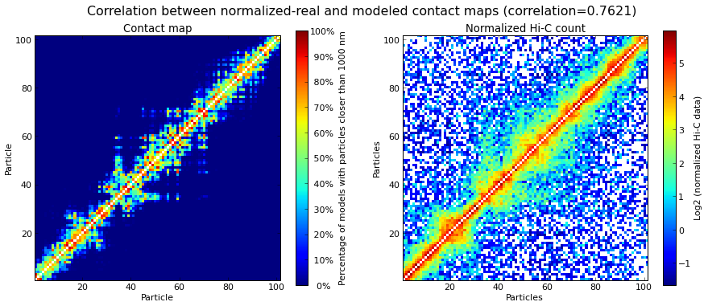

.. parsed-literal::

    (0.64054751239725927, 0.0)

Model analysis
--------------

Model clustering
~~~~~~~~~~~~~~~~

First we are going to cluster the 3D models based on their structural similarity. Clusters are numbered from larger (more models) to smallest (less models).

.. code:: python

    # Cluster models based on structural similarity
    models.cluster_models(fact=0.90, dcutoff=1000)
    print models.clusters

.. parsed-literal::

    Number of Singletons excluded from clustering: 0
    Total number of clusters: 2
       Cluster #1 has 6 models [top model: 33]
       Cluster #2 has 4 models [top model: 44]
    
    Total number of clusters: 2
       Cluster #1 has 6 models [top model: 33]
       Cluster #2 has 4 models [top model: 44]
    

The output of this analysis is stored in a Python dictionary that contains the cluster number and the models within the cluster. The output shows that the models result in 39 clusters where cluster number 1 (named 0) contains 149 models and cluster number 2 (named 1) contains 136 models.

Once a cluster is generated, one can plot it for easy visualization. The "y" axis of the plot shows the IMP Objective function. The width of the branch is proportional to the number of models in the cluster. One would expect that the largest cluster (the one numbered with a "0" and wider width branch) has the lowest IMP Objective Function. This is indicative that the optimization found most often the same solution, which corresponded to the lowest IMP Objective Function.

.. code:: python

    # Plot the resulting clusers
    cl = models.cluster_analysis_dendrogram(color=True)

.. image:: ../nbpictures/tutorial_6_modelling_and_analysis_24_0.png

One can also show the similarity betwen clusters for a limited number of them (5 in this example)

.. code:: python

    # Show de dendogram for only the 5 top clusters and no colors
    cl = models.cluster_analysis_dendrogram(n_best_clusters=5)

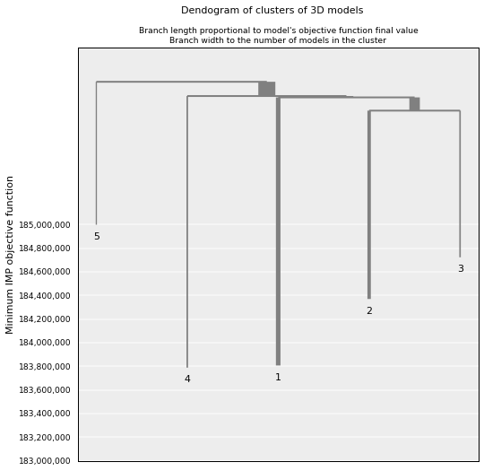

Models consistency
~~~~~~~~~~~~~~~~~~

To assess how "deterministic" a cluster is, one can calculate for each particle the percentage of models (in the cluster) that superimpose a given particle within a given cut-off (pre-set cut-offs of 50, 100, 150 and 200 nm). The lower the consistency value (in %) the less deterministic the models within the selected cluster. This measure can be taken as a proxy of variability across the model. 

.. code:: python

    # Calculate the consistency plot for all models in the first cluster (cluster 0)
    models.model_consistency(cluster=1, cutoffs=(300,500,1000,1500))

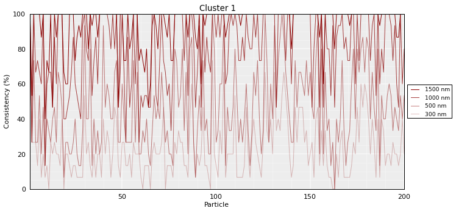

Be aware that this measure makes sense using only models within a cluster and not models from different clusters.

DNA density plots
~~~~~~~~~~~~~~~~~

From the 3D models, the DNA density (or local compactness) can be calculated as the ratio of the bin size (in base pairs) and the distances between consequtive particles in the models. The higher the density the more compact DNA for the region. As this measure varies dramatically from particle to particle, one can calculate it using running averages.

.. code:: python

    # Calculate a DNA density plot
    models.density_plot()

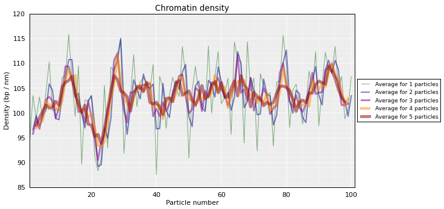

.. code:: python

    # Get a similar plot for only the top cluster and show the standar deviation for a specific(s) running window (steps)
    models.density_plot(cluster=1,error=True, steps=(5))

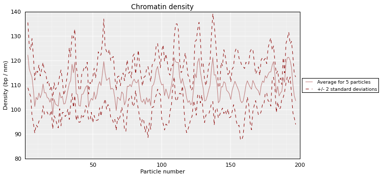

Models contact map
~~~~~~~~~~~~~~~~~~

Given a set of selected models (either from a cluster or a list) one can calculate the percentage of pairs of particles within a distance cut-off. This can then be represented as a heat-map which is equivalent to a Hi-C interaction matrix.

.. code:: python

    # Get a contact map for the top 50 models at a distance cut-off of 300nm
    models.contact_map(models=range(5,10), cutoff=1000, savedata="contact.txt")
The goal of TADBit is to find a 3D structure (or ensemble of structures) that best satisfies the original Hi-C matrix. Therefore, we can compare the contact map produced above to the original HiC input matrix for parts of the models.

.. code:: python

    # Correlate the contact map with the original input HiC matrix for cluster 0
    models.correlate_with_real_data(cluster=1, plot=True, cutoff=1000)
    # Correlate the contact map with the original input HiC matrix for cluster 1
    models.correlate_with_real_data(cluster=2, plot=True, cutoff=1000)
    # Correlate the contact map with the original input HiC matrix for cluster 10
    models.correlate_with_real_data(cluster=2, plot=True, cutoff=1500)

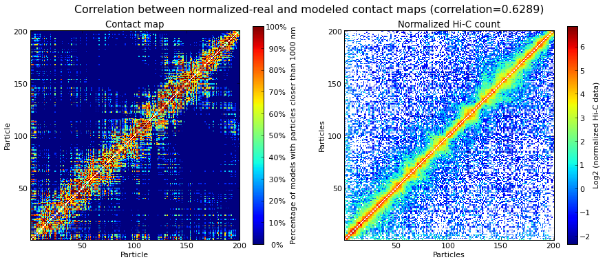

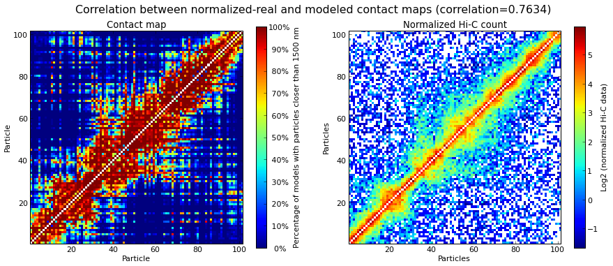

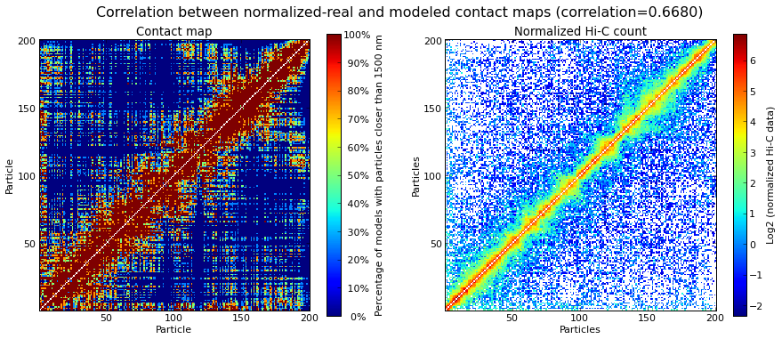

.. parsed-literal::

    (0.66804570055680079, 0.0)

Calculating distances between particles
~~~~~~~~~~~~~~~~~~~~~~~~~~~~~~~~~~~~~~~

Sometimes is useful to get a distribution of distances between pairs of particles in the models (or sub-set of models). Next we show several ways of getting such representations.

.. code:: python

    # Get the average distance between particles 13 and 30 in all kept models
    models.median_3d_dist(13, 20, plot=False)

.. parsed-literal::

    509.89513123103302

Lets plot the distribution used to get this median value.

.. code:: python

    # Plot the distance distributions between particles 13 and 30 in all kept models
    models.median_3d_dist(15, 20, plot=True)

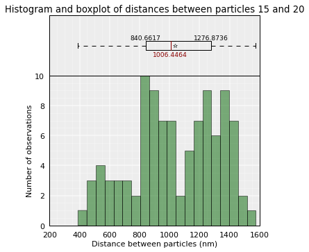

We may also want to use only the 10 first models (lowest energy), or the models belonging to a cluster (example cluster 1).

.. code:: python

    # Plot the distance distributions between particles 13 and 30 in the top 100 models
    models.median_3d_dist(13, 30, models=range(10))

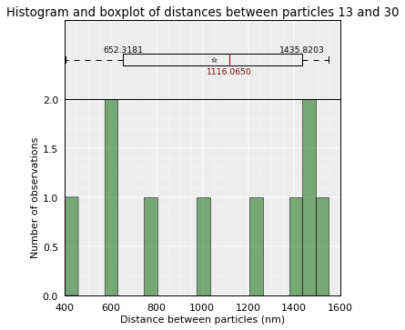

.. code:: python

    # Plot the distance distributions between particles 13 and 30 in the models from cluster 0
    models.median_3d_dist(0, 154, plot=True, cluster=1)

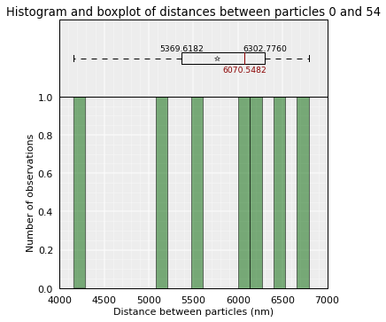

Save and load models and analysis
---------------------------------

By saving your analysis, you won't need to repeat some of the most expensive calculations.

.. code:: python

    # Save your entire analysis and models
    models.save_models('dmel_01.models')

And to load them:

.. code:: python

    # Load the models
    models = load_structuralmodels('dmel_01.models')
    print models

.. parsed-literal::

    StructuralModels with 10 models (objective function range: 1243287276 - 1247672118)
       (corresponding to the best models out of 50 models).
      IMP modeling used this parameters:
       - maxdist     : 450
       - upfreq      : 0
       - reference   : Dekker dataset optimzed for TAD24
       - kforce      : 5
       - lowfreq     : -0.6
       - scale       : 0.005
       - lowrdist    : 1000.0
      Models where clustered into 2 clusters

Specific 3D models can be saved in two formats:
    - CMM format, which can be directly load into Chimera for visualization.
    - XYZ format, which is a simple format that can be useful for further analysis that require coordinates.

.. code:: python

    # Write a CMM file for the top model
    models.write_cmm(directory="./", model_num=0)
    # Write a XYZ file for the top model
    models.write_xyz(directory="./", model_num=0)
    # Write a XYZ file for the top 10 models
    #models.write_xyz(directory="./models/", models=range(10))
    # Write a XYZ file for the cluster 1 models
    #models.write_xyz(directory="./models/", cluster=0)

Related Software
----------------

Chimera
~~~~~~~

Our group has been using the visualization tool Chimera from Ferrin's Group at UCSF (http://www.cgl.ucsf.edu/chimera/) to visualize the 3D models. Here we provide a couple of automatic ways of getting static and video images of selected models. A user can input the models using the generated CMM format in the previous step of this tutorial.

** NOTE **
To properly insert the images/videos in this tutorial, we need to import libraries from IPython. However, such libraries are not necessary for the modeling nor the analysis of the models.
** NOTE **

.. code:: python

    # Generate the image using Chimera in batch mode. That takes some time, wait a bit before running next command.
    # You can check in your home directory whether this has finished.
    models.view_model(models=[1], tool='chimera_nogui', savefig='image_model_1.png')

::

    ---------------------------------------------------------------------------
    TypeError                                 Traceback (most recent call last)

    <ipython-input-45-90b8044b43db> in <module>()
          1 # Generate the image using Chimera in batch mode. That takes some time, wait a bit before running next command.
          2 # You can check in your home directory whether this has finished.
    ----> 3 models.view_model(models=[1], tool='chimera_nogui', savefig='image_model_1.png')
    

    /usr/local/lib/python2.7/dist-packages/TADBit-0.1-py2.7-linux-x86_64.egg/pytadbit/imp/structuralmodels.pyc in view_model(self, models, cluster, tool, savefig, cmd)
        919         else:
        920             models = self.__models
    --> 921         models = [m['rand_init'] if 'IMPmodel' in type(m) else m for m in models]
        922         for model_num in models:
        923             self.write_cmm('/tmp/', model_num=model_num)

    TypeError: argument of type 'type' is not iterable

.. code:: python

.. code:: python

    # Generate the video using Chimera in batch mode. That takes SIGNIFICANT time, wait a bit before running next command.
    # You can check in your home directory whether this has finished.
    models.view_model(model_num=0, tool='chimera_nogui', savefig='image_model_1.webm')
.. code:: python

