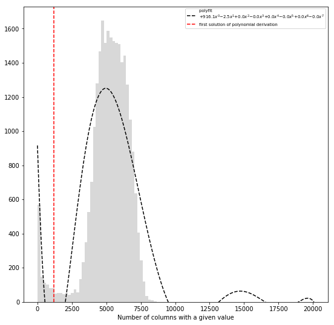
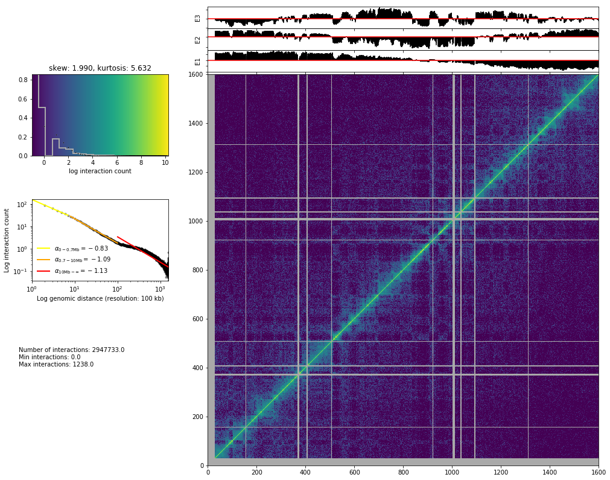
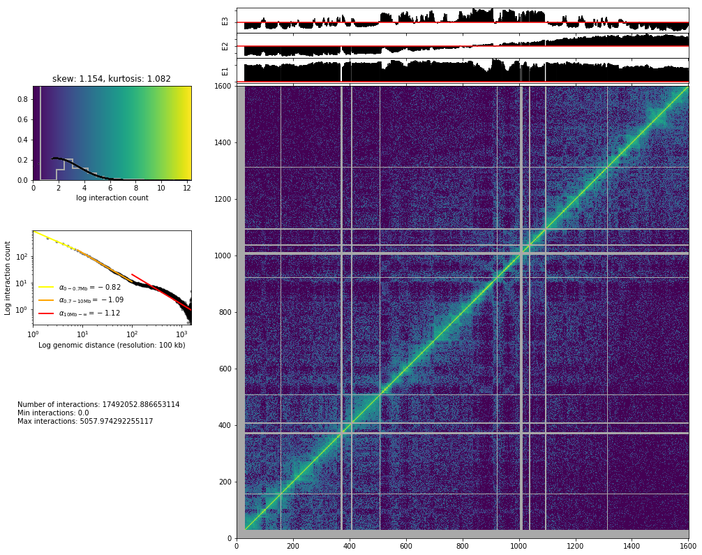
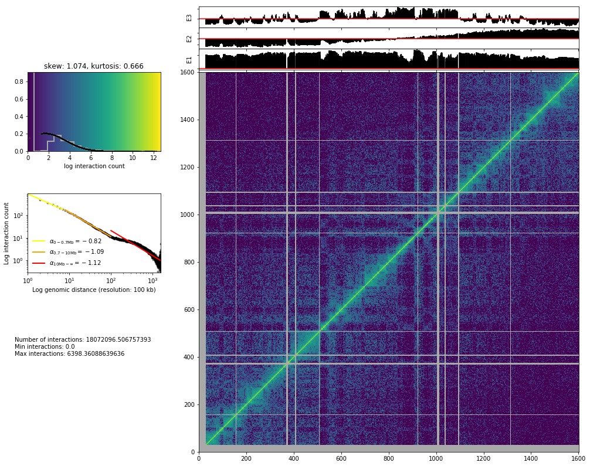
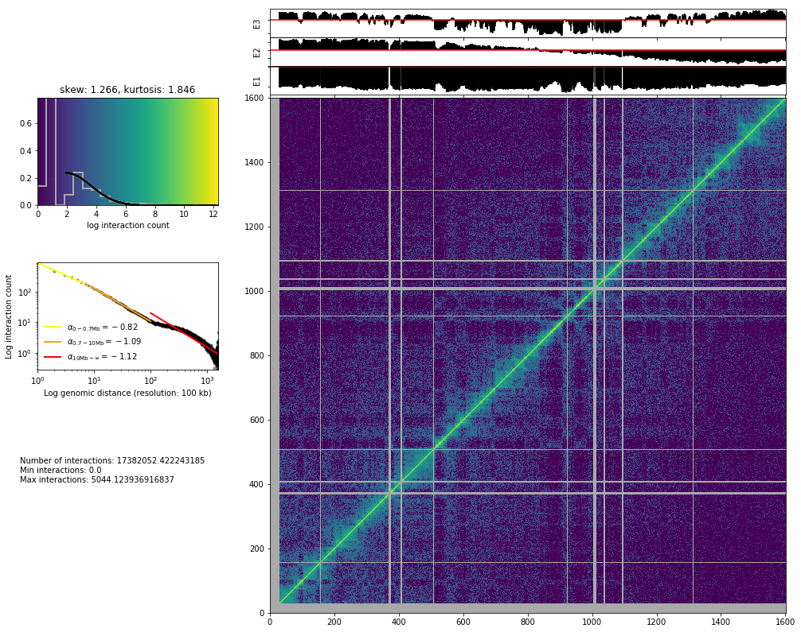
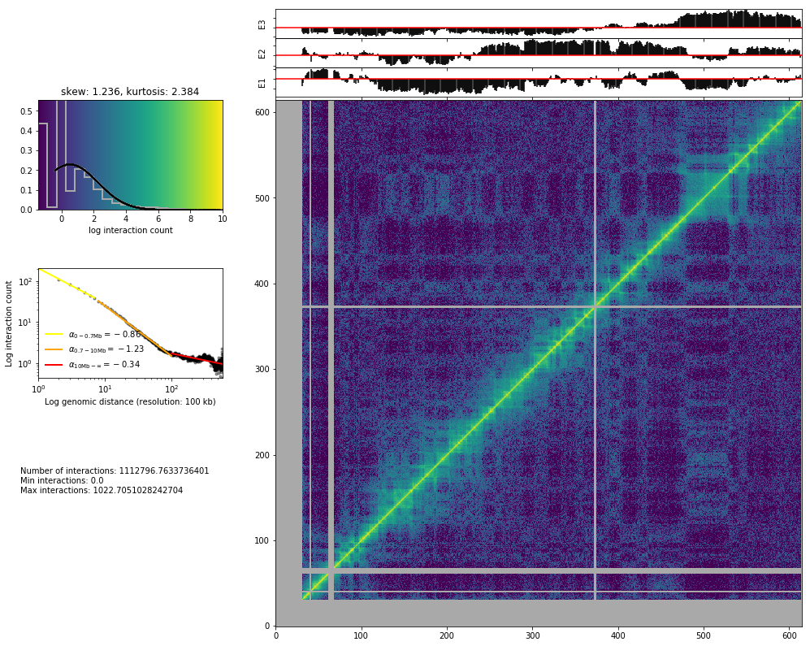

Bin filtering and normalization
===============================

.. code:: ipython2

    from pytadbit.parsers.hic_parser import load_hic_data_from_bam

.. code:: ipython2

    cell = 'mouse_B'
    repl = 'rep1'
    
    reso = 100000

.. code:: ipython2

    hic_data = load_hic_data_from_bam(
        'results/fragment/{0}_{1}/03_filtering/valid_reads12_{0}_{1}.bam'.format(cell, repl),
        reso, ncpus=8)

.. ansi-block::

    
      (Matrix size 27269x27269)                                                    [2019-01-11 12:35:55]
    
      - Parsing BAM (122 chunks)                                                   [2019-01-11 12:35:55]
         .......... .......... .......... .......... ..........     50/122
         .......... .......... .......... .......... ..........    100/122
         .......... .......... ..                                  122/122
    
      - Getting matrices                                                           [2019-01-11 12:37:01]
         .......... .......... .......... .......... ..........     50/122
         .......... .......... .......... .......... ..........    100/122
         .......... .......... ..                                  122/122
    

Filter bins with low interaction counts
---------------------------------------

In this case, the filtering we are applying is divided in two steps: 1.
First we ask to remove all columns having a total of less than 10
interactions (``min_count=10``). This is a relatively loose filtering.
2. We apply a more complex filter. We will remove bins with a total
number of counts much lower than the mean of the interaction counts.

***Note**: For this (very sparse) dataset, we required very few (10)
interactions per bin. In normal cases, to filter bins with too low
interaction counts one should require that each bin contains a minimum
percentage (default 75%) of cells with no-zero counts, or a minimum
number of interactions in total (for good quality data the recommended
value could be 2500).*

.. code:: ipython2

    hic_data.filter_columns(draw_hist=True, min_count=10, by_mean=True, silent=True)

.. ansi-block::

    
    WARNING: Using twice min_count as the matrix was symmetricized and contains twice as many interactions as the original

.. code:: ipython2

    print 'removed {:,} columns out of {:,} ({:.1f}%)'.format(len(hic_data.bads), len(hic_data),
                                                               len(hic_data.bads) / float(len(hic_data)) * 100)

.. ansi-block::

    removed 2,660 columns out of 27,269 (9.8%)

.. code:: ipython2

    print 'removed {:,} columns out of {:,} ({:.1f}%)'.format(len(hic_data.bads), len(hic_data),
                                                               len(hic_data.bads) / float(len(hic_data)) * 100)

.. ansi-block::

    removed 2,660 columns out of 27,269 (9.8%)

At 100 kb it makes no sense to view the full matrix (your matrix will
have more cells than your screen have pixels), so it is much more
informative to plot a specific region of the genome only using the
``focus`` parameter.

.. code:: ipython2

    from pytadbit.mapping.analyze import hic_map

.. code:: ipython2

    hic_map(hic_data, normalized=False, focus='chr3', show=True, cmap='viridis')

.. ansi-block::

    /home/dcastillo/miniconda2/lib/python2.7/site-packages/matplotlib/axes/_base.py:3477: UserWarning: Attempted to set non-positive ylimits for log-scale axis; invalid limits will be ignored.
      'Attempted to set non-positive ylimits for log-scale axis; '
    /home/dcastillo/miniconda2/lib/python2.7/site-packages/pytadbit/utils/tadmaths.py:90: RuntimeWarning: divide by zero encountered in log10
      return np.log10(val)

Normalization algorithms
------------------------

***Note**: if columns with a lot of zeroes are present the ICE
normalization will last very long to converge, and these low-coverage
columns will present, at the end of the normalization, few cells with
very high values of interaction*

Iterative Correction and Eigenvector decomposition (ICE)
~~~~~~~~~~~~~~~~~~~~~~~~~~~~~~~~~~~~~~~~~~~~~~~~~~~~~~~~

ICE normalization \ `(Imakaev et al., 2012) <#cite-Imakaev2012a>`__
assumes an equal experimental visibility of each bin and seeks
iteratively for biases that equalize the sum of counts per bin in the
matrix. At each iteration, a new matrix is generated by dividing each
cell by the product of the sum of counts in its row times the sum of
counts in its column. The process converges to a matrix in which all
bins have identical sum.

If :math:`W` is the raw matrix, :math:`N` is its size, and
:math:`i`\ (:math:`j`) the index of the columns(rows), the normalized
matrix :math:`M` is iteratively computed as:

.. math:: M_{i,j} = \frac{W_{i,j}}{\sqrt{\sum_{n=0}^N{W_{i,n}} \times \sum_{n=0}^N{W_{n,j}}}}

This normalization has usually a quite strong effect, and visually the
matrices look very smooth and regular.

.. code:: ipython2

    hic_data.normalize_hic(iterations=100, max_dev=0.00001)

.. ansi-block::

    iterative correction
      - copying matrix
      - computing biases
              1083.000        5384.660      101635.000    0  17.87492
              4407.395        5483.780        8251.728    1   0.50475
              4560.550        5512.003        6238.145    2   0.17261
              5116.644        5521.481        6119.412    3   0.10829
              5173.833        5524.944        5781.389    4   0.06355
              5374.323        5526.241        5761.161    5   0.04251
              5380.193        5526.744        5621.079    6   0.02652
              5470.168        5526.942        5623.500    7   0.01747
              5465.095        5527.021        5561.686    8   0.01120
              5506.121        5527.053        5567.812    9   0.00737
              5500.600        5527.066        5539.771   10   0.00479
              5519.386        5527.071        5544.417   11   0.00314
              5515.770        5527.073        5531.733   12   0.00205
              5524.250        5527.074        5534.470   13   0.00134
              5522.248        5527.075        5528.790   14   0.00087
              5526.033        5527.075        5530.231   15   0.00057
              5525.014        5527.075        5527.710   16   0.00037
              5526.688        5527.075        5528.422   17   0.00024
              5526.195        5527.075        5527.312   18   0.00016
              5526.929        5527.075        5527.650   19   0.00010
              5526.699        5527.075        5527.165   20   0.00007
              5527.019        5527.075        5527.321   21   0.00004
              5526.915        5527.075        5527.110   22   0.00003
              5527.053        5527.075        5527.180   23   0.00002
              5527.006        5527.075        5527.089   24   0.00001
              5527.066        5527.075        5527.120   25   0.00001
    rescaling to factor 1
      - getting the sum of the matrix
        => 24609.000
      - rescaling biases

.. code:: ipython2

    from pytadbit.mapping.analyze import hic_map
    
    hic_map(hic_data, normalized=True, focus='chr3', show=True, cmap='viridis')

Save biases
~~~~~~~~~~~

.. code:: ipython2

    hic_data.save_biases('results/fragment/{0}_{1}/03_filtering/valid_reads12_{0}_{1}_ICE_{2}kb.biases'.format(
        cell, repl, reso / 1000))

Vanilla coverage normalization
~~~~~~~~~~~~~~~~~~~~~~~~~~~~~~

The vanilla normalization \ `(Rao et al., 2014) <#cite-Rao2014>`__ is a
variation of the ICE where a single iteration is performed.

.. code:: ipython2

    hic_data.normalize_hic(iterations=0, max_dev=0.00001)

.. ansi-block::

    iterative correction
      - copying matrix
      - computing biases
    rescaling to factor 1
      - getting the sum of the matrix
        => 25061.997
      - rescaling biases

.. code:: ipython2

    from pytadbit.mapping.analyze import hic_map
    
    hic_map(hic_data, normalized=True, focus='chr3', show=True, cmap='viridis')

Save biases
~~~~~~~~~~~

.. code:: ipython2

    hic_data.save_biases('results/fragment/{0}_{1}/03_filtering/valid_reads12_{0}_{1}_Vanilla_{2}kb.biases'.format(
        cell, repl, reso / 1000))

Square root vanilla coverage (SQRT) normalization
~~~~~~~~~~~~~~~~~~~~~~~~~~~~~~~~~~~~~~~~~~~~~~~~~

The SQRT vanilla normalization \ `(Rao et al., 2014) <#cite-Rao2014>`__
is a variation of the Vanilla coverage where each element in the matrix
is divided by the square root of the product of sums of counts.

.. math:: M_{i,j} = \frac{W_{i,j}}{\sqrt{\sum_{n=0}^N{W_{i,n}} \times \sum_{n=0}^N{W_{n,j}}}}

.. code:: ipython2

    hic_data.normalize_hic(iterations=0, sqrt=True, max_dev=0.00001)

.. ansi-block::

    iterative correction
      - copying matrix
      - computing biases
    rescaling to factor 1
      - getting the sum of the matrix
        => 1790593.806
      - rescaling biases

.. code:: ipython2

    from pytadbit.mapping.analyze import hic_map
    
    hic_map(hic_data, normalized=True, focus='chr3', show=True, cmap='viridis')

Save biases
~~~~~~~~~~~

.. code:: ipython2

    hic_data.save_biases('results/fragment/{0}_{1}/03_filtering/valid_reads12_{0}_{1}_SQRT_{2}kb.biases'.format(
        cell, repl, reso / 1000))

OneD normalization
~~~~~~~~~~~~~~~~~~

OneD normalization \ `(Vidal et al., 2018) <#cite-Vidal2018>`__ is based
on fitting a non-linear model between the total amount of contacts per
bin and the known biases: - GC content - number of RE sites (the most
important bias, the more cut sites, the more mapped reads) - read
mappability

As the estimation of each of this statistics is very important for the
normalization, they are left outside the normalization function, in
order to allow user to modify them.

.. code:: ipython2

    from pytadbit.parsers.bed_parser          import parse_mappability_bedGraph
    from pytadbit.utils.normalize_hic         import oneD
    from pytadbit.mapping.restriction_enzymes import RESTRICTION_ENZYMES
    from pytadbit.parsers.genome_parser       import parse_fasta, get_gc_content

.. code:: ipython2

    fasta = 'genome/Mus_musculus-GRCm38.p6/Mus_musculus-GRCm38.p6.fa'
    genome = parse_fasta(fasta, verbose=False)

get mappability ~2 min

.. code:: ipython2

    f_mappability = 'genome/Mus_musculus-GRCm38.p6/Mus_musculus-GRCm38.p6.50mer.bedGraph'
    
    mappability = parse_mappability_bedGraph(f_mappability, reso)

.. ansi-block::

         saving mappabilty to cache...

.. code:: ipython2

    for c in genome:
        if not c in mappability:
            mappability[c] = [float('nan')] * (len(genome) / reso + 1)
        if len(mappability[c]) < len(genome) / reso + 1:
            mappability[c] += [float('nan')] * (
                (len(genome) / reso + 1) - len(mappability[c]))
    mappability = reduce(lambda x, y: x + y,
                         (mappability.get(c, []) for c in genome))

get GC content ~ 30 sec

.. code:: ipython2

    gc_content = get_gc_content(genome, reso, n_cpus=8)

compute r\_sites ~30 sec

.. code:: ipython2

    re_site = RESTRICTION_ENZYMES['MboI'].replace('|', '')
    
    n_rsites  = []
    for crm in genome:
        for pos in xrange(0, len(genome[crm]), reso):
            seq = genome[crm][pos:pos + reso + 400]
            n_rsites.append(seq.count(re_site))

.. code:: ipython2

    sum_cols = [float('nan') if c in hic_data.bads else 
                sum(0.0 if l in hic_data.bads else hic_data[c, l] for l in xrange(len(hic_data))) 
                for c in xrange(len(hic_data))]

.. code:: ipython2

    biases = oneD(tot=sum_cols, map=mappability, res=n_rsites, cg=gc_content)

.. ansi-block::

    

.. code:: ipython2

    hic_data.bias = list(biases)

.. code:: ipython2

    from pytadbit.mapping.analyze import hic_map
    
    hic_map(hic_data, normalized=True, focus='chr19', show=True, cmap='viridis')

Save biases
~~~~~~~~~~~

.. code:: ipython2

    hic_data.save_biases('results/fragment/{0}_{1}/03_filtering/valid_reads12_{0}_{1}_oneD_{2}kb.biases'.format(
        cell, repl, reso / 1000))

Comparison
~~~~~~~~~~

By eye, the effect of choosing one normalization over an other is often
very small

.. code:: ipython2

    import matplotlib.pyplot as plt
    import numpy as np
    from pytadbit.utils.extraviews import plot_HiC_matrix

.. code:: ipython2

    plt.figure(figsize=(22, 21))
    axe = plt.subplot(3, 2, 1)
    plt.title('Raw data')
    matrix = hic_data.get_matrix(focus='chr3:10000000-40000000', normalized=False)
    plot_HiC_matrix(np.log2(matrix), axe=axe,#  vmin=0.5,
                    triangular=True)
    axe.axis('off')
    for num, norm in enumerate(['SQRT', 'oneD', 'Vanilla', 'ICE'], 3):
        # load biases
        hic_data.load_biases('results/fragment/{0}_{1}/03_filtering/valid_reads12_{0}_{1}_{3}_{2}kb.biases'.format(
        cell, repl, reso / 1000, norm))
        # retrieve data as matrix
        matrix = hic_data.get_matrix(focus='chr3:10000000-40000000', normalized=True, masked=True)
        # define subplot
        axe = plt.subplot(3, 2, num)
        # draw plot
        plt.title(norm)
        plot_HiC_matrix(np.log2(matrix), axe=axe, 
                        vmin=-0.5 if norm=='oneD' else 1,  # manually adjust color scale depending on the normalization
                        bad_color='grey', triangular=True)
        axe.axis('off')
    plt.show()

.. ansi-block::

    /home/dcastillo/miniconda2/lib/python2.7/site-packages/ipykernel_launcher.py:5: RuntimeWarning: divide by zero encountered in log2
      """
    /home/dcastillo/miniconda2/lib/python2.7/site-packages/ipykernel_launcher.py:18: RuntimeWarning: divide by zero encountered in log2

Other normalizations
~~~~~~~~~~~~~~~~~~~~

ICE and Vanilla normalizations are widely used however other, more
convoluted, normalizations \ `(Hu et al., 2012) <#cite-hu2012hicnorm>`__
\ `(Yaffe and Tanay, 2011) <#cite-Yaffe2011>`__ can be used outside
TADbit and then loaded in TADbit as normalized matrices for further
analysis.

Best normalization
~~~~~~~~~~~~~~~~~~

Which is the best normalization to use is a question that can not be
answered easily because it depends on the type of data and the type of
analysis.

Most of the time Hi-C experiments are conducted in different conditions
and, for each, in several replicates. A good way to find the best
normalization method may be to select the one that achieve to minimize
the differences between replicates and maximize the differences between
conditions (this in the context of the analysis to be performed).

.. raw:: html

   <!--bibtex
   @article{hu2012hicnorm,
     title={HiCNorm: removing biases in Hi-C data via Poisson regression},
     author={Hu, Ming and Deng, Ke and Selvaraj, Siddarth and Qin, Zhaohui and Ren, Bing and Liu, Jun S},
     journal={Bioinformatics},
     volume={28},
     number={23},
     pages={3131--3133},
     year={2012},
     publisher={Oxford Univ Press}
   }
   @article{Yaffe2011,
   abstract = {Hi-C experiments measure the probability of physical proximity between pairs of chromosomal loci on a genomic scale. We report on several systematic biases that substantially affect the Hi-C experimental procedure, including the distance between restriction sites, the GC content of trimmed ligation junctions and sequence uniqueness. To address these biases, we introduce an integrated probabilistic background model and develop algorithms to estimate its parameters and renormalize Hi-C data. Analysis of corrected human lymphoblast contact maps provides genome-wide evidence for interchromosomal aggregation of active chromatin marks, including DNase-hypersensitive sites and transcriptionally active foci. We observe extensive long-range (up to 400 kb) cis interactions at active promoters and derive asymmetric contact profiles next to transcription start sites and CTCF binding sites. Clusters of interacting chromosomal domains suggest physical separation of centromere-proximal and centromere-distal regions. These results provide a computational basis for the inference of chromosomal architectures from Hi-C experiments.},
   author = {Yaffe, Eitan and Tanay, Amos},
   doi = {10.1038/ng.947},
   file = {:home/fransua/.local/share/data/Mendeley Ltd./Mendeley Desktop/Downloaded/Yaffe, Tanay - 2011 - Probabilistic modeling of Hi-C contact maps eliminates systematic biases to characterize global chromosomal archit.pdf:pdf},
   issn = {1546-1718},
   journal = {Nature genetics},
   keywords = {Binding Sites,Chromosomes,Cluster Analysis,Epigenesis,Genetic,Human,Humans,Lymphocytes,Lymphocytes: ultrastructure,Models,Probability},
   mendeley-groups = {Research articles},
   month = {nov},
   number = {11},
   pages = {1059--65},
   pmid = {22001755},
   title = {{Probabilistic modeling of Hi-C contact maps eliminates systematic biases to characterize global chromosomal architecture.}},
   url = {http://www.ncbi.nlm.nih.gov/pubmed/22001755},
   volume = {43},
   year = {2011}
   }
   @article{Imakaev2012a,
   abstract = {Extracting biologically meaningful information from chromosomal interactions obtained with genome-wide chromosome conformation capture (3C) analyses requires the elimination of systematic biases. We present a computational pipeline that integrates a strategy to map sequencing reads with a data-driven method for iterative correction of biases, yielding genome-wide maps of relative contact probabilities. We validate this ICE (iterative correction and eigenvector decomposition) technique on published data obtained by the high-throughput 3C method Hi-C, and we demonstrate that eigenvector decomposition of the obtained maps provides insights into local chromatin states, global patterns of chromosomal interactions, and the conserved organization of human and mouse chromosomes.},
   author = {Imakaev, Maxim V and Fudenberg, Geoffrey and McCord, Rachel Patton and Naumova, Natalia and Goloborodko, Anton and Lajoie, Bryan R and Dekker, Job and Mirny, Leonid A},
   doi = {10.1038/nmeth.2148},
   file = {:home/fransua/.local/share/data/Mendeley Ltd./Mendeley Desktop/Downloaded/Imakaev et al. - 2012 - Iterative correction of Hi-C data reveals hallmarks of chromosome organization.pdf:pdf},
   issn = {1548-7105},
   journal = {Nature methods},
   keywords = {Hi-C},
   mendeley-groups = {stats/Hi-C,Research articles},
   mendeley-tags = {Hi-C},
   month = {oct},
   number = {10},
   pages = {999--1003},
   pmid = {22941365},
   title = {{Iterative correction of Hi-C data reveals hallmarks of chromosome organization.}},
   url = {http://www.ncbi.nlm.nih.gov/pubmed/22941365},
   volume = {9},
   year = {2012}
   }
   @article{Rao2014,
   author = {Rao, Suhas S P and Huntley, Miriam H and Durand, Neva C and Stamenova, Elena K and Bochkov, Ivan D. and {James T. Robinson} and Sanborn, Adrian L. and Machol, Ido and Omer, Arina D. and Lander, Eric S. and Lieberman-Aiden, Erez},
   doi = {10.1016/j.cell.2014.11.021},
   file = {:home/fransua/.local/share/data/Mendeley Ltd./Mendeley Desktop/Downloaded/Rao et al. - 2014 - A 3D Map of the Human Genome at Kilobase Resolution Reveals Principles of Chromatin Looping.pdf:pdf},
   issn = {0092-8674},
   journal = {Cell},
   keywords = {Hi-C},
   mendeley-groups = {Research articles,projects/GEVO/CTCF},
   mendeley-tags = {Hi-C},
   number = {7},
   pages = {1665--1680},
   pmid = {25497547},
   publisher = {Elsevier Inc.},
   title = {{A 3D Map of the Human Genome at Kilobase Resolution Reveals Principles of Chromatin Looping}},
   url = {http://dx.doi.org/10.1016/j.cell.2014.11.021},
   volume = {159},
   year = {2014}
   }

   -->

References
~~~~~~~~~~

[^](#ref-1) Imakaev, Maxim V and Fudenberg, Geoffrey and McCord, Rachel
Patton and Naumova, Natalia and Goloborodko, Anton and Lajoie, Bryan R
and Dekker, Job and Mirny, Leonid A. 2012. *Iterative correction of Hi-C
data reveals hallmarks of chromosome organization.*.
`URL <http://www.ncbi.nlm.nih.gov/pubmed/22941365>`__

[^](#ref-2) Rao, Suhas S P and Huntley, Miriam H and Durand, Neva C and
Stamenova, Elena K and Bochkov, Ivan D. and James T. Robinson and
Sanborn, Adrian L. and Machol, Ido and Omer, Arina D. and Lander, Eric
S. and Lieberman-Aiden, Erez. 2014. *A 3D Map of the Human Genome at
Kilobase Resolution Reveals Principles of Chromatin Looping*.
`URL <http://dx.doi.org/10.1016/j.cell.2014.11.021>`__

[^](#ref-3) Enrique Vidal, François le Dily, Javier Quilez, Ralph
Stadhouders, Yasmina Cuartero, Thomas Graf, Marc A Marti-Renom, Miguel
Beato, Guillaume J Filion. 2018. *OneD: increasing reproducibility of
Hi-C samples with abnormal karyotypes*.
`URL <https://doi.org/10.1093/nar/gky064>`__

[^](#ref-4) Hu, Ming and Deng, Ke and Selvaraj, Siddarth and Qin,
Zhaohui and Ren, Bing and Liu, Jun S. 2012. *HiCNorm: removing biases in
Hi-C data via Poisson regression*.

[^](#ref-5) Yaffe, Eitan and Tanay, Amos. 2011. *Probabilistic modeling
of Hi-C contact maps eliminates systematic biases to characterize global
chromosomal architecture.*.
`URL <http://www.ncbi.nlm.nih.gov/pubmed/22001755>`__
