Three-dimensional modeling
**************************

.. contents::
   :depth: 3

Data filtering
==============

The first step in the structure determination method by IMP, as in any integrative approach, is to check 
for possible biases in the experimental data the could give rise to artifacts in the final 3D models. In 
TADBit, this is done by studying the distribution of the sum of interactions per raw/columns in the Hi-C 
matrix. According to this distribution, some columns may be removed if the sum of their interactions 
significantly lower than the median of median of all the interactions.
This step is performed automatically within TADBbit each time new experimental data are loaded. To ensure 
that only the otliers columns are removed, TADBit checks if the selected cutoff corresponds is a concave 
down in the region between zero and the median of the overall distribution. The rejected columns are stored 
in the variable Experiment._zeros, which represents the columns to be skipped in the consecutive steps.
The following example shows the cutoff (dashed red line, autmatically determined with the above described 
method) for the Human chromosome 19 data (data preloaded in the 'exp' variable). According to the fit showed 
in the plot, all the columns corresponding the Hi-C raw data with total count of interaction below the dashed 
red line (~46 in this case) will be discarded. Their corresponding particles will be treated as 
'missing particles' (particles with no experimental data).

::

  from pytadbit.utils import filter_with_polynomial_fit

  filter_with_polynomial_fit(exp.get_hic_matrix(), draw_hist=True)

.. figure::  pictures/example_filtering.png
   :align:   center

Data normalization
==================
To account for possible biases in the experimental data, the Z-score of the 5C data is computed. However, 
since the Z-score requires the data to be normally distributed, 5C data are log10 transformed prior the 
computation of the Z-score. The input data for IMP consist then in the resulting Z-score matrix computed 
on the experimental data.

The filtered Hi-C data (stored in :class:`pytadbit.experiment.Experiment`) need then to be normalized before entering the IMP pipeline. The normalization is carried out in two steps: (i) generation of the weight for each pair of interactions, based on the interaction count in the corresponding row/column; (ii) Z-score ( `z-score <http://en.wikipedia.org/wiki/Standard_score#Calculation_from_raw_score>`_) compitation for each interaction pair.

Calculation of weights
----------------------

Weights can be calculated according to two formulas (see 
:class:`pytadbit.experiment.Experiment.normalize_hic`); however, in the context of three-dimensional modeling, 
the "over_tot" method is recommended, as the distribution of values generated is closer to normal.

Hi-C interaction counts are thus normalized according to the following formula:

.. math::

  weight(I, J) = \frac{\sum^N_{i=0}{(matrix(i, J))} \times \sum^N_{j=0}{(matrix(I, j))}}{\sum^N_{i=0}{\sum^N_{j=0}{(matrix(i, j))}}}

where 'matrix' is the raw data (count of interactions), and N is the number of rows/columns.

The result is stored in a new matrix, called 'weight'. The values that will be used in the next step are the 
multiplication of this weights per the raw data.

Calculation of the z-score
--------------------------

Z-scores are computed according to classical formula (:math:`\frac{x-\mu}{\sigma}`) on the log10 transformed 
values of the normalized data (see above):

.. math::

  zscore(I, J) = \frac{log_{10}(weight(I, J) \times matrix(I, J)) - mean(log_{10}(weight \times matrix))}{stddev(log_{10}(weight \times matrix))}

**Important: values on the diagonal are not taken into account in this calculation.**

Dealing with zeros
^^^^^^^^^^^^^^^^^^

In an Hi-C interaction matrix, a value of zero means that the corresponding fragments of chromatin were 
not crosslinked in the experiment. Since this could be caused either by an experimental artifact or by 
the fact that the two corresponding fragments were never found close enough to be crosslinked, we assume 
that :math:`log_{10}(0) = 0`, in the calculation of the mean and stddev, and equal to -1 in the calculation
 of the z-score.

TADBit tutorial #1. From Hi-C data to TAD 3D models
===================================================

This tutorial will walk users in the necessary steps for modeling a 3D genomic domain from a Hi-C fly dataset (REF). First, we will load a "Chromosome" object from which we take one "Experiment" object ('exp'). From this Experiment object we can model a given region using IMP.
^^^^^^^^^^^^^^^^^^^^^^^^^^^^^^^^^^^^^^^^^^^^^^^^^^^^^^^^^^^^^^^^^^^^^^^^^^^^^^^^^^^^^^^^^^^^^^^^^^^^^^^^^^^^^^^^^^^^^^^^^^^^^^^^^^^^^^^^^^^^^^^^^^^^^^^^^^^^^^^^^^^^^^^^^^^^^^^^^^^^^^^^^^^^^^^^^^^^^^^^^^^^^^^^^^^^^^^^^^^^^^^^^^^^^^^^^^^^^^^^^^^^^^^^^^^^^^^^^^^^^^^^^^^^^^^^^^^^^

1. Loading data
~~~~~~~~~~~~~~~

Import the necessary libraries and set some variables:

*****
    WE WILL HAVE TO TELL IN THE MANUAL HOW TO USE THIS TUTORIAL IN THEIR OWN COMPUTERS, WITH GRAPHS, ETC...
    REMEMBER TO CHANGE THE NAMES OF THE LIBRARIES THAT YOU MAY HAVE CHANGED!
*****

::

    # Libraries
    from pytadbit import Chromosome
    from pytadbit.tad_clustering.tad_cmo import optimal_cmo
    from pytadbit.imp.structuralmodels import load_structuralmodels
    from pytadbit.imp.CONFIG import CONFIG

Definition of a Chromosome object:

::

    crm = '2R' # Chromosome name
    my_chrom = Chromosome(crm) # Create the chromosome object

Load all experiments done on Drosophila's chromosome 2R (Hi-C matrices), which include Corces' technical 
and biolobical replicates. Then visualize the data: 

::

    # Load three different experimental data named TR1, TR2 and BR
    datasets = ['TR1', 'TR2', 'BR']
    for xnam in datasets:
        my_chrom.add_experiment(xnam, 
                                resolution=10000, 
                                xp_handler='/home/fransua/db/hi-c/corces_dmel/10Kb/{0}/{0}_{1}_10Kb.txt'.format(crm, xnam))
    my_chrom.experiments
    
    # Visualize the experimental data for each of the three experiments
    for xnam in datasets:
        my_chrom.visualize(xnam)

.. parsed-literal::

    /usr/local/lib/python2.7/dist-packages/pytadbit/chromosome.py:468: RuntimeWarning: divide by zero encountered in log2
      img = axe.imshow(fun(matrix), origin='lower', vmin=vmin, vmax=vmax,

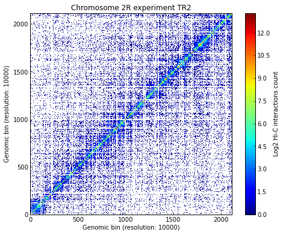

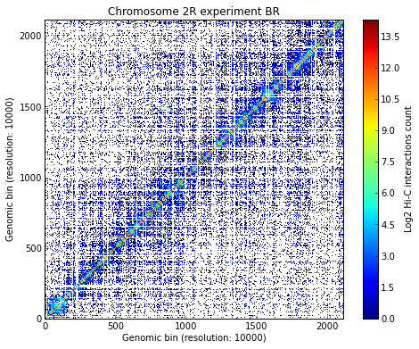

2. Calculating TAD borders
~~~~~~~~~~~~~~~~~~~~~~~~~~

Calculate TAD borders for the three expriments

::

    # Identify TADs of the experimental data saved in my_chrom (about 20' execution time)
    for xnam in datasets:
        my_chrom.find_tad(xnam) # Finding TADs can take significant CPU time (by default it uses all available CPUs)
        my_chrom.visualize(xnam, paint_tads=True)

.. image:: pictures/Tadbit_for_IMP_fransua_11_1.png

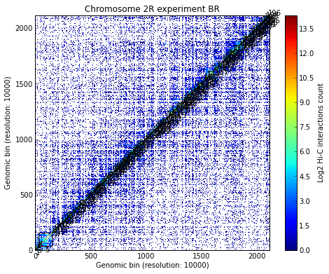

Calculating TADs takes significant CPU time. Thus, it is a good idea to save the results and reload them when
 needed:

::

    # Save the TAD definition for all experiments. To re-load a chromosome use the load_chromosome() function.
    my_chrom.save_chromosome('my_chrom.tdb')

Align the three experiments (TAD borders) and visualize the alignment:

::

    # Align all experiments
    my_chrom.align_experiments()
    my_chrom.alignment

.. parsed-literal::

    {('BR',
      'TR1',
      'TR2'): Alignment of boundaries (length: 210, number of experiments: 3)}

::

    # Visualize the result of the alignment
    ali = my_chrom.alignment[('BR','TR1','TR2')]
    ali.write_alignment()

.. raw:: html

   <pre>Alignment shown in 10 Kb (3 experiments) (scores: 0 1 2 3 4 5 6 7 8 9 10)
   TR1:| ---- | ---- | ---- | ---- | ---- |   155|   160|   165|   184|   191|   196|   203|   210|   215|   226|   237|   251|   263|   269|   283|   289| ---- | ---- |   334|   341|   355|   361| ---- |   371|   379|   387|   395|   405|   448|   454|   461| ---- |   477|   483|   497|   502|   508|   517|   527|   532|   542|   547|   553|   558|   569|   587|   596|   601|   629|   644|   652|   669|   678|   700|   705|   711|   716|   721|   728|   733|   746|   752|   757|   772|   777| ---- |   789|   794|   802|   808|   817|   822|   830|   835|   849|   856|   864|   872|   878|   883|   892|   901|   906|   912|   931|   936|   945|   974|   981|   987|  1003|  1009|  1014|  1036|  1050|  1063|  1069|  1075|  1084|  1090|  1096|  1102|  1108|  1113|  1120|  1126|  1139|  1145|  1173|  1181|  1189|  1197|  1202| ---- |  1210|  1222|  1246|  1265|  1271|  1277|  1289|  1298|  1326|  1331|  1336|  1342|  1349|  1354|  1361|  1367|  1375|  1401|  1406|  1427|  1432|  1449|  1454|  1459|  1467|  1474|  1500|  1510|  1516|  1525|  1533|  1538|  1558|  1565|  1612|  1621|  1646|  1652|  1680|  1685|  1690|  1696|  1706| ---- |  1717|  1726|  1736|  1741|  1748|  1754|  1760|  1795|  1800|  1809|  1838|  1844|  1849|  1858|  1868|  1875|  1880|  1885|  1890|  1895|  1924|  1929|  1940|  1946|  1953|  1958|  1963|  1971|  1978|  1985|  1994|  1999|  2007|  2018|  2024|  2040|  2045|  2052|  2057|  2062|  2067|  2075|  2081|  2089|  2096| ---- |  2114
   TR2:| ---- | ---- | ---- | ---- | ---- |   155|   160|   165|   184|   191|   196|   203|   210|   215| ---- |   237|   251|   263|   269|   283|   289|   294|   299|   334|   341|   355|   361|   367|   372|   379|   387|   395|   405|   448|   454|   461| ---- |   477|   483|   497|   502|   508|   517|   527|   532|   542|   547|   553|   558|   569|   587|   596|   601|   629|   644|   652|   669|   678|   703| ---- |   711|   716|   721|   728|   733|   746|   752|   757|   772|   777| ---- |   789|   794|   802|   808|   817|   822|   830|   835|   849|   856|   864|   872|   878|   883|   892|   901|   906|   912|   931|   936|   945|   973|   981|   987|  1003|  1009|  1014|  1036|  1050|  1063|  1069|  1075|  1084| ---- |  1094|  1102|  1108|  1113|  1120|  1126|  1139|  1145|  1174|  1180|  1189|  1197|  1202| ---- |  1210|  1222|  1246|  1265|  1271|  1277|  1289|  1298|  1326|  1331|  1336|  1342|  1349|  1354|  1361|  1367|  1375|  1401|  1406|  1427|  1432|  1449|  1454|  1459|  1467|  1474|  1500| ---- |  1516|  1525|  1533|  1538|  1559|  1565|  1612|  1621|  1646|  1652|  1681| ---- |  1690|  1696|  1706| ---- |  1717|  1726|  1736|  1741|  1748|  1754|  1760|  1795|  1801|  1806|  1838|  1844|  1849|  1858|  1868|  1875|  1880|  1885|  1890|  1895|  1924|  1929|  1940|  1946|  1953|  1958|  1963|  1971|  1978|  1985|  1994|  1999|  2007|  2018|  2024|  2040|  2045|  2052|  2057|  2062|  2067|  2075|  2081|  2089|  2096| ---- |  2114
   BR :|     7|    15|    23|    28|    33|   155|   160|   165|   184|   191|   196|   203| ---- |   215|   229|   237|   251|   263|   269|   283|   289|   294| ---- |   334|   341| ---- |   361| ---- |   371|   379|   387|   395|   405|   448|   454|   460|   466|   477|   483|   498| ---- |   508|   517|   527|   533|   542|   547|   553|   558|   569|   587|   597|   602|   629|   644|   652|   669|   678|   701|   706|   711|   716|   721|   728|   733|   746|   752|   757|   773|   778|   784|   789|   794|   802|   808|   817|   822|   830|   835|   849|   856|   864|   872|   878|   883|   892|   901|   906|   912|   931|   940|   945|   974|   981|   987|  1003| ---- |  1014|  1036|  1050|  1063|  1069|  1075|  1084|  1089|  1094|  1102|  1108|  1113|  1120|  1126|  1139|  1145|  1173|  1181|  1189| ---- |  1200|  1205|  1210|  1222|  1246|  1265|  1270|  1275|  1289|  1298|  1325|  1330|  1335|  1342|  1349|  1354|  1361|  1366|  1375|  1401|  1406|  1427|  1432|  1449|  1454|  1459|  1467|  1474|  1500| ---- |  1516|  1525|  1533|  1538|  1558|  1565|  1612|  1621|  1646|  1652|  1681| ---- |  1690|  1696|  1704|  1709|  1717|  1726|  1736|  1741|  1748|  1754|  1760|  1795|  1800| ---- | ---- |  1844|  1849|  1858|  1868|  1875|  1880|  1886| ---- |  1895|  1924|  1929|  1940|  1946|  1953|  1958|  1963|  1971|  1978|  1985|  1994|  1999|  2007|  2018|  2024|  2040|  2045| ---- |  2057|  2062|  2067|  2074|  2081|  2089|  2096|  2106|  2114
   
   </pre>
    

The region between boundaries 405 and 448 (430Kb) has well conserved boundaries (score of 9 and 10) and will 
therefore be selected for the modeling:

::

    # Get the TAD number for each of the selected TADs in each experiment using the brk (upper boundary)
    brkp = 448
    ntad = {}
    ltad = {}
    for xnam in datasets:
        ltad[xnam] = my_chrom.experiments[xnam].tads
        for tad_k, tad_v in ltad[xnam].iteritems():
            for k, v in tad_v.iteritems():
                if k == 'brk' and v == brkp:
                    ntad[xnam] = tad_k
                    print "Experiment "+ xnam + " has selected TAD " + str(ntad[xnam])

.. parsed-literal::

    Experiment TR1 has selected TAD 25
    Experiment TR2 has selected TAD 27
    Experiment BR has selected TAD 29

::

    # alternative way to do the same
    # I know you should have passed a hard time to write your loop, but I think this way is more elegant
    # and it works even if one of the TADs does not end exactly at 448 (it could be that the column is 448 448 449).
    brkp = 448
    ntad = {}
    columns = ali.get_column(lambda x: x['brk'] == brkp, 
                             min_num=1) # selection of columns having TADs ending at genomic bin '448'
                                        # Can also be done by counting columns, this one is the 32: 
                                        # >>> ali.get_column(32)
    column= columns[0]                  # only one column
    for tad in column[1]:               # second element of a column is the list of TADs (first is the column number)
        ntad[tad['exp'].name] = tad['index']
        print "Experiment "+ tad['exp'].name + " has selected TAD " + str(tad['index'])

.. parsed-literal::

    Experiment TR1 has selected TAD 25
    Experiment TR2 has selected TAD 27
    Experiment BR has selected TAD 29

Compare all-against-all the selected tads:

::

    # We can now compare the selected TADs
    for i in range(0, len(datasets)):
        for j in range(i+1, len(datasets)):
            xnam1 = datasets[i]        
            xnam2 = datasets[j]
            hic1 = my_chrom.get_tad_hic(my_chrom.experiments[xnam1].tads[ntad[xnam1]],xnam1)
            hic2 = my_chrom.get_tad_hic(my_chrom.experiments[xnam2].tads[ntad[xnam2]],xnam2)
            align1, align2, score = optimal_cmo(hic1, hic2, max_num_v=8, long_nw=True, long_dist=True, method='frobenius')
            print "{:>3}[{}] .vs. {:>3}[{}] CC: {:.3}".format(xnam1, ntad[xnam1], xnam2, ntad[xnam2], score['rho'])

.. parsed-literal::

    TR1[25] .vs. TR2[27] CC: 0.949
    TR1[25] .vs.  BR[29] CC: 0.93
    TR2[27] .vs.  BR[29] CC: 0.945

All the comparisons have a high correlation coefficient (>0.92); thus, the three experiments for the selected TADs can be merged into a single experiment:

::

    # Sum all datasets into a single experimetal set
    exp = my_chrom.experiments['BR'] + my_chrom.experiments['TR1'] + my_chrom.experiments['TR2']
    my_chrom.experiments.append(exp)
    exp

.. parsed-literal::

    Experiment BR+TR1+TR2 (resolution: 10Kb, TADs: None, Hi-C rows: 2115)

Re-calculate all the TADs for the sum of the experiments:

::

    # Re-calculate the TAD borders for the new dataset with the sum of the individual matrices
    xnam = 'BR+TR1+TR2'
    my_chrom.find_tad(xnam) # Finding TADs can take significant CPU time (by default it uses all available CPUs)
    my_chrom.visualize(xnam, paint_tads=True)

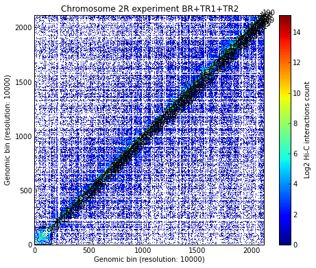

::

    # Is the selected TAD also found in the new TADs from matrix joining the three experiments?
    strp = 406 # starting point
    endp = 448 # end point
    ltad[xnam] = my_chrom.experiments[xnam].tads
    for tad_k, tad_v in ltad[xnam].iteritems():
        if tad_v['start'] == strp and tad_v['end'] == endp:
            ntad[xnam] = tad_k
            print "Experiment "+ xnam + " has selected TAD " + str(ntad[xnam])

.. parsed-literal::

    Experiment BR+TR1+TR2 has selected TAD 24

The selected TAD (TAD 24) is also found in the new TADs from the matrix joining the three experiments. 
Visualize the selected TAD:

***** 
    I ALSO WORRY FOR THE BLUE LINES THAT GO TO THE DIAGONAL. ARE THOSE CORRECT? MISSING VALUES? => yes, data is a bit wired...
*****

::

    # Visualize a specific TAD
    my_tad = my_chrom.experiments[xnam].tads[ntad[xnam]]
    my_chrom.visualize(xnam, tad=my_tad)

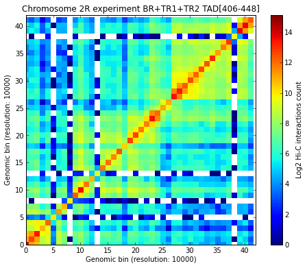

.. parsed-literal::

    <matplotlib.image.AxesImage at 0x3f5f290>

3. Model the 3D structure of a selected TAD
~~~~~~~~~~~~~~~~~~~~~~~~~~~~~~~~~~~~~~~~~~~

Run the 3D modeling on the selected TAD. The generated models are stored in a dictionary whose keys are consecutive integers, ordered by the IMP Objective Function value (smaller to larger). All the models are based on specific sets of experimental data for which TADBit modeling parameters need to be optimized (see Tutorial #2). Optimizing the parameters takes significant CPU time and thus we have pre-optimized them for the datasets in this tutorial. The specific parameters are stored in a python dictionary called CONFIG. The one used in this tutorial are CONFIG['dmel_01'].

******
    IF I USE ONLY 406 to 448 I GET AN ERROR ON nmin, SEEMS THAT CANNNOT MODEL SMALL REGIONS? TO CORRECT! => indeed it is the step of "polynomial-fit" filtering that was craching, this steps needs a minimum of columns to be able to fit something... This step is now skipped when number of columns is too low.
****** 

::

    # 3D modeling configuration.
    CONFIG

.. parsed-literal::

    {'dmel_01': {'kforce': 5,
      'lowfreq': -0.7,
      'lowrdist': 100,
      'maxdist': 600,
      'reference': 'victor corces dataset 2013',
      'upfreq': 0.3}}

::

    # Build 3D models based on the Hi-C data. This is done by IMP. 
    models = exp.model_region(406, 448, n_models=500, n_keep=100, n_cpus=8, keep_all=True, config=CONFIG['dmel_01'])
    print models

.. parsed-literal::

    /usr/local/lib/python2.7/dist-packages/pytadbit/utils/hic_filtering.py:145: UserWarning: WARNING: Too few data to filter columns. SKIPPING...
      warn('WARNING: Too few data to filter columns. SKIPPING...')

.. parsed-literal::

    StructuralModels with 100 models (objective function range: 922965 - 932558)
       (corresponding to the best models out of 500 models).
      IMP modelling used this parameters:
       - maxdist     : 600
       - upfreq      : 0.3
       - reference   : victor corces dataset 2013
       - kforce      : 5
       - lowfreq     : -0.7
       - lowrdist    : 100
      Models where clustered into 0 clusters

Select a subset of all the generated models:

::

    # Select top 10 models
    models.define_best_models(10)
    print "Lowest 10 IMP OF models:" 
    print models
    
    # Select top 50 models
    models.define_best_models(100)
    print "Lowest 50 IMP OF models:" 
    print models

.. parsed-literal::

    Lowest 10 IMP OF models:
    StructuralModels with 10 models (objective function range: 922965 - 923673)
       (corresponding to the best models out of 500 models).
      IMP modelling used this parameters:
       - maxdist     : 600
       - upfreq      : 0.3
       - reference   : victor corces dataset 2013
       - kforce      : 5
       - lowfreq     : -0.7
       - lowrdist    : 100
      Models where clustered into 0 clusters
    Lowest 50 IMP OF models:
    StructuralModels with 100 models (objective function range: 922965 - 932558)
       (corresponding to the best models out of 500 models).
      IMP modelling used this parameters:
       - maxdist     : 600
       - upfreq      : 0.3
       - reference   : victor corces dataset 2013
       - kforce      : 5
       - lowfreq     : -0.7
       - lowrdist    : 100
      Models where clustered into 0 clusters

For each model, the IMP objective function value, the random number generator feed used in IMP, the xyz coordinates and the log file of the search for the best conformation (i.e. the 3D conformation that best satisfies the input restraints - corresponding to the lowest IMP objective function) are stored. Data from a model can be retreived as followed:

::

    # Get the data for the lowest IMP OF model (number 0) in the set of models
    model = models[0]
    print model

.. parsed-literal::

    IMP model of 43 particles with: 
     - Final objective function value: 922965.537593
     - random initial value: 479
     - first coordinates:
            X      Y      Z
          119   -500    282
           37   -476    212
          136   -459    187
    

The IMP objective function can be plotted as function of each optimization step during the modeling:

::

    # Get the IMP OF of the stored model in "model"
    model.objective_function(log=True, smooth=True)

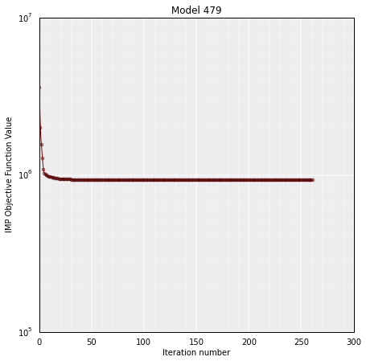

It is important to verify whether the set of selected models (usually the top 20%, based on their IMP objective function value) has a good correlation with the input Hi-C data. High correlation values mean that the select set of 3D models represent well the input experimental data. The correlation is calculated with the following function:

::

    # Calculate the correlation coefficient between the selected models and the original Hi-C matrix
    models.correlate_with_real_data(models=range(50), plot=True, cutoff=300)

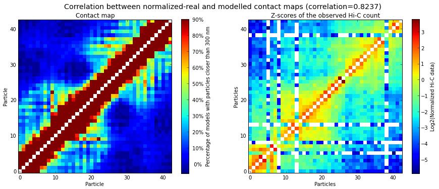

4. Model analysis
~~~~~~~~~~~~~~~~~

4.1 Model clustering
^^^^^^^^^^^^^^^^^^^^

The selected models are clustered based on their structural similarity. Clusters are numbered from larger (more models) to smaller (less models):

::

    # Cluster models based on structural similarity
    models.cluster_models(fact=0.90, dcutoff=200)
    print models.clusters

.. parsed-literal::

    {0: [57, 39, 70, 43, 63, 44, 42, 12, 9, 0, 15, 30, 62, 17, 8, 28, 75, 35, 38, 56, 34, 54, 36, 40, 73, 1, 45, 59, 14, 64, 58, 55, 53, 51, 27, 2], 1: [50, 41, 88, 84, 77, 89, 61, 67, 94, 81, 79, 46, 82, 47, 71, 68, 48, 60, 66, 95], 2: [3, 76, 22, 5, 4, 65, 13, 23, 7, 83, 78, 21, 24], 3: [29, 33, 32, 37, 25, 20], 4: [80, 86, 87, 74, 69, 72], 5: [98, 91, 85, 93], 6: [10, 11, 16, 6], 7: [97, 92, 99], 8: [90, 96], 9: [52, 49], 10: [19, 18], 11: [31, 26]}

Generated clusters can be plotted for ease of visualization. The "y" axis of the plot shows the IMP objective function. The largest cluster (the one numbered with a "0") is expected to have the lowest IMP objective function:

******
     NEED TO SAVE THE CLUSTERING AND DENDOGRAM DATA INTO A FILE. => format? always or on demand?
******

::

    # Plot the resulting clusers
    cl = models.cluster_analysis_dendrogram(color=True)

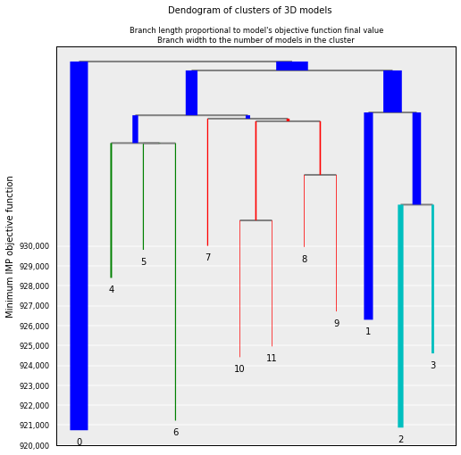

Similarity betwen clusters can be shown for a limited number of them (5 in this example):

::

    # Show de dendogram for only the 5 top clusters and no colors
    cl = models.cluster_analysis_dendrogram(n_best_clusters=5)

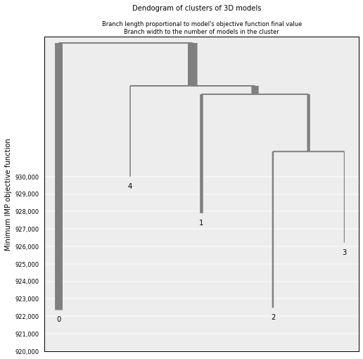

4.2 Models consistency
^^^^^^^^^^^^^^^^^^^^^^

To assess how "deterministic" a cluster is, for each particle the percentage of models (in the cluster) that superimpose the particle within a given cut-off (pre-set cut-offs of 50, 100, 150 and 200 nm) can be calculated. The lower the consistency value (in %) the less deterministic (i.e. more variable) the corresponfing region of models within the selected cluster. This measure can be taken as a proxy of variability across the model:

***** 
    NEED TO SAVE THE CONSISTENCY DATA INTO A FILE. => Done, on demand only
*****

::

    # Calculate the consistency plot for all models in the first cluster (cluster 0)
    models.model_consistency(cluster=0)

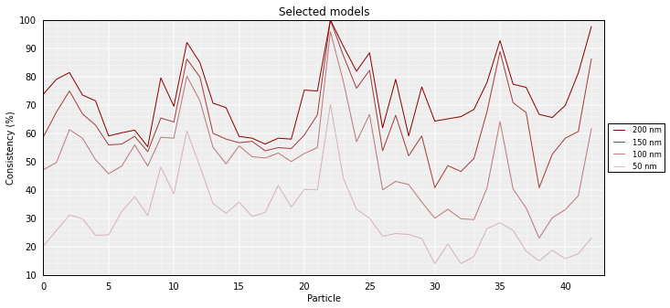

4.3 DNA density plots
^^^^^^^^^^^^^^^^^^^^^

From the 3D models, the DNA density (or local compactness, in bp/nm) can be calculated as the ratio of the bin size (in base pairs) and the distances (nm) between consequtive particles in the models. The higher the density the more compact DNA for the region. Values are calculated using running averages:

******
     NEED TO SAVE THE DENSITY DATA INTO A FILE. => done on demand only
******

::

    # Calculate a DNA density plot
    models.density_plot()

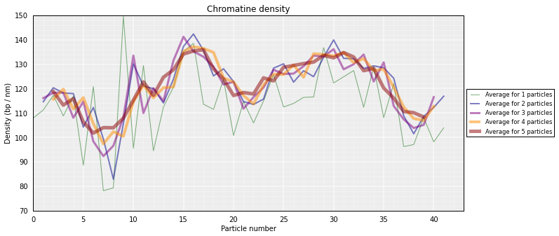

***** 
    I NEED TO UNDESTAND HOW YOU GET THIS STANDARD DEVIATION (MAYBE USE STANDAR ERROR?). => It's simply two times the standard deviation, but it moves a lot from one model to the other.
    ALSO, I DID TRIED TO USE ONLY ONE STEPS (10) AND DID NOT WORK. WHY? => FIXED. before only tuples were accepted.
*****

::

    # Get a similar plot for only the top cluster and show the standar deviation for a specific running window (steps)
    models.density_plot(error=True, steps=(2, 5))

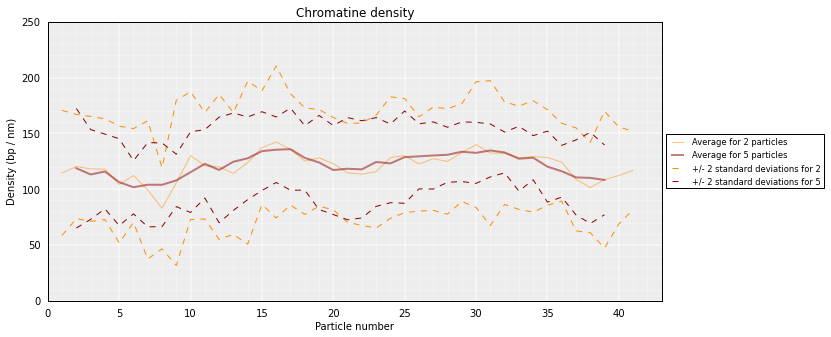

4.4 Models contact map
^^^^^^^^^^^^^^^^^^^^^^

Given a set of selected models (either from a cluster or a list), the percentage of pairs of particles within a for a distance cut-off can be calculated. The result can then be represented as a heat-map similar to the ones used to represent Hi-C data:

******
    ALSO REMOVE THE Z LABEL => all?
    NEED TO SAVE THE CONTACT MAP DATA INTO A FILE. => done.
******

::

    # Get a contact map for the top 50 models at a distance cut-off of 300nm
    models.contact_map(models=range(50), cutoff=300)

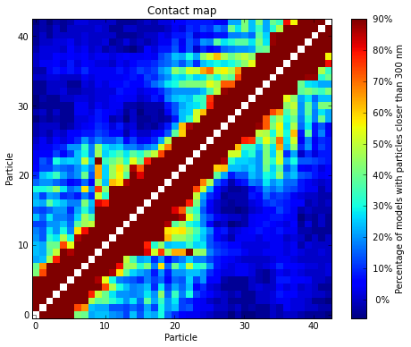

The goal of IMP is to find a 3D structure (or an ensemble of structures) that best satisfies the original Hi-C matrix. To verify the how well the generated models represent the input experimental data, the contact map produced above can be compared to the original Hi-C input matrix:

::

    # Correlate the contact map with the original input Hi-C matrix
    models.correlate_with_real_data(models=range(50), plot=True, cutoff=300)

4.5 Calculating distances between particles
^^^^^^^^^^^^^^^^^^^^^^^^^^^^^^^^^^^^^^^^^^^

Sometimes is useful to get the distribution of distances between pairs of particles in the models (or in a sub-set of the models): 

******
    WE ALSO NEED TO CALCULATE ANGLES BETWEEN THREE PARTICLES.
    WOULD BE NICE TO ALSO HAVE THE MEDIAN FOR A DISTANCE (NOT JUST THE AVERAGE). => hmmm the name of the function is bad, what is returned is the median... you can also get the full list of value if you want to compute the mean for example. I haven't done the mean. But if you wish I can.
    ALL OUTPUT NEEDS TO HAVE A MAXIMUM OF TWO DECIMALS. => At the time to write them imto a file OK. But for the return of a function, I do not think this is a good idea, if you want it you just do "round(result, 3)"
    THERE IS A NEED ALSO TO HAVE AN OPTION FOR SAVING THE ACTUAL DISTANCES IN A FILE. => format? usually the format is a three columns file: P1 P2 Distance
******

::

    # Get the average distance between particles 13 and 23 in all kept models
    models.average_3d_dist(13, 23, plot=False)

.. parsed-literal::

    353.18443338679435

Plot of the distribution used to get the mean value:

::

    # Plot the distance distributions between particles 13 and 23 in all kept models
    models.average_3d_dist(13, 23, plot=True)

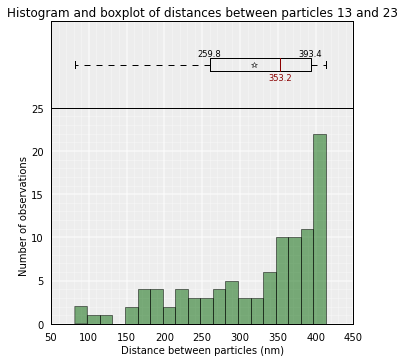

To use only the 10 first models (lowest energy), or the models belonging to a cluster (example cluster 0):

::

    # Plot the distance distributions between particles 13 and 23 in the top 10 models
    models.average_3d_dist(13, 23, models=range(10))

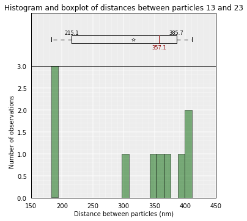

::

    # Plot the distance distributions between particles 13 and 23 in the models from cluster 0
    models.average_3d_dist(13, 23, plot=True, cluster=0)

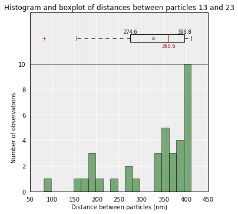

4.6 Visualizing the 3D models
^^^^^^^^^^^^^^^^^^^^^^^^^^^^^

Specific 3D models can be saved in two formats:
    - CMM format, which can be directly loaded into Chimera for visualization.
    - XYZ format, which is a simple format that can be useful for further analysis that require coordinates.

******
    CAN GET GET THE OPTION TO WRITE CMMs AND XYZ FILES FOR A RANGE OF MODELS OR ALL MODELS IN A CLUSTER?
    WE NEED TO PREPARE A PAIR OF FUNCTIONS THAT WRITE MODELS AND SCRIPTS FOR CHIMERA
        1. SINGLE MODEL TO VISUALIZE AS A "tube"
        2. ENTIRE CLUSTER TO VISUALIZE AS "surface"
    DAVIDE CAN HELP IN PREPARING THE CHIMERA PYTHON SCRIPTS => YES!!! :)
******

::

    # Write a CMM file for the top model
    models.write_cmm(directory="./", model_num=0, models=None, cluster=None)
    # Write a XYZ file for the top model
    models.write_xyz(directory="./", model_num=0, models=None, cluster=None)

Save and load your analysis
---------------------------

By saving the analysis, some of the most expensive calculations will not need to be repeated:

::

    # Save your entire analysis and models
    models.save_models('dmel_01.models')

To load them:

::

    # Load the models
    models = load_structuralmodels('dmel_01.models')
    print models

.. parsed-literal::

    StructuralModels with 100 models (objective function range: 922965 - 932558)
       (corresponding to the best models out of 500 models).
      IMP modelling used this parameters:
       - maxdist     : 600
       - upfreq      : 0.3
       - reference   : victor corces dataset 2013
       - kforce      : 5
       - lowfreq     : -0.7
       - lowrdist    : 100
      Models where clustered into 12 clusters

