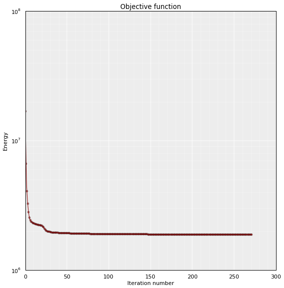
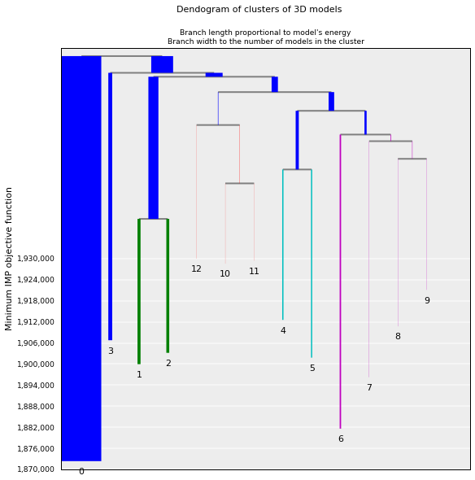
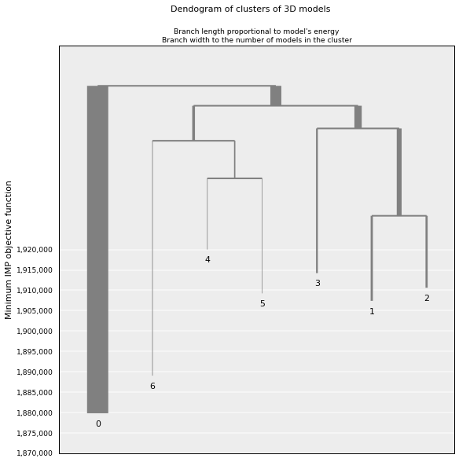
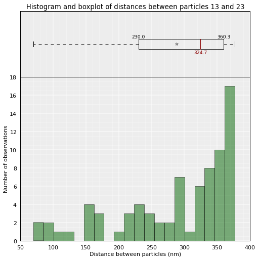
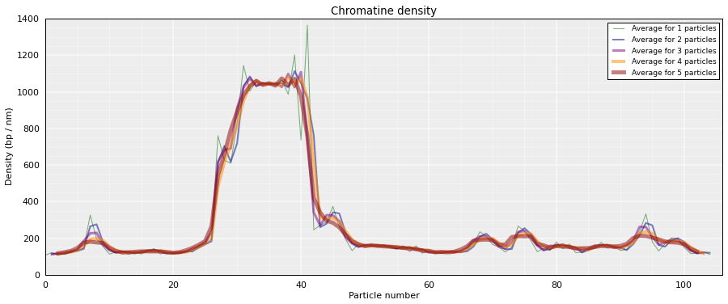
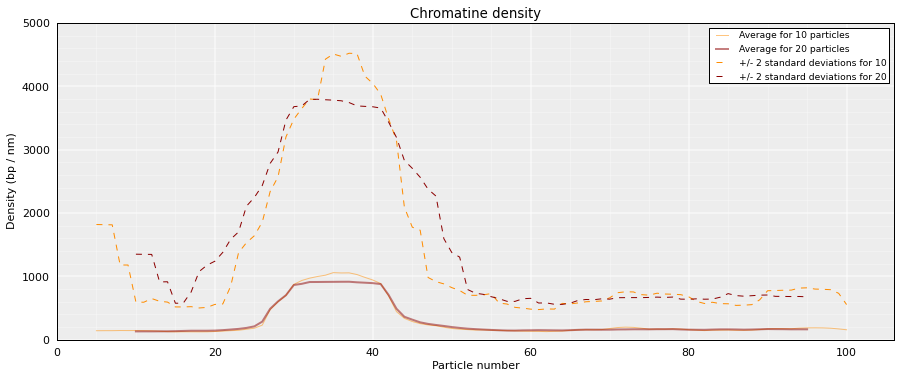
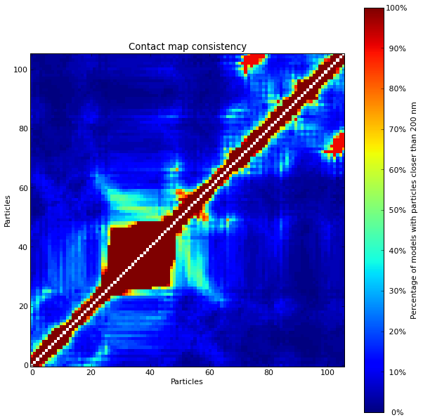
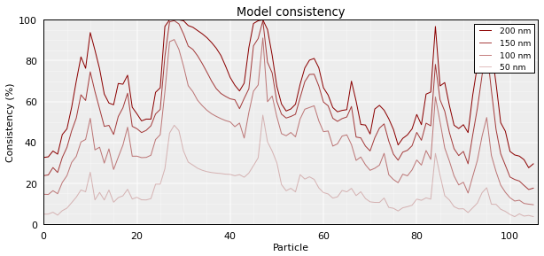
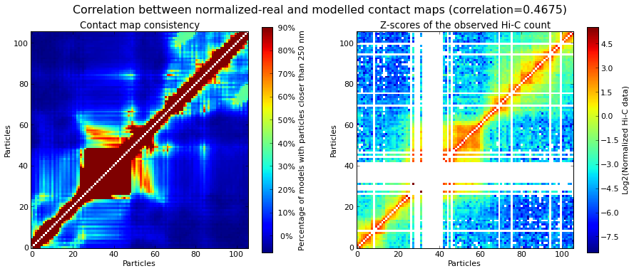

Three-dimensional modeling
**************************

.. contents::
   :depth: 3

Data filtering
==============

To model chromatin structure, we need to ensure that our data is clean enough. The first step is thus to draw the distribution of the sum of interactions per raw/columns in the Hi-C matrix. According to this distribution, we may remove some columns if they present a suspiciously low count of interaction.

Here an example, where "exp" is an preloaded Experiment corresponding to human's 19th chromosome:

::

  from pytadbit.utils import filter_with_polynomial_fit

  filter_with_polynomial_fit(exp.get_hic_matrix(), draw_hist=True)

.. figure::  pictures/example_filtering.png
   :align:   center

Than, according to the fit represented above, we would discard all columns in the Hi-C raw data having cumulative count of interaction below the dashed red line in the graph above (~46). This columns will be removed from the modeling, and their associated particles will have no experimental data.

*This step is done automatically within tadbit each time an experiment is loaded. In order to ensure that we do remove outlier columns, tadbit checks if this root corresponds to a* **concave down** *region and if it stands* **between zero and the median** *of the overall distribution. The result of these "bad" columns is stored in the variable Experiment._zeros, that represents the columns to be skipped in the consecutive steps.*

Data normalization
==================

Hi-C data stored in :class:`pytadbit.experiment.Experiment` might be normalized in order to be used by IMP.
This normalization is achieve in two steps, first we generate weight for each pair of interactions, depending on the interaction count in the corresponding row/column, second we calculate the `z-score <http://en.wikipedia.org/wiki/Standard_score#Calculation_from_raw_score>`_ of each of these interaction pairs.

Calculation of weights
----------------------

Weights can be calculated according to two formulas (see :class:`pytadbit.experiment.Experiment.normalize_hic`), however, in the context of three-dimensional modeling, the "over_tot" method is recommended, as the distribution of values generated is closer to normal.

Hi-C interaction count are thus normalized according to this formula:

.. math::

  weight(I, J) = \frac{\sum^N_{i=0}{(matrix(i, J))} \times \sum^N_{j=0}{(matrix(I, j))}}{\sum^N_{i=0}{\sum^N_{j=0}{(matrix(i, j))}}}

"matrix", being our row data (count of interactions), N the number of rows/columns.

The result is stored in a new matrix, called weight. The values that will be used in the next step are the multiplication of this weights per the raw data.

Calculation of the z-score
--------------------------

Z-scores are computed according to classical formula (:math:`\frac{x-\mu}{\sigma}`), over the decimal logarithm values of the normalized data (see above). Ending in this formula:

.. math::

  zscore(I, J) = \frac{log_{10}(weight(I, J) \times matrix(I, J)) - mean(log_{10}(weight \times matrix))}{stddev(log_{10}(weight \times matrix))}

**Important: values on the diagonal are not taken into account for this calculus.**

Dealing with zeros
^^^^^^^^^^^^^^^^^^

A zero in an Hi-C interaction matrix, means that the given two fragments of DNA were never found close enough to be crosslinked together. However such values are also highly suspicious to be artifacts. 

Right now we assume that :math:`log_{10}(0) = 0`, in the calculation of the mean and stddev, and equal to -1 in the calculation of the z-score itself.

How to get ThreeDeeModels?
==========================

Here we load a Chromosome object, from which we take one Experiment object ('exp'). 

From this Experiment object we can model a given region using IMP.

::

    from pytadbit import Chromosome

Definition of a Chromosome object

::

    crm = '2R'
    crmbit = Chromosome('2R')

Load all experiments done on Drosophila's chromosome 2R (Hi-C matrices), and sum the Hi-C matrices (Corces' technical and biolobical replicates) into a single experiment

::

    for xnam in ['TR2', 'TR1', 'BR']:
        crmbit.add_experiment(xnam, resolution=10000, 
                              xp_handler='/home/fransua/db/hi-c/corces_dmel/10Kb/{0}/{0}_{1}_10Kb.txt'.format(crm, xnam))
    
    exp = crmbit.experiments['TR1'] + crmbit.experiments['TR2'] + crmbit.experiments['BR']

Finally run the IMP modelling on a given region (this region corresponds to the one Davide shows at meeting with Guillaume)

::

    models = exp.model_region(190, 295, n_models=5000, n_keep=1000, n_cpus=8, keep_all=True)

Playing around with models
--------------------------

Models are stored in a dictionary which keys are number (the lowest the less energy).
Thus to have a look to the best model we just type:

::

    print models

.. parsed-literal::

    ThreeDeeModels with 1000 models (energy range: 1879749-1937736)
       (corresponding to the best models out of 5000 models).
      Models where clustered into 0 clusters

Note that if, at this point, you want to keep only 500 models, just do:

::

    models.define_best_models(500)
    print models

.. parsed-literal::

    ThreeDeeModels with 500 models (energy range: 1879749-1921292)
       (corresponding to the best models out of 5000 models).
      Models where clustered into 0 clusters

And back to the thousand models:

::

    models.define_best_models(1000)
    print models

.. parsed-literal::

    ThreeDeeModels with 1000 models (energy range: 1879749-1937736)
       (corresponding to the best models out of 5000 models).
      Models where clustered into 0 clusters

Thus for each model is stored, the final energy, the random initial number used with IMP, the coordinates xyz and the log of the search for the best conformation lowering the energy.

Each can be reached like this:

::

    model = models[0]
    print model

.. parsed-literal::

    IMP model of 106 particles with: 
     - Final energy: 1879749.89564
     - random initial value: 3730
     - first coordinates:
            X      Y      Z
         -511    234   -325
         -434    217   -254
         -497    253   -208
    

Objective function
------------------

We want to plot the objective function for this best model:

::

    models.objective_function_model(0, log=False, smooth=False)

.. image:: pictures/Tadbit_for_IMP_notebook_20_0.png

... perhaps nicer with log (note that it can be done using the IMPmodel object directely):

::

    model = models[0]
    model.objective_function(log=True, smooth=True)

Clustering models
-----------------

First we run the clustering. The result of this will be stored inside the ThreeDeeModels object.

::

    models.cluster_models(fact=0.75, dcutoff=200)
    print models.clusters

.. parsed-literal::

    {0: [668, 652, 381, 392, 241, 526, 259, 938, 722, 452, 203, 247, 648, 678, 588, 285, 309, 204, 25, 228, 412, 579, 36, 94, 521, 937, 642, 68, 834, 44, 156, 192, 637, 543, 359, 566, 415, 132, 15, 75, 22, 761, 933, 736, 48, 710, 619, 618, 323, 251, 961, 402, 211, 338, 812, 134, 666, 10, 691, 321, 929, 268, 744, 962, 375, 634, 39, 240, 63, 187, 536, 93, 943, 65, 930, 106, 728, 472, 781, 73, 789, 147, 641, 814, 747, 274, 502, 258, 433, 265, 593, 510, 442, 313, 230, 218, 893, 165, 467, 679, 575, 746, 559, 126, 84, 102, 31, 771, 14, 674, 349, 6, 280, 330, 580, 66, 12, 90, 143, 277, 740, 62, 772, 249, 196, 286, 606, 537, 382, 661, 115, 650, 136, 826, 810, 103, 177, 127, 380, 578, 534, 29, 96, 9, 122, 109, 158, 799, 107, 361, 123, 468, 611, 208, 515, 24, 743, 224, 358, 289, 492, 43, 603, 699, 188, 21, 408, 369, 72, 599, 785, 809, 617, 2, 205, 28, 16, 546, 184, 124, 428, 128, 401, 655, 987, 186, 315, 133, 848, 889, 74, 261, 105, 297, 52, 288, 255, 675, 151, 995, 92, 209, 33, 589, 758, 976, 35, 920, 584, 342, 30, 217, 164, 498, 973, 458, 83, 544, 570, 254, 387, 901, 142, 406, 873, 195, 999, 226, 329, 114, 61, 978, 202, 801, 326, 257, 667, 245, 104, 215, 307, 311, 372, 173, 528, 750, 518, 191, 221, 154, 811, 379, 767, 239, 276, 253, 807, 531, 70, 1, 459, 393, 335, 216, 613, 8, 185, 519, 595, 76, 377, 941, 200, 716, 235, 429, 182, 576, 922, 101, 272, 145, 654, 841, 163, 169, 573, 854, 760, 82, 720, 969, 491, 87, 404, 175, 141, 328, 275, 886, 7, 594, 194, 57, 564, 378, 113, 673, 60, 936, 4, 213, 869, 538, 649, 532, 737, 110, 118, 440, 556, 225, 797, 150, 582, 513, 91, 38, 514, 778, 353, 490, 19, 947, 991, 703, 496, 181, 846, 117, 201, 0, 548, 111, 149, 69, 5, 304, 131, 541, 301, 50, 453, 368, 140, 487, 157, 100, 47, 499, 706, 231, 162, 718, 193, 627, 299, 112, 59, 263, 665, 233, 282, 721, 374, 715, 899, 37, 659, 171, 561, 524, 927, 478, 489, 322, 436, 152, 242, 409, 765, 138, 210, 267, 945, 336, 770, 121, 612, 658, 333, 495, 714, 45, 905, 227, 46, 863, 161, 180, 430, 78, 99, 287, 689, 364, 745, 116, 80, 176, 27, 733, 248, 18, 77, 605, 444, 539, 455, 817, 878, 574, 621, 967, 974, 523, 273, 139, 602, 206, 189, 530, 3, 108, 610, 640, 585, 89, 816, 739, 651, 148, 558, 120, 67, 413, 693, 129, 719, 463, 137, 405, 705, 984, 704, 497, 271, 135, 229, 512, 821, 308, 23, 725, 316, 944, 663, 422, 331, 199, 507, 643, 895, 54, 319, 670, 238, 909, 632, 17, 503, 281, 85, 457, 894, 825, 802, 557, 607, 13, 278, 178, 97, 815, 435, 155, 912, 975, 577, 780, 592, 174, 681, 399, 533, 88, 168, 318, 34, 237, 840, 397, 292, 79, 119, 806, 81, 146, 98, 813, 327, 86, 389, 232, 565, 394, 339, 71, 471, 236, 183, 266, 58, 493, 172, 403, 348, 295, 207, 64, 11, 214, 879, 954, 517, 243, 615, 465, 932, 42, 851, 166, 798, 786, 779, 939, 20, 223, 963, 695, 494, 542, 994, 125, 754, 32, 828, 332, 437, 294, 40, 144, 800, 748, 41, 306, 981, 500, 153, 550, 234, 179, 159, 293, 949, 449, 190, 49, 260, 283, 198, 856, 130, 540, 395, 170, 445, 959, 522, 552, 376, 466, 55, 385, 484, 355, 529, 167, 777, 26, 160, 95, 344, 290, 598, 360, 244, 384, 246, 197, 562, 587, 888, 370, 793, 581, 662, 337, 365, 256, 764, 485, 916, 269], 1: [866, 735, 906, 597, 907, 795, 924, 923, 983, 711, 877, 373, 824, 325, 919, 858, 864, 320, 432, 931, 303, 347, 985, 717, 410, 357, 837, 729, 990, 367, 366, 928, 883, 782, 630, 692, 604, 940, 831, 890, 417, 914, 911, 787, 881, 324, 386, 554, 482, 305, 270, 264, 252, 314, 783, 979, 902, 876, 520, 830, 980, 291, 620, 759, 857, 977, 822, 250, 956, 371, 727, 418, 752, 647, 609, 474, 896, 836, 898, 768, 805, 709, 354, 784, 657, 388, 763, 917, 885, 441, 396], 2: [563, 669, 483, 638, 684, 753, 400, 690, 833, 910, 686, 950, 926, 279, 829, 625, 567, 891, 664, 839, 479, 553, 749, 411, 677, 511, 908, 636, 583, 438, 832, 505, 525, 571, 951, 398, 769, 653, 688, 946, 685, 942, 989, 997, 918, 477, 773, 900, 790, 590, 867, 960, 560, 742, 804, 845, 988, 903, 982, 506, 875, 957, 350, 756, 791, 600, 921, 698, 568, 935, 788, 596, 504, 451, 547, 586, 591, 818, 302, 868, 724, 682, 434, 644, 766, 426, 774], 3: [732, 509, 971, 423, 775, 958, 862, 757, 850, 762, 953, 835, 461, 871, 416, 555, 964, 470, 469, 755, 501, 897, 904, 407, 421, 414, 696, 391, 671, 614, 842, 624, 447, 861, 819, 865, 346, 363, 844, 847, 508, 843, 486, 820, 965, 855, 345, 683, 948, 454, 527, 460, 672, 853, 419, 660, 707, 608, 827, 913, 880, 970, 545, 340, 351, 425], 4: [852, 701, 569, 731, 860, 870, 646, 892, 859, 639, 645, 730, 838, 738, 697, 616, 723, 796, 823, 849, 601, 713, 925, 462, 622, 626, 694, 623, 631, 488, 708], 5: [803, 312, 424, 882, 352, 629, 262, 446, 427, 687, 356, 284, 680, 334, 296, 343, 776, 741, 448, 431, 362, 516, 341, 464, 656, 456, 450, 874, 300, 955], 6: [56, 915, 676, 473, 792, 53, 298, 51, 808, 572, 884, 549, 439, 794, 475, 476, 383, 310, 317, 443, 952, 535, 390, 712, 628, 726, 551, 887, 872, 481], 7: [220, 212, 222, 219], 8: [635, 420, 633, 480], 9: [734, 751, 700, 702], 10: [968, 998, 934], 11: [972, 966, 996], 12: [986, 992, 993]}

Plot clusters
-------------

We can plot everything (The 12 clusters found):

::

    cl = models.cluster_analysis_dendrogram(color=True)

Or just 6 of them (without this colors that no one understands...)

::

    cl = models.cluster_analysis_dendrogram(n_best_clusters=7)

Distance between 2 particles
----------------------------

We can just quickly get a value of the distance between particle 13 and 23

::

    models.average_3d_dist(13, 23, plot=False)

.. parsed-literal::

    325.43350473976784

This by default, is calculated over the ensemble of models we have. Lets plot the distribution used to get this mean value:

::

    models.average_3d_dist(13, 23, plot=True)

We may also want to use only the 100 first models (lowest energy), or the models belonging to cluster number 0:

::

    models.average_3d_dist(13, 23, models=range(100))

.. image:: pictures/Tadbit_for_IMP_notebook_37_0.png

::

    models.average_3d_dist(13, 23, plot=True, cluster=0)

.. image:: pictures/Tadbit_for_IMP_notebook_38_0.png

Density plot
------------

Using distances between particle, we can plot now the density (bp per nm) of our chromosomic region.

::

    models.density_plot(models=None)

.. parsed-literal::

    <matplotlib.axes.AxesSubplot at 0x3694450>

::

    models.density_plot(cluster=0, error=True, steps=(10,20))

.. parsed-literal::

    <matplotlib.axes.AxesSubplot at 0x36a0c10>

Contact Map
-----------

::

    models.contact_map(models=range(100), cutoff=200)

.. parsed-literal::

    <matplotlib.axes.AxesSubplot at 0x3d58290>

Consistency Plot
----------------

::

    models.model_consistency(cluster=0)

::

    models.correlate_with_real_data(cluster=0, plot=True, cutoff=250)

Save and load your analysis
---------------------------

To save your results in a file called "ici"

::

    models.save_models('ici')

And to load them:

::

    from pytadbit.imp.threedeemodels import load_threedeemodels
    
    models = load_threedeemodels('ici')
    print models

.. parsed-literal::

    ThreeDeeModels with 1000 models (energy range: 1879749-1937736)
       (corresponding to the best models out of 5000 models).
      Models where clustered into 13 clusters

and start again :)
