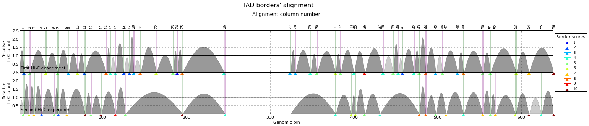

Alignment of TAD boundaries
===========================

.. contents::
   :depth: 3

TADBit allows to use the information from different Hi-C experiments and to put it together in order to 
decide whether some TAD boundaries are conserved or not.

Following with the example in the previous section (:ref:`getting_start`), we will load one extra experiment 
(from the same works of [Lieberman-Aiden2009]_):

.. code:: python

    from pytadbit import Chromosome
    
    # initiate a chromosome object that will store all Hi-C data and analysis
    my_chrom = Chromosome(name='My fisrt chromosome', centromere_search=True)
    
    # load Hi-C data
    my_chrom.add_experiment('First Hi-C experiment', hic_data="../../scripts/sample_data/HIC_k562_chr19_chr19_100000_obs.txt", resolution=100000)
    my_chrom.add_experiment('Second Hi-C experiment', hic_data="../../scripts/sample_data/HIC_gm06690_chr19_chr19_100000_obs.txt", resolution=100000)
    
    # run core tadbit function to find TADs, on each experiment
    my_chrom.find_tad('First Hi-C experiment')
    my_chrom.find_tad('Second Hi-C experiment')
       
    print my_chrom.experiments

.. parsed-literal::

    [Experiment First Hi-C experiment (resolution: 100Kb, TADs: 43, Hi-C rows: 639, normalized: None), Experiment Second Hi-C experiment (resolution: 100Kb, TADs: 31, Hi-C rows: 639, normalized: None)]

We now have loaded two Hi-C experiments, both at 100 Kb resolution, and have predicted the location of TADs in each of them (42 TADs detected in the first experiment and 31 in the second).

Aligning boundaries
-------------------

To align TAD boundaries several algorithms have been implemented 
(see :func:`pytadbit.chromosome.Chromosome.align_experiments`); our recommendation, however, is to use 
the default "reciprocal" method (:func:`pytadbit.boundary_aligner.reciprocally.reciprocal`). 

*Note: If the align_experiments function is run with no argument, by default all the loaded experiments will be aligned.*

Continuing with the example, the two loaded experiments are aligned as follow:

.. code:: python

    my_chrom.align_experiments(names=["First Hi-C experiment", "Second Hi-C experiment"])
    
    print my_chrom.alignment

.. parsed-literal::

    {('First Hi-C experiment', 'Second Hi-C experiment'): Alignment of boundaries (length: 56, number of experiments: 2)}

All the alignments done between the experiments belonging to the same chromosome are stored under the 
alignment dictionary attached to the Chromosome object. Each alignment is an object itself 
(see :class:`pytadbit.alignment.Alignment`)

Check alignment consistency through randomization
~~~~~~~~~~~~~~~~~~~~~~~~~~~~~~~~~~~~~~~~~~~~~~~~~

In order to check that the alignment makes sense and that it does not correspond to a random association of boundaries, the “randomize” parameter can be set to True when aligning:

.. code:: python

    score, pval = my_chrom.align_experiments(randomize=True, rnd_method="interpolate",
                                             rnd_num=1000)
    
    print 'score:', score
    print 'p-value:', pval

.. parsed-literal::

    score: 0.267857142857
    p-value: 0.0

Alignment objects
-----------------

Visualization
~~~~~~~~~~~~~

The first function to call to check the quality of the generated alignments is the 
:func:`pytadbit.alignment.Alignment.write_alignment`:

.. code:: python

    ali = my_chrom.alignment[('First Hi-C experiment', 'Second Hi-C experiment')]
    
    print ali

.. parsed-literal::

    Alignment shown in 100 Kb (2 experiments) (scores: 0 1 2 3 4 5 6 7 8 9 10)
     First Hi-C experiment:|     6|    13| ---- | ---- |    32| ---- |    46| ---- |    59|    70|    78| ---- | ---- |   104|   109|   115|   125| ---- |   132|   137|   145|   164|   184|   189|   195|   245|   324|   330|   348|   356|   378|   384| ---- |   400| ---- |   413| ---- |   435|   447|   453|   458|   472|   478|   486|   498|   506| ---- |   524|   531|   554|   563| ---- |   594|   609| ---- |   639
    Second Hi-C experiment:|     5|    12|    18|    27| ---- |    42|    47|    57| ---- | ---- |    79|    86|    98| ---- | ---- |   115| ---- |   127| ---- | ---- | ---- | ---- | ---- | ---- |   195|   246| ---- | ---- | ---- | ---- |   378| ---- |   397| ---- |   402|   413|   431| ---- | ---- | ---- | ---- | ---- |   478|   486|   498| ---- |   510| ---- |   531|   554|   563|   569|   593|   609|   624|   639
    

The different colors, corresponding to the TADBit confidence in detecting the boundaries, show how conserved the boundaries are between (in this case) cell types.

Alignment can also be viewed using matplotlib:

.. code:: python

    ali.draw()

The get\_column function
~~~~~~~~~~~~~~~~~~~~~~~~

The :func:`pytadbit.alignment.Alignment.get_column` function allows to select specific columns of an alignment. 

To select, for example, the third column of an alignment:

.. code:: python

    ali.get_column(3)

.. parsed-literal::

    [(2, [>-<, >1700<])]

The first element of the tuple is the column index, while the two values of the second element of the tuple 
are the TADs associated to the aligned boundaries in that column. Note that TAD objects are represented 
between the '>' and '<' symbols (see: :class:`pytadbit.alignment.TAD`).

The :func:`pytadbit.alignment.Alignment.get_column` function can also take as an argument a function, in 
order to select a column (or several) depending on a specific condition. For example, to select all the 
boundaries with a score higher than 7:

.. code:: python

    cond1 = lambda x: x['score'] > 7

and to the get the selected columns:

.. code:: python

    ali.get_column(cond1=cond1)

.. parsed-literal::

    [(24, [>19400<, >19400<]), (43, [>48500<, >48500<]), (55, [>63800<, >63800<])]

resulting, in the selection of these 3 columns.

To add a second condition, e.g. to select only the columns after the 50th column of the alignment:

.. code:: python

    cond2 = lambda x: x['pos'] > 50
    ali.get_column(cond1=cond1, cond2=cond2)

.. parsed-literal::

    [(55, [>63800<, >63800<])]

Finally, to be more flexible, this conditions can be applied to only a given number of experiments (in this example of a pairwise alignment, it does not make a lot of sense):

.. code:: python

    ali.get_column(cond1=cond1, cond2=cond2, min_num=1)

.. parsed-literal::

    [(53, [>60800<, >60800<]), (55, [>63800<, >63800<])]

