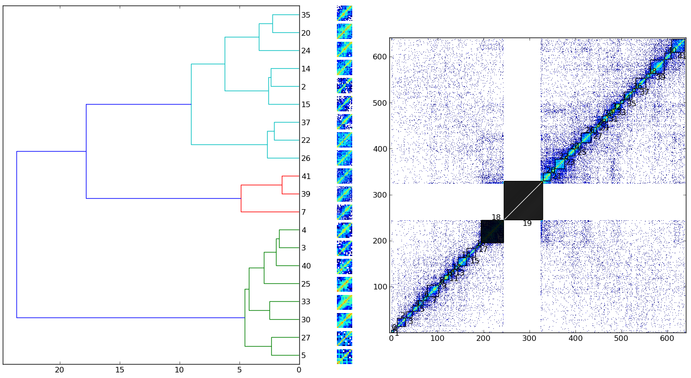

TAD clustering
**************

.. contents::
   :depth: 3

Tadbit allows to compare the topology of TADs using directly the Hi-C matrix. This comparison is done using the same methodology as for protein structure comparison using contact map overlap (CMO) [DiLena2010]_.

The function that allows such comparison is :func:`pytadbit.tad_clustering.tad_cmo.optimal_cmo`. The comparisons are pairwise however the main idea of using it is to pull together several of these pairwise comparisons in order to find group of TADs with specific characteristics.

Here the output of the example script *'clustering.py'*:

