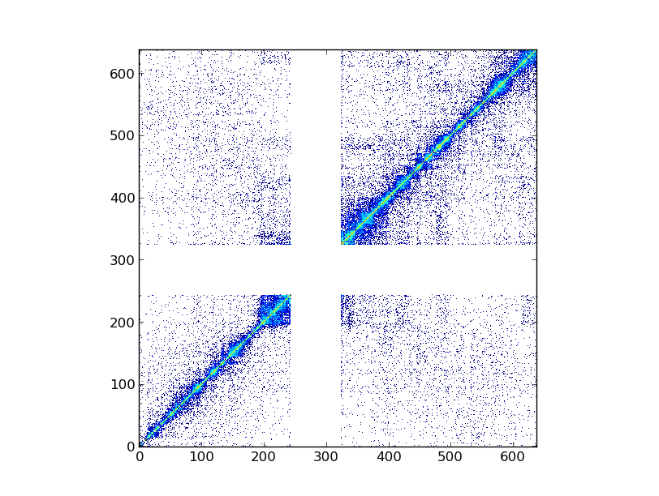
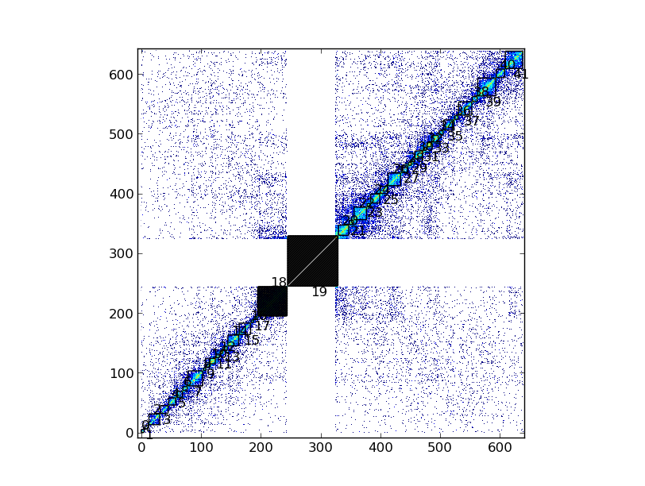

.. _getting_start:

Getting start
*************

.. contents::
   :depth: 3

Hi-C data format 
=================

Hi-C data is usually presented as a symmetric matrix in a tab separated file, usually like this:

::

  chrT_001	chrT_002	chrT_003	chrT_004	chrT_005	chrT_006
  chrT_001	629	164	88	105	10	35
  chrT_002	86	612	175	110	40	29
  chrT_003	159	216	437	105	43	73
  chrT_004	100	111	146	278	70	42
  chrT_005	16	36	26	79	243	39
  chrT_006	19	50	53	42	37	224

However, the number of extra columns or rows may vary as no convention as been proposed yet. The tadbit library allows to load most of this matrices. Classically a Hi-C matrix is loaded as this:

*Note: this example loads human 19th chromosome from* [Lieberman-Aiden2009]_ *results.*

::

  from pytadbit import Chromosome
  
  # initiate a chromosome object that will store all Hi-C data and analysis
  my_chrom = Chromosome(name='My fisrt chromosome')

  # load Hi-C data
  my_chrom.add_experiment('First Hi-C experiment', xp_handler="sample_data/HIC_k562_chr19_chr19_100000_obs.txt", resolution=100000)

Strange data format
-------------------

In the case Tadbit is not able to parse the input file, user can create its own parser as pass it to Chromosome. For example one might be interested in using [Dixon2012]_ data that appears like this:

::

  chr21	0	20000	0	0	0	0	0	0	0	0
  chr21	20000	40000	0	0	0	0	0	0	0	0
  chr21	40000	60000	0	0	0	0	0	0	0	0
  chr21	60000	80000	0	0	0	0	0	0	0	0
  chr21	80000	100000	0	0	0	0	0	0	0	0
  chr21	100000	120000	0	0	0	0	0	0	0	0
  chr21	120000	140000	0	0	0	0	0	0	0	0
  chr21	140000	160000	0	0	0	0	0	0	0	0
  

In this case we could implement a simple parser like this one:

::

  def read_dixon_matrix(f_handle):
      """
      reads from file handler (already openned)
      """
      nums = []
      start = 3
      for line in f_handle:
          values = line.split()[start:]
          nums.append([int(v) for v in values])
      f_handle.close()
      return tuple([nums[j][i] for i in xrange(len(nums)) for j in xrange(len(nums))]), len(nums)
  
And call it as follow:

::
  
  my_chrom.add_experiment("/some_path/hi-c_data.tsv", name='First Hi-C experiment', 
                           parser=read_dixon_matrix)

Experiments, when loaded are stored in a special kind of list attached to chromosome objects:

::

   my_chrom.experiments

will return:

::

  [Experiment First Hi-C experiment (resolution: 20Kb, TADs: None, Hi-C rows: 100)]

a specific Experiment may be accessed either by its name or by its position in the :class:`pytadbit.chromosome.ExperimentList` :

::

  my_chrom.experiments[0] == my_chrom.experiments["First Hi-C experiment"]

Each Experiment is an independent object with a list of associated functions (see :class:`pytadbit.experiment.Experiment`)

.. _run_tadbit:

Run Tadbit core function
========================

Once loaded the location of topologically associating domains (TADs) can be estimated.

::

  my_chrom.find_tads('First Hi-C experiment')

:func:`pytadbit.chromosome.Chromosome.find_tad` is called from our Chromosome object, however it is applied to a specific experiment. TADs found by tadbit will thus be associated to this experiment. They can be accessed like this:

::

  exp = my_chrom.experiments["First Hi-C experiment"]
  exp.tads

"tads" returned in this example is a dictionary of TADs, each is in turn a new dictionary containing information about the start and end position of one TAD.

::
  
   {0: {'start': 0,
        'end'  : 24,
	'brk'  : 24,
        'score': 8},
    1: {'start': 25,
        'end'  : 67,
	'brk'  : 67,
        'score': 4},
    :...
    :...
    :...
    }

"start" and "end" values correspond respectively to the start and end position of the given TAD in the chromosome (note that this numbers have to be multiplied by the resolution of the experiment "exp.resolution"). "brk" key corresponds the value of "end", all "brk" together corresponds to all TADs' boundaries.

Forbidden regions and centromere
--------------------------------

Once TADs are detected by the core :func:`pytadbit.tadbit.tadbit` function, Tadbit checks that they are not larger than a given value (3 Mb by default). If a TAD is larger than this value, it will be marked with a **negative score**, and will be automatically excluded from the main Tadbit functions.

An other, check achieved by Tadbit, is the search for centromeric region. Tadbit assumes that the larger gap found in the Hi-C matrix corresponds to the centromere. This search is updated, and refined, each time a new experiment is linked to a given Chromosome. Typically, TADs calculated by the core :func:`pytadbit.tadbit.tadbit` function are including centromeric regions, what Tadbit will do if a centromere is found is to split the TAD that includes the centromere into two TADs (one ending before the centromere, and one starting after). As centromeric regions are not necessarily TAD boundaries, we mark both TADs surrounding with negative scores (just as forbidden regions).

Data visualization
==================

Once loaded, Hi-C data can be visualized using the :func:`pytadbit.chromosome.Chromosome.visualize` function.

*Note: only need to specify which experiment to show*

Than, following with the example of human 19th chromosome from [Lieberman-Aiden2009]_:

::
  
  my_chrom.visualize("First Hi-C experiment", show=True) 

In this plot are represented the log2 interaction counts, resulting from the given Hi-C experiment.

If the steps corresponding to previous section (:ref:`run_tadbit`) have been done, and TADs are defined, we can also visualize them on the same kind of plot:

::

    my_chrom.visualize("First Hi-C experiment", paint_tads=True, show=True) 

*Note: TADs number 19, corresponding to centromere is shaded, as well as TAD number 18, that size > 3 Mb.*

Saving and restoring data
=========================

In order to avoid having to calculate TAD position each time, Tadbit allows to save/load Chromosome objects, with all associated experiments..

::

   my_chrom.save_chromosome("some_path.tdb")

And to load again the chromosome, with the experiments:

::

   from pytadbit import load_chromosome

   my_chrom = load_chromosome("some_path.tdb")

*Note: While we do have saved and loaded information about TADs, raw Hi-C data is not stored in this way (this, in order to save space), and may be loaded again for each experiment:*

::

    expr = my_chrom.experiments["First Hi-C experiment"]

    expr.load_experiment("sample_data/HIC_k562_chr19_chr19_100000_obs.txt")

